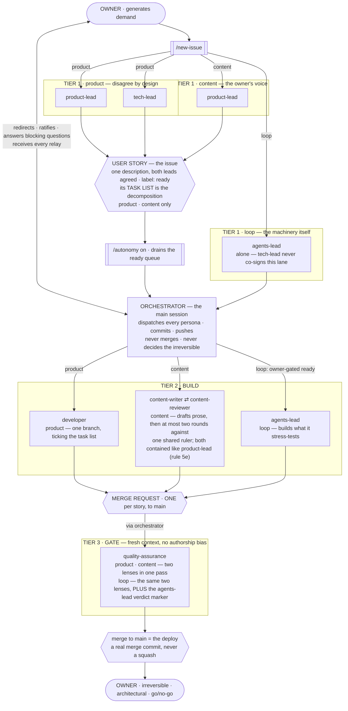
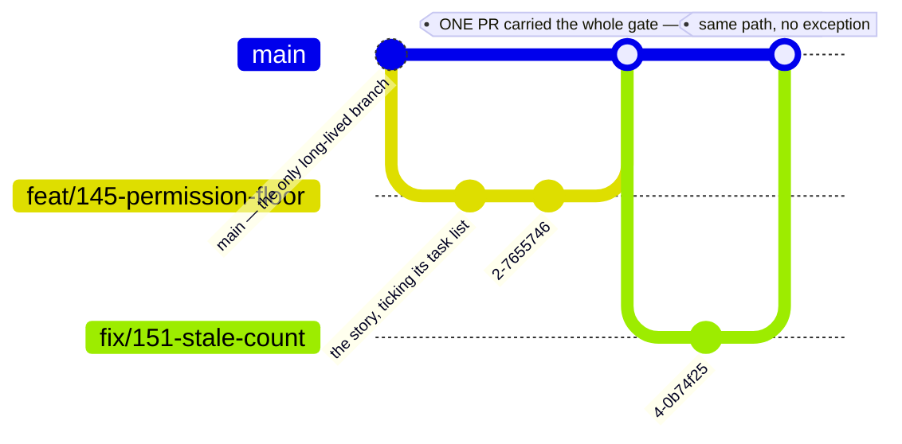
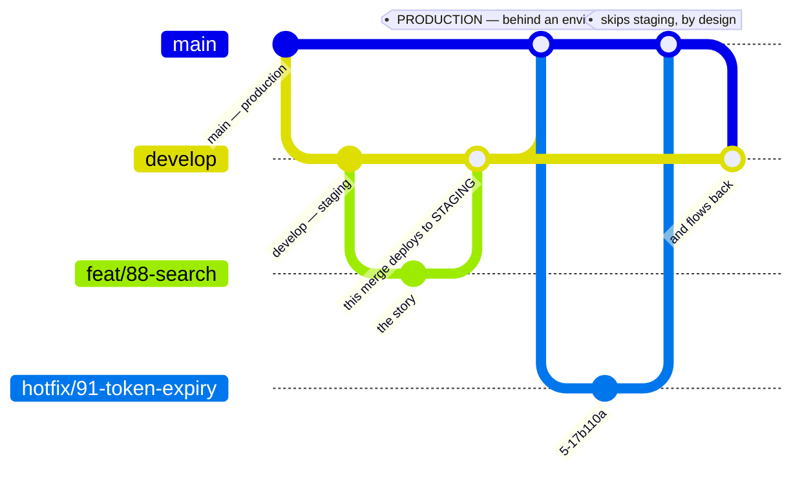
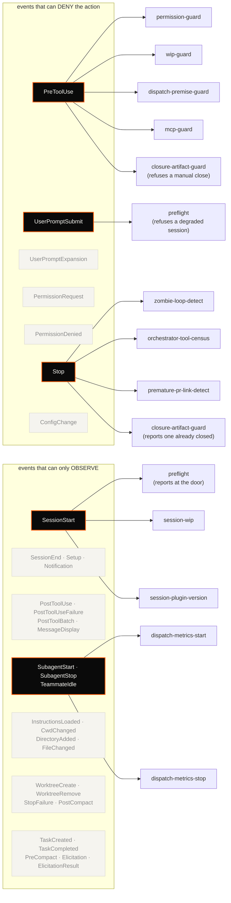
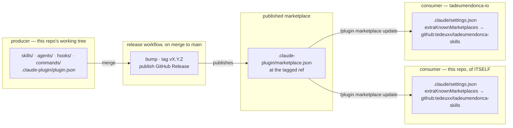

# tadeumendonca-skills

> A **Claude Code harness configuration**: the personas, permission hooks and skill library that make
> an agent's work reviewable — so "the agent finished" and "the work is done" stop being the same claim.

Treating the development loop itself as the thing you engineer — its gates, its guardrails, its
review — rather than just working faster inside an unchanged one. The author's CV calls that
**AI-DLC & Agent Harness Engineering**; this repo is it, packaged so it runs somewhere other than his own
machine. Install it into a repo and Claude gains a dev-loop with gates
in it: a reviewer that verifies a merge request against a Definition of Done, a hook that
mechanically refuses irreversible actions, and 14 skills that hand the model one set of conventions
to follow instead of whatever it would have reached for that session.

The loop is not a proposal — it builds and ships
[tadeumendonca.io](https://tadeumendonca.io), whose repo
([`tadeumendonca-io`](https://github.com/tedeuxx/tadeumendonca-io)) is public alongside this one: a
live deployed site with a blocking CI matrix, a decision library recording each load-bearing choice
and what it cost, and hooks carrying their own test suites. **The library is wider than that one
site proves**, which is the honest scope and is spelled out under [Limitation](#limitation).

## One of three pillars

The site this loop ships opens its architecture page on the frame this repository sits inside, and a
reader arriving from there should meet the same frame at the door rather than a click away. It is
three things, and this repository is the middle one:

- **The solution** — [`tadeumendonca-io`](https://github.com/tedeuxx/tadeumendonca-io): the React SPA
  built with Vite and TypeScript, the Terraform that provisions CloudFront and S3, the pipeline with
  its gates and its deploy, and the markdown content held in the repository itself.
- **The customization** — this repository: the personas in `agents/`, the hooks registered in
  `hooks/hooks.json`, the skill library in `skills/`, the **four** command files in `commands/`
  (`ls commands/` → `autonomy.md blueprint.md new-issue.md sprint-retrospective.md`; `autonomy` and
  `blueprint` each carry modes a human types after the name, so the count of typed forms is larger than
  the count of files and the two must not be conflated — see the resource table below), and the
  methodology ADRs in `docs/adr/`.
- **The runtime** — Claude Code: the orchestrator and the subagents, the `PreToolUse` and
  `SessionStart` events, the permission policy, and the tools with MCP.

**Agent Harness Engineering is what sits where the three overlap** — deciding what the harness
**refuses**, what it **advises** and what it only **documents**, and then proving the inventory of
that is still true. None of the three is the discipline on its own.

**The frame does not make this repository a component of the site**, and that is the load-bearing
half rather than a caveat on it — the intersection only means something if the three are independent.
The site states it directly, so it is quoted rather than restated:

> The three are not tiers of one system […]: **each one exists without the other two**. The site runs
> without the plugin. The plugin installs in any repository. The runtime is not mine.
>
> — [tadeumendonca.io/en/architecture](https://tadeumendonca.io/en/architecture)

Read from this side, that is a claim this repository has to keep paying: installing it needs no AWS
account, no domain and nothing deployed — see [What it does not require](#what-it-does-not-require) —
and the loop it installs is judged by the gates in *your* repository, not by anything running at
tadeumendonca.io. What the site is, here, is the worked example: the one place the whole thing is
visible end to end, which is also why its scope is the honest bound on the library — see
[Limitation](#limitation).

## The problem

<!-- claim id=0005 class=JUDGEMENT -->

Agentic development produces plausible work fast. The bottleneck moves: it is no longer *writing* the
code, it is *trusting* it. And "trust" defaults to a human reading every diff, which puts the human
back on the critical path the agent was supposed to clear.

Three failures cause most of that, and none is fixed by prompting harder.

**The agent's own report is the only evidence.** It says the tests pass. Asked whether the work is
done, the same context that produced the code judges the code — so a missed edge case is missed
twice, confidently.

**The floor is advice, not a floor.** "Don't force-push", "don't `terraform apply` locally", "ask
before merging" live in a prompt, which means they hold until the context is long, the task is
urgent, or the instruction scrolls out of the window.

**Every session re-decides the same questions.** How this project names things, which library it
already chose, why the last person rejected the obvious approach — none of that survives a new
context, so the model answers from the average of everything it has read. The result is code that is
individually reasonable and collectively inconsistent, and the inconsistency compounds silently.

## How it works

The pattern is **agent-led verification, human-residual**: the agent proves *done* with mechanical
gates and real evidence; the human keeps the judgment that is genuinely theirs — the irreversible
call, the architectural one, the production go/no-go. One mechanism per failure above, in order —
**personas** answer the self-report problem, **hooks** answer the advisory-floor problem, **skills**
answer the re-decision problem — and they are deliberately different in kind, because a guarantee
that is only as strong as the model's attention is not the same kind of thing as one that is a shell
script. Each says below what it costs.

## The engineering floor the whole library encodes

The personas, hooks and skills are mechanisms. This is what they are mechanisms *for*.

**Two tiers, and the difference between them is the discipline.**

**The non-negotiable floor never bends to risk:** the quality gate (tests, coverage, lint, typecheck,
review), a regression suite covering the implemented features, observability, and security by-design.
Stated as **properties** — which suites and which telemetry satisfy them is read from the repo, never
assumed.

**Calibrated judgment scales to blast-radius:** planning depth, threat-model depth, abstraction, when to
ask. Heavy where a mistake is irreversible; product-speed where it is cheap to revert.

The eleven principles:

1. **Plan-first** — design and align before coding.
2. **Ask on the boundaries** — architecture, contracts, anything irreversible. In-pattern implementation
   is decided autonomously, and no architectural call is made alone.
3. **Thin vertical slices, bounded by file overlap** — a second slice may start if it touches no file an
   open one touches. Overlap rather than a count, because counting blocks disjoint work while doing
   nothing about the real risk.
4. **Surgical changes, tracked debt** — work around adjacent mess and file it.
5. **Simple but extensible** — an abstraction must pay for itself.
6. **No dogma** — honour a platform's conventions as its context.
7. **Rigor calibrated to blast-radius** — the dial. The floor is what it never turns below.
8. **Quality is a gate** — tests, coverage, regression, lint, typecheck, review.
9. **Observability is part of done** — provable where it runs, and smoke after deploy.
10. **Security and resilience by-design** — least privilege, idempotency, fail-fast, retries.
11. **Living docs** — diagrams and decisions kept current.

### Permissions

**Pre-authorize the inner loop**, which is git-reversible. **Deny the irreversible boundary** —
`terraform apply`/`destroy`, direct cloud mutation, force-push, history rewrite, hard reset, recursive
delete, secret writes, and any flag that disables the permission system itself — and gate at the repo's
point of no return. Never `--dangerously-skip-permissions`.

**Permissions are a versioned repo contract**: the committed `settings.json`, never the gitignored local
overlay. A prohibition that lives only in an unreviewed local file is one "allow always" click from
being gone.

**Control comes from reversibility, mechanical gates and the deny boundary — not from interrupting you.**

**Design constraints any reimplementation of this floor must keep, stated because they are easy to get
half right:** the deny must precede execution — a post-hoc audit is not this mechanism; the hook must be
tested through its **installed** form, not invoked directly by its own test suite, because a guard
committed non-executable silently no-ops and a test that never checks the installed path proves nothing
about what ships; and when a gate is found not to gate, **the fix is the gate, not the finding** — a green
that proves nothing is worse than a red.

## The roster, and what each tier holds

`agents/` holds **8 subagent personas** — three tiers, the owner at both ends, and the work units they
hand each other. The seventh is `content-reviewer` (#317), and it is the roster's **first pair**: it
exists to argue with `content-writer` (renamed from `writer` in the same slice) against one shared
ruler, which is reason #1 of the four — *disagreement is wanted*.

**The eighth is `scrum-master` (#375), and it is the first profile in this roster that holds NOTHING.**
Its frontmatter declares `tools: []`, an explicit empty grant — no dispatch, no `Edit`, no `Bash`, no
label, no milestone — so its whole output is text it returns: a **selection record** naming one profile, one
stage and one item, which the orchestrator executes. It satisfies reason #2 of the four — *a fresh
context is wanted* — on the argument the retrospective rite already accepts one step later: selection is
otherwise decided by the context that has seen the whole session and is least able to see its own bias
in a ranking.

**It does not appear in the lane fence below, and that is correct rather than an omission.** The fence
carries the `(issue type, tier)` actors of the states table, and `scrum-master` acts at **no state
transition** — it names who should act next, which is a different question from who does act. The gate
checks that every id in the fence resolves to a live brief and deliberately not the reverse, so a live
persona absent from it is already the expected shape (`quality-assurance` is the other one).

**Its arrival is coupled to a removal, and the two must be read together (#375).**
`hooks/scripts/orchestrator-write-guard.sh` — which refused the orchestrator's own edits inside a git
working tree — is **deleted in the same slice**, on the owner's diagnosis that it was a contingency
rather than a design: *«esse hook nao deveria existir. o que queriamos era deixar a sessao principal
intencionalmente ociosa somente delegando. isso o SM ajuda.»* What replaces a lock is not another lock.
The selection record names who should act **before** acting, so acting outside it becomes a visible
discrepancy between a record and a commit. **That is detection and not prevention, and nothing reads
the record** — see the hooks section for what the removal costs, stated there rather than implied here.



**Three lanes, one hub — not one box per tier.** Tier 1's composition is not a single box wearing three
labels; it is three lanes, and the issue's type decides which one it enters. All three converge on the
same orchestrator: **the orchestrator is the hub every lane passes through**, not a station one tier
dispatches through.

**Who closes a description on each lane is stated in ONE place, and it is not this one.** The canonical
wording is the `filed → **description closed**` rows of the states table in
[`skills/agents-configuration/SKILL.md`](./skills/agents-configuration/SKILL.md) — the file every persona
preloads, read at the moment a dispatch is made. **This section is the narrative and points at it; the
diagram above is a drawing of it.** Where the two disagree, the table wins.

### The lane anchor — a machine-readable mirror of those rows, and nothing else

**The fence below is DERIVED from the states table cited above, and the table still wins.** It adds no
rule and decides nothing; it exists so that a *consumer* has one side of a comparison that a regex can
read. `tadeumendonca-io`'s `/architecture` page publishes the same lane relation in prose, and #329 was
eleven days of that prose stating a retired pairing with nothing anywhere able to see the disagreement.
This anchor is the **precondition** for the drift detector that closes that class; the detector itself is
a separate slice in the consuming repo and is not built here.

**One line per `(issue type, tier)` pair — six lines — carrying persona ids and nothing else.** No prose
inside the fence, and that is the load-bearing constraint rather than a style choice. The canonical
table's own `content` build row reads *"`content-writer` — **not `developer`**"*, and its `loop` intake
row reads *"`agents-lead`, alone — `tech-lead` never co-signs this lane"*. Both sentences are correct
English, and both name, in backticks, the persona the row exists to **exclude**. Any extractor tolerant
enough to read those cells pulls `developer` into the `content` lane and `tech-lead` back into the `loop`
lane — the precise two errors #329 was about. A negation is unparseable; the remedy is a format with
nowhere to write one.

**Exactly one fence — and the argument for it is a FORECAST, said in that tense because nothing reads
this fence yet.** No consumer exists: `roster:lanes` appears nowhere in `tadeumendonca-io`
(`grep -rln "roster:lanes"` there returns nothing), and the reader that *does* exist —
`rosterDispatchNames` in `apps/fed/scripts/harness-source.mjs`, called from `check-harness-drift.mjs` —
is pointed at that repo's own `CLAUDE.md` and matches a **different** marker, `roster:dispatch`. It is
cited here as the **precedent this anchor is shaped to mirror**, not as anything that reads these lines.

**The forecast is still the reason for the arm.** The consumer built for this anchor will mirror that
existing reader, whose fence regex is lazy and non-global — so a *second* pair of markers would be
silently read by nothing and reported by nothing. The gate asserts the fence **count** rather than its
presence in order to close that failure shape **before** a consumer inherits it, which is the only moment
it is cheap to close. Arm A is correct either way; what would be wrong is claiming the duplicate is being
silently ignored today, when nothing is looking at all.

<!-- roster:lanes -->
```
product tier1 `product-lead` `tech-lead`
content tier1 `product-lead`
loop tier1 `agents-lead`
product tier2 `developer`
content tier2 `content-writer` `content-reviewer`
loop tier2 `agents-lead`
```
<!-- /roster:lanes -->

**Tier 3 is absent on purpose, and it is not an omission to close later.** `quality-assurance` gates all
three lanes, so a tier-3 line would repeat one name three times and carry no information a reader or a
consumer could act on; what actually differs there is which lens it applies, which is prose. The
consequence is stated so the green is not over-read: the gate below checks that every id in the fence
resolves to a live brief, and **not** the reverse — *every live persona appears in the fence* would be a
false assertion, because `quality-assurance` deliberately does not.

**`tier1` / `tier2` in the keys name the LANE ROLE — intake and build — not a persona's roster tier.**
The two coincide for most of the roster and come apart for one: `agents-lead` is roster **tier 1** in the
table above and appears on `loop tier2`, because on the `loop` lane it both closes the description and
builds. That is the ratified vocabulary (#329) and is not a defect to reconcile, but it is exactly the
line a consumer author would misread, so read the keys as *(issue type, lane role)*.

**`content tier2` carries two rows of the table rather than one.** `content-writer` is the
`ready → **in progress**` actor and `content-reviewer` is `in progress → **drafted**`; the fence is keyed
on tier, so both land on the build line — which is also how the diagram above draws them.

~~`loop` closes through **both** `agents-lead` and `tech-lead` — the persona that stress-tests the
machinery and the persona that would write the ADR it produces, since a `loop` issue is the kind most
likely to need one.~~ **Struck 2026-08-25 (#329), and the way it survived is the finding, not the
sentence.** `loop`-typed intake has been **`agents-lead` alone** by standing rule from 2026-08-13 on; this
line went on stating the retired pairing for eleven days across nine surfaces, and nothing contradicted
it because it was the **only** surface stating the rule at all. Owner ruling on the exception, in one
word: **"nunca"** — `tech-lead` never co-signs this lane, with no straddling case and no judgement at
dispatch time. `agents-lead` still writes the ADR a `loop` decision earns, per the #223 domain split;
that never required a second persona at intake. **Struck rather than deleted because the paired default
is what anyone reading this page for eleven days took away from it**, and because a rule that walked
back in once will walk back in again unless the door is visible.

**The owner↔orchestrator edge is drawn now, not left implicit.** The owner redirects, ratifies, answers a
blocking question, and receives every relay through the orchestrator — an interaction that runs
continuously through a story's whole build, not only at the two endpoints (`/new-issue` and the
irreversible act) the earlier diagram showed.

**`loop` is a shorter path, but not for the reason an earlier draft of this figure claimed.** It is not
gate-free at intake — a `loop`-typed Issue still needs `ready` before anything builds against it, and
`/autonomy on`'s own queue predicate is `(product OR loop) AND ready` ([ADR-0002](./docs/adr/0002-roster-and-dev-loop.md)),
so it can be drained the same mechanical way a `product` story can. What is actually different: `ready`
on a `loop` Issue is an **owner-only** transition ([ADR-0002](./docs/adr/0002-roster-and-dev-loop.md),
record 0015's Corollary 4) rather than the two leads reconciling between themselves, and its own tier 2 is
`agents-lead`, building what it just stress-tested. **Tier 3 is not skipped, and neither is its lens.**
Every lane, `loop` included, still merges through `MR --> QA --> M`: rule 7b denies `gh pr merge` to
every `agent_type` but `quality-assurance`, unconditionally, so an agents-lead-built change is no
exception. **What differs is that this lane answers for MORE there rather than less** —
`agents/quality-assurance.md`'s harness-diff criterion
([ADR-0002](./docs/adr/0002-roster-and-dev-loop.md), record 0015's Corollary 2) means a diff touching
`hooks/**`, `agents/**`, `skills/**`, `commands/**` or `.claude/**` gets the same two-lens Definition of
Done as any other diff, **plus** a requirement no other lane carries: an `agents-lead` verdict marker
must be present on the PR before the gate may classify the diff safe or merge it. **A reviewer that has
to have been present, not a review that is skipped.**

~~**Tier 3 is not skipped — its lens is.** … a diff touching `hooks/**`, `agents/**`, `skills/**`,
`commands/**` or `.claude/**` is gated on the presence of an `agents-lead` verdict marker, not on the
full two-lens Definition of Done — the DoD review already happened, in tier 1, before the build.~~

**Struck #335.** It was live from 2026-08-12 to 2026-08-28 here and in the universal preload, and it was
wrong twice over: Corollary 2 **adds** the marker to the gate's checks rather than substituting it for
the DoD, and the justification was false on the DoD's own terms — tier 1 on a `loop` Issue closes a
*description*, and every criterion in `skills/quality-gates/SKILL.md`'s Definition of Done has a subject
that only exists after the build. **Struck here rather than corrected outright**, because
`tadeumendonca-io` published a page from this section and a reader who took the old claim deserves to
find out it changed; **corrected outright in `skills/agents-configuration/SKILL.md`**, where struck text
is tokens every persona pays on every dispatch to read a rule that no longer holds. The corrected
sentence is promoted verbatim from that consuming page rather than drafted fresh.


**No persona talks to another persona** — every dispatch still goes through the orchestrator; what changed
is that the edge is now drawn for its full span (including the owner's side of it) rather than once for
legibility.

**And one duty on that owner↔orchestrator edge is about restraint rather than relay: the orchestrator
hands the owner a PR link only when the remaining act is his** — ready to merge, every check complete and
successful, which reads mechanically as `APPROVE-PENDING-HUMAN` at the PR's current head. The operative
wording is his own sentence, in `commands/autonomy.md`'s *Reporting* section; the argument, the
enforcement and the cost of the informal ship-notice it removes are
[ADR-0002](./docs/adr/0002-roster-and-dev-loop.md)'s eighteenth amendment (#327).

**`MR --> QA` reads "via orchestrator"** because the gate is dispatched, not self-triggered — the merge
request reaches `quality-assurance` the same way every other piece of work reaches a persona: through the
orchestrator.

| persona | tier | what it holds |
|---|---|---|
| **scrum-master** | 1 · process | whether the rites ran and the states moved · ranks the eligible pool and names who acts next · **holds no tools** |
| **product-lead** | 1 · intake | what to build and why · the reader · the market · the copy lens |
| **tech-lead** | 1 · intake | architecture direction · sequencing · **writes product/system ADRs** |
| **agents-lead** | 1 · intake | the machinery — the scenarios a harness proposal misses, before it is built · **writes loop/machinery ADRs** |
| **developer** | 2 · build | the slice end to end — app, infrastructure and pipeline |
| **quality-assurance** | 3 · gate | the Definition of Done, **and** whether this can cause a problem in production · **holds the merge** |

**The owner appears twice on purpose** — *human-residual* is where the loop opens and where the
undelegatable part comes back. **`agents-lead` sits in tier 1** because a harness proposal is closed
the same way a story is: before anything is built.

**A fresh context is the whole point.** The gate has not read the conversation that produced the work, so
it has no authorship bias and no memory of why a shortcut felt reasonable. It verifies each criterion
against the repo and cites what it found.

**Choice: a persona exists for one of four reasons, and "someone should be arguing with someone" is only
the first.**

- **Disagreement is wanted** — two roles pointing opposite ways produce information a single view cannot.
- **A fresh context is wanted** — the reviewer has not read the conversation that produced the work, so
  it has no authorship bias and no memory of why a shortcut felt reasonable.
- **The context window is the constraint** — a review that would not fit beside the work runs beside
  nothing, in its own window, and returns a verdict instead of a transcript.
- **The capability should be smaller** — a role can be denied what the orchestrator holds. That is a
  boundary a shell hook can enforce, where an instruction only asks.

A persona that satisfies none of the four is a handoff, and **a persona that is never invoked is a
document.**

- **Cost:** every persona is another result to reconcile on the same merge request.
- **Cost:** fewer personas means fewer capability boundaries — separate specialists cannot edit each
  other's files, one builder can, and a guarantee becomes discipline.
- **Cost:** a broader persona's checklist is longer, and every item competes with every other.
- **Counter-evidence for the narrow design:** specialised lenses spent their best findings outside their
  own lanes. The specialisation was not what made them useful — the fresh context was.

### What the model buys, and what it costs

**Buys**

- **Disagreement is information.** Two roles grading the same change from different angles catch
  different things — measured here: one graded the exposure and called it advisory, the other graded the
  record and blocked. Both were right about different objects.
- **A fresh context has no authorship bias.** The reviewer has not read the conversation that produced
  the work, so a shortcut that felt reasonable at the time reads as a shortcut.
- **Reviews that would not fit run anyway.** Each persona has its own window, so depth on the review does
  not compete with room for the work.
- **Capability boundaries are enforceable.** A role can be denied what the orchestrator holds, and a hook
  enforces that where an instruction only asks.

**Costs**

- **Reconciliation overhead, and it scales with the roster.** Every persona is another verdict to weigh
  on the same merge request, and the orchestrator does the weighing. This is the cost that folded two
  gatekeepers into one — and the fold has a residual: until 2026-08-04 `quality-assurance` verified the
  security gatekeeper's own comment before merging (marker present, verdict approving, head SHA matching)
  — the only place in this loop where a verdict was mechanically checked by a party other than its
  author. That subject is gone; the remaining verdict is **self-enforced**. The posted artifact still
  closes *omission* (a merge on a review that was claimed rather than given leaves no comment), it no
  longer buys *confirmation*.
- **The orchestrator is a relay, and relays distort.** A verdict reaches the owner through a summary
  someone wrote — which is why gatekeeper verdicts are posted as artifacts on the pull request, and why
  approvals and ratifications are read from the artifact rather than from the relay.
- ~~**Nothing enforces a dispatch.** No check, job or hook requires that a lens ran, so an undispatched
  lens fails silently and looks identical to a clean one.~~ **Struck 2026-08-20 (#294).** Still true
  of *omission* — no check, job or hook requires that a lens ran, and a dispatch that never happens is
  not a tool call, so no hook can intercept it. What changed: the loop can also go zombie on
  **narration** — the orchestrator asserting a dispatch in prose without making the tool call, which is
  strictly worse than silence because it defeats the human reading the turn. `zombie-loop-detect.sh` (a
  `Stop` hook) now surfaces this, one turn after the turn that went zombie: it reads the same
  `gatekeeper-verdict` artifact `session-wip.sh` already read at `SessionStart`, moved to fire at the
  end of every main-agent turn instead — the failure's own boundary. It is detection, not prevention,
  and it reads loop state only (a closed three-literal enumeration the gate's own persona defines),
  never prose — it cannot distinguish "narrated but not attempted" from "attempted and errored", and it
  catches nothing during intake, before a PR exists, or a narrated dispatch of a lens denied `gh pr
  comment` (whose absence stays unobservable by construction). See the hooks section above for the full
  design.
- **Personas can run on a stale brief.** A merged change to a persona does not reach a session until the
  installed build catches up, and a subagent cannot see the notice that says so.
- **Work no brief claims runs the default path anyway.** Nothing detects *"this is not my kind of work"* —
  a persona dispatched outside its mandate reviews competently against the wrong criteria and returns
  findings that are true and irrelevant. Measured here: a harness reconfiguration ran through the product
  delivery line for eleven rounds. Every round found something real, because with no user story there was
  nothing else left to measure against but the record itself. **The issue type on the routing edges is
  the fix, and it only works because something reads it.**
- **Changing the harness is itself engineering, and for a long time nobody owned it.** Second-order
  effects of a configuration change are invisible from inside the change — a deny written for a tool no
  hook can see, a glob scoped to the wrong root, a persona left running a brief that predates the merge
  it is reviewing. Each was found by accident, after implementation, and each cost review rounds in
  tokens and wall-clock. `agents-lead` exists to move that discovery **before** the build, and its
  standing rule is the one that decides whether it is worth dispatching: **every scenario ships with how
  to verify it, or is labelled a hypothesis.** A persona that speculates about a harness produces twenty
  plausible failure modes and no way to sort them.
- **Review does not converge on its own.** Fixing a finding writes a record, and the record is reviewable
  — so each round creates surface for the next. Without a stopping rule that is a decision rather than a
  judgement, a slice can stay in review while the queue behind it stands still.

**Which gives the rule for where a persona may be added: sparingly, and almost never a second one in the
same tier.** Reconciliation cost is paid *within* a tier — two roles judging the same thing at the same
moment produce two verdicts someone has to weigh. Across tiers it is not paid at all, because each tier
hands the next a finished artifact rather than an opinion.

So the tiers here hold one persona each, except intake, where the second exists because **disagreement
between product and system is the point** — and where the third, on the machinery, never runs on the same
work as the other two.

### Intake formalism is what buys the gate its objectivity

**The gate's ruler is external to the gate, and that is the load-bearing relationship in the whole
design.** `quality-assurance` consolidates that every requirement of the issue was met, and those
requirements are the leads' output, not something the gate invents mid-review. A finding either anchors
in a stated requirement or a Definition-of-Done criterion, or it does not block — taste has no route to a
blocker, not because the reviewer restrains itself but because there is nothing to anchor it to.

Read backwards, the failure is obvious: **a vague issue leaves the gate nothing to anchor on**, so it
falls back on impression, and impression has no stopping rule — twenty-two findings on one documentation
change is what an unanchored gate looks like. The work does not disappear when a loop adopts this
formalism; it moves upstream, where a missed requirement costs a text edit at intake instead of a full
review round at the gate. **A design that adopts the gate without the intake formalism gets the cost and
not the benefit.**

**Parallel, not serial.** Dispatching lens → fix → gate → fix serialises steps that have no dependency
between them; the measured cost of serialising was the loop's throughput, not its round count.

**Two rounds is the budget.** From the third round on, the gate's verdict is accompanied by a decision
request: rounds consumed, what remains, and an explicit choice — push through, park, or narrow. The
obligation is one sentence: **state what shipping as-is would cost.** Not whether more could be found —
more can always be found — but what the reader or the next maintainer actually pays.

### The Scrum names are for legibility, and three of them import expectations this loop does not honour

**The rites are named after the official Scrum events** — `/sprint-retrospective` today, `/sprint-planning`
and `/sprint-review` when they are built — **so a reader who has never seen this loop can tell what is
happening and how to control it.** The bound is legibility, not Scrum coverage: `loop` stays, because it
already reads to a stranger, and so do `ready`, `blocked`, `product`, `content`, every persona name,
Definition of Done, Definition of Ready and story points. A word that already reads needs no Scrum
equivalent.

**A Scrum name is legible because it carries expectations. Three of them carry expectations that are
false here, and stating them is part of the naming decision rather than a caveat on it:**

1. **`sprint-planning` implies estimation-as-ceremony and a team commitment.** Neither exists — estimation
   is isolated subagent dispatch with a median, and nothing bounds how many items one iteration holds.
2. **`sprint-review` implies a stakeholder demo of an Increment.** Merge is deploy here, the owner reviews
   live after the fact, and the rite is **refused on its shape** rather than deferred: a route list rots,
   and a looker's finding is not falsifiable, so it must not be a gate.
3. **`sprint-retrospective` is the closest match and still imports one falsehood.** Scrum's retrospective
   is the team in one room; this one is N isolated contexts that never see each other's output — the
   rite's mechanism, not its formatting.

**This is stated twice on purpose, here and in the universal preload.** This document is prose no agent
carries; the preload is what every persona reads at the moment it acts. Two audiences, two homes — the
same deliberate shape the four merge holds already use, and the alternative is a rule that only the
audience that did not need it ever sees.

## The Definition of Done, and when a finding earns the right to block

**The primary ruler is the issue: every requirement the leads stated, enumerated and marked met or
unmet, individually.** A verdict that says "implements the issue" has consolidated nothing. Where the
description is not closed enough to enumerate, *that* is the finding — reviewing it anyway hides that
intake failed. `quality-gates` (in the table below) is the **mechanical** half of "done" — the coverage
floor, the gate table per loop model, the concrete thresholds. This is the **methodology** half: how a
requirement becomes a verdict, and how a finding earns the right to hold a merge. Each of the ten
criteria below is verified with **evidence** — a command's real output, a line in the diff — never with
"looks fine".

1. **Scope** — one thin vertical slice, end to end, no unrelated changes. Adjacent debt is *reported*,
   not fixed inline and **not filed as new work**.
2. **Traceability** — references its issue; acceptance criteria covered by end-to-end journeys.
3. **Tests proportional to the slice** — unit/integration alongside the code to the repo's coverage
   floor; a user-visible change adds a green end-to-end story; a docs change adds none but breaks none.
4. **Gates green with real evidence** — lint, typecheck, build, end-to-end regression, static analysis.
5. **Decision recorded** — if the change crosses a significance boundary (infrastructure, a public
   contract or schema, a fixed decision, a new dependency or tool class, a cross-cutting pattern) it
   references a decision record; otherwise it declares that none is needed.
6. **Observability** — new behaviour is provable *where it runs*, satisfied by naming the artifact that
   proves it. **`n/a` is a finding, not a shrug**: say what has no observable and why, so a reader can
   disagree.
7. **No documentation drift** — affected docs and records updated in the same merge request.
8. **History hygiene** — conventional commit subjects; a real merge commit.
9. **Security posture** — names what the diff touches on that axis and what was checked.
10. **Content truth** — where the diff changes anything a reader or a crawler will see, the copy lens
    (`product-lead`) returned a verdict and its blocking findings are resolved. **A claim the gate can
    itself falsify against a checkable source fails this criterion whatever the lens returned.**

**A finding blocks only if it names a criterion and a falsifier** — the command, line or file that would
show the reviewer wrong. A finding naming no criterion is **advisory**: reported, never blocking. This is
not licence to notice less; what changes is that *good observation* and *merge blocker* stop being the
same thing. Without the rule, the ceiling on a review is however much the reviewer happened to notice —
which is how six review passes land on a README.

**Severity is set by the lens that found it**, with a stated reason. The party reading a verdict has no
basis for re-ranking it and will treat everything as blocking otherwise — which is how a five-item list
becomes five commits. A verdict whose findings are all advisory **does not hold a merge**, and must say
so, because the word *adjust* reads like a blocker.

**Named residual:** nothing catches a lens that marks something advisory when it should have blocked.
Criterion 10's second half bounds it for false claims; the rest is accepted deliberately, because a
reviewer that freely re-grades another lens's findings recreates the reconciliation cost the single gate
was built to avoid.

## The skill library, whose domain each skill is, and what is actually preloaded

<!-- claim id=0004 class=DERIVED -->

**Skills carry the conventions so the model does not re-invent them.** **14 skills + autonomy** —
typed `autonomy on` or `autonomy off`, never bare, since `commands/autonomy.md` states that a bare
`/autonomy` *"prints help and does nothing else"* — plus `new-issue`, `blueprint` and
`sprint-retrospective`, across **four command files** (`ls commands/` → `autonomy.md blueprint.md
new-issue.md sprint-retrospective.md`). **The count of typed forms is larger than the count of files,
because `autonomy` and `blueprint` each carry modes, and the two must not be conflated** — this
README's own resource-table row for **Commands (legacy)** says exactly that, and **this sentence
conflated them anyway until #387**: it named bare `autonomy` as one of the commands and omitted
`autonomy on`, the mode that actually does the work. Generic by construction (`<project>` /
`<apex-domain>` placeholders), covering the AWS
services, the frontend stack, the CI/CD wiring and the engineering principles. Each states *the choice
and its trade-off*, not just the rule — because a rule without its reason is one the next session will
"improve".

**They are not shared evenly, and the allocation is stated per skill because no coarser granularity could state it truthfully.** ~~At family granularity one skill belongs to a different persona than the rest of its family, which is a fact about that skill rather than about the family. So this is one table, the family is a column…~~ **Struck #286 — the families are gone and the tree is one level, fourteen directories.** The table was already per skill, which is why the flatten cost it one column rather than a redesign: what disappeared is the *inheritance* (`hooks/scripts/skills-table.py`'s map was per family with three exceptions beside it; it is now fourteen explicit lines, one per skill). **Each description is still the skill's own first line of body rather than a paraphrase of it.**

**That column was headed *wielded by* until #172, and the rename is the point rather than a tidy-up.** It answers **whose mandate a convention falls under** — who is accountable for `dynamodb` being right. It does **not** answer *what does this persona have loaded*, and the two diverge sharply: under the old heading a reader had one column and no way to tell which question it was answering, so the curated preload below read as a contradiction of it rather than as a different fact.

**Reconciling the two into one column was the alternative, and it was rejected.** Across the eight
briefs (`ls agents/*.md | wc -l` → 8) the `skills:` lists total **36 preload entries**
(`grep -h '^  - ' agents/*.md | wc -l`, re-run
2026-09-01; the universal preload — `harness-engineering` at #224, **split into
`agents-configuration` + `engineering-standards` at #381**, which is what moved this from 28 to 36,
eight briefs gaining one entry each — is what pushed it above the ten it used to be;
`published-voice` is carried by the content pair and by nobody else, which is now **two** briefs rather
than the one it was extracted from), resolving to **nine distinct files
(`grep -h '^  - ' agents/*.md | sort -u | wc -l`), all nine
of them rows in this table.** Against **14** rows, making the column mean *preloaded by* would still
print "— none" against **5 of them** — `backend`, `cloud-infrastructure`, `definition-of-done`,
`frontend` and `planning-poker`: publishing, on the document a forker reads first, that no persona is
responsible for just over a third of the library. That is false, and it deletes the true information
the column already carries to remove a contradiction that a heading fixes.

**Both figures and all five names are derived from the table below, by one command over both
inputs** — never enumerated by hand, which is what this sentence used to be and why it stayed wrong
for weeks:

```
awk -F'|' 'FILENAME !~ /README/ { if ($0 ~ /^  - /) { s=$0; sub(/^  - /,"",s); p[s]=1 } next }
  $0 ~ /^. skill . what it decides . whose domain .$/ { t=1; next }
  t && $0 !~ /^\|/ { t=0 }
  t { n=$2; gsub(/[^a-z-]/,"",n); if (n != "" && n !~ /^-+$/) { c++; if (!(n in p)) { print n; z++ } } }
  END { print "rows: " c "  none: " z }' agents/*.md README.md
```

**The magnitude fell and the objection did not, which is the honest form rather than a retreat.**
~~*"Against 67 rows … 60 of them, `dynamodb`, `vpc` and `cloudfront` among them … nine tenths of the
library"*~~ — struck 2026-09-01 (#387, the owner's ruling: correct the facts, keep the argument). Two
separate defects, and only one was a number: **67/60 predates the consolidations** that took the
library to 14, and **`dynamodb`, `vpc` and `cloudfront` stopped being skills at #229**, so the
examples carrying the rhetoric were three dead identifiers named in the present tense — the same class
this batch fixed in `agents/tech-lead.md`. The replacements are not chosen for effect: they are
whatever the command above returns, and `cloud-infrastructure` is the row the three dead names
consolidated into. **The claim is smaller and it is still the claim** — a third of the library
published as belonging to nobody is not less false than nine tenths of it, only less dramatic.

*"Of body"* is a precision the frontmatter forced (#166): every skill now opens with a `description:`
block written for the **matcher** — one trigger sentence of 300-500 characters naming the situation the
skill serves. This column is not that field, deliberately. It is the human inventory, and the generator
skips the frontmatter to keep reading the line under it.

### What each persona actually preloads

**`skills:` in a persona's frontmatter is not a menu — it injects each file's full body into the context
before the persona's first turn.** There is no declare-without-loading option, so the list is bounded by
**bytes, not by count**, and it is also the **only** channel: `Skill` is not grantable through `tools:`
(#177), and `printenv CLAUDE_PLUGIN_ROOT` exits 1 inside a subagent shell. **Every exclusion is a real
deprivation rather than a deferral**, which is why the briefs argue their omissions rather than listing
them.

**Every figure below was RE-MEASURED on 2026-08-31 and every one of them roughly DOUBLED — and that is
a finding about this list rather than about the slice that re-measured it.** The command, so the next
reader falsifies it instead of trusting the date:

```
python3 - <<'PY'
import pathlib
root = pathlib.Path('.')
for f in sorted((root/'agents').glob('*.md')):
    ents, inb = [], False
    for l in f.read_text().splitlines():
        if l.startswith('skills:'): inb = True; continue
        if inb:
            if l.startswith('  - '): ents.append(l[4:].strip())
            else: break
    print(f.stem, f"{sum((root/'skills'/e/'SKILL.md').stat().st_size for e in ents):,} B", ents)
PY
```

**Every PER-SKILL byte figure further down this section — every parenthetical stating one skill's own
size, with no member enumerated here on purpose — is one line of the same tree, and comes from its own
command rather than from that script:**

```
find skills -name SKILL.md -exec wc -c {} +
```

**The criterion above replaced an enumeration, and it was replaced for the reason it existed.** The
line here read ~~*"the parentheticals beside `definition-of-ready`, `definition-of-done` and
`planning-poker`"*~~ and shipped as a complete list of the class. It was not: this section states a
skill's own size for **six** distinct skills, across seven occurrences — `definition-of-ready` twice —
which `grep -nE '[0-9]{1,3}(,[0-9]{3})+ ?B' README.md` surfaces for a human to sort from the
historical and struck figures beside them. The three not named included **`published-voice`, which was
144 B stale and carried a present-tense `wc -c` claim about it** — inside a round whose entire subject
was catching exactly that. The three that *were* named had shipped without a falsifier and had drifted
by 134, 22 and 150 bytes; they were re-derived on 2026-09-01 and were correct once re-derived — which
is the whole point: **the rule broken was not *publish the number with its command*** — the command was
published, right here — **it was `documentation-standard`'s companion clause, *verifying the members
does not verify the set***. A criterion cannot go stale when a seventh parenthetical is added; a list
of three can, and did. Re-derived whole on 2026-09-01: the command above returns 14 per-skill lines, and every
per-skill figure below was checked against that output rather than against the members someone
remembered. **Nothing gates any of this** — see the *claim registry* note on claim `0004`, which
declares that the arm owns the table and none of the surrounding prose.

**`developer` published 101,637 B and measures 198,688 B; `product-lead` published 50,437 B and
measures 145,353 B.** The split that produced `engineering-standards` moved these numbers by roughly
12 KB each — it does not begin to account for the gap. **These figures had been drifting for weeks
under merges that grew a preloaded skill without touching this list**, which is exactly the failure
this repository's *publish the number with its command* rule exists to prevent, surviving in the
document that publishes the most numbers. The per-entry deltas narrated in each bullet below (`+763 B`
at #265, `+5,717 B` at #260) are **historical and were correct when written**; they are kept because
each records a decision, and they are **not** re-derivable against the totals above — a bullet's delta
and a bullet's total no longer belong to the same measurement, and pretending they do is how the next
figure goes stale invisibly.

- **`developer` — 198,688 B** — `code-review` · `quality-gates` · `agents-configuration` · `engineering-standards` ·
  `shell` · `devops`. `quality-gates` grew 763 B at #265 — a pointer
  paragraph repointing its former generic DoD framing at the new `definition-of-done` skill — which
  moves this total by the same amount, since this brief carries the whole file.
- **`quality-assurance` — 178,881 B** — `agents-configuration` · `engineering-standards` · `quality-gates` ·
  `devops` · `shell`. `coverage` used to be a fifth, separate entry here; #257 folded its
  content into `quality-gates`, so the same policy is still fully preloaded — the entry disappeared, not
  the content. `sonarcloud` used to be the third entry; #259 folded it into `devops`, and this brief now
  preloads `devops` whole rather than losing the Sonar-diagnosis content it needs — the same fork #258
  put to `tech-lead`, decided the same way and for a stronger reason here: `devops` also carries the
  canonical source for three of this brief's own production-lens criteria (IAM least-privilege, the
  immutable OIDC subject, SHA-pinning) that this file previously restated in compressed form.
  `quality-gates`'s #265 growth (see `developer`, above) moves this total by the same 763 B.
- **`tech-lead` — 207,405 B** — `documentation-standard` · `agents-configuration` · `engineering-standards` ·
  `definition-of-ready` · `shell` · `devops`. This used to be five entries (`adr`,
  `documentation-standard`, `harness-engineering`, `shell`, `devops`); #260 folded `adr` into
  `documentation-standard` as its Part II, so the entry count temporarily dropped to four before #264
  added a fifth back. This brief already preloaded both bodies of content in full
  before the merge (76,495 B), and the merged file runs 1,590 B heavier than the sum of the two originals
  it replaces (12,024 B vs. 6,307 B + 4,127 B) — the added framing prose that keeps Part I and Part II
  legible as two sections rather than one blended body. `versioning` used to be a separate fifth entry too;
  #258 folded it into `devops`, and this brief now preloads `devops` whole rather than losing the
  sequencing content it argued it needs (#227) — a real decision, recorded in the brief itself, that
  also closes a gap the *whose domain* table below already asserted (`tech-lead` as a `devops` domain
  holder, #227) without this preload list backing it until now. The trade: a heavier preload than the
  narrow `versioning` file it replaces. **`definition-of-ready` (11,265 B, #264) is the newest entry** —
  argued rather than assumed: closing an Issue's description with `product-lead` is not an occasional
  reference for this persona, it happens at every intake dispatch, which is the same class of necessity
  that justifies a preload rather than a `Read` on demand.
- **`product-lead` — 145,353 B** — `agents-configuration` · `engineering-standards` · `definition-of-ready` · `shell`.
  `definition-of-ready` (11,265 B, #264) is a new, deliberate second domain-specific entry alongside the
  universal preloads — the same reasoning as `tech-lead`'s addition above: this persona performs the act
  the skill defines (closing a description to the point it earns `ready`) at every dispatch, not
  occasionally.
- **`agents-lead` — 196,140 B** — `agents-configuration` · `engineering-standards` · `documentation-standard` · `shell` ·
  `devops`. `harness-engineering` was the one exception to what used to be `skills: []`; the other three
  followed for reasons its own brief states (`documentation-standard`'s Part II — the ADR practice
  formerly the standalone `adr` skill, folded in at #260 — for loop/harness ADRs since #223,
  `shell` and `devops` as the transversal/machinery skills it owns). This entry used to read
  `adr` (6,307 B, 72,368 B total); the #260 merge swaps the identifier **and** grows what this brief
  receives — it now also carries Part I, the general documentation standard, which it never preloaded on
  its own. That is a real, if incidental, increase (+5,717 B) rather than a renaming with no effect, and
  it is harmless: nothing in Part I describes machinery this brief owns, so there is nothing new to go
  stale. `versioning` used to be a fifth entry here;
  #258 folded it into `devops`, so the entry disappeared and the content travels inside the skill already
  loaded. **`definition-of-ready` was deliberately NOT added here** — `agents-lead` takes no part in
  closing a `product`/`content` description (`/agents-configuration`, *Intake*); it is dispatched on
  `loop`-typed proposals only, where `ready` is an owner-only transition it never performs. It remains
  the persona most exposed to staleness, a real tension a frozen
  preload creates that its own brief names as a residual rather than resolves.
- **`content-writer` — 163,349 B** — `agents-configuration` · `engineering-standards` · `shell` · `published-voice`.
  Renamed from `writer` at #317; the figure moved for one reason and it is not the rename, which costs
  nothing — `harness-engineering` grew in the same slice, by the state-machine rows this pair required.
  **`published-voice` (29,261 B) is not an addition to this brief, it is a relocation out of it:** the
  voice calibration, the corpus evidence, the sourcing constraint, the ranked title criteria and the
  teaser rules were brief prose and are now a skill, so what this persona reads is very nearly what it
  read before. **It is not sold as a token saving and is not one** — `Skill` is not grantable through
  `tools:` (#177) and there is no on-demand channel inside a subagent, so a preloaded skill is exactly
  as always-on as the brief text it replaces, and the skill's `description` is additionally always-on
  in every session that loads the library. What the move buys is that the drafter and the reviewer that
  reads its drafts judge against **the same sentences** — ~~the second consumer being the content
  reviewer the owner has decided on and not yet built (ADR-0011's 2026-08-23 amendment)~~ **and that
  second consumer is now built (#317), which is what closes the named exception rather than leaving it
  standing.**
  *A correction of a correction, and the sentence it replaces was wrong about more than its number.*
  This line read ~~*"the figure published here at #316 was **29,139 B** and `wc -c` at this head
  returns **29,117**. The file was not edited between the two, so the published number was wrong when
  it shipped — a 22-byte miss."*~~ **Both halves were false, and each in a different way.** 29,139 was
  **correct** when published — `git show 0f484b5:skills/published-voice/SKILL.md | wc -c` → **29139**
  — and the file **was** edited between the two: `e214d6f` (2026-08-23) shrank it by exactly the 22 B
  the sentence attributed to a miss
  (`git show e214d6f:skills/published-voice/SKILL.md | wc -c` → **29117**), so there was an edit, not
  an error. And 29,117 was itself stale by the time the sentence claimed to have just measured it:
  `0d218e1` (#313, 2026-08-28) grew the file to **29,261**, which is what `wc -c` returns at this head.
  **A present-tense measurement verb inside a paragraph whose subject is a stale byte figure is the
  sharpest form of this defect** — it reads as freshly checked and is the least likely line in the
  section to be re-checked. It is why the class sentence above now publishes a criterion instead of a
  list of three.
- **`content-reviewer` — 163,349 B** — `agents-configuration` · `engineering-standards` · `shell` · `published-voice`.
  **Byte-identical to `content-writer`'s, because the list is identical — and that identity is the
  design rather than a copy-paste.** The pair
  is only worth its cost if both halves judge against one file; giving the reviewer a skill the writer
  does not have would hand it a second ruler, which is exactly what the extraction at #316 existed to
  prevent. **What is withheld is argued the same way as everywhere else on this list:** `quality-gates`
  is the ruler for code and this persona reads prose; `documentation-standard` governs repository
  documentation, a different register; `devops` describes machinery it never touches. **The round
  protocol is stated in this brief and not in `content-writer`'s**, which carries only the four rules
  that bind the drafter — a deliberate asymmetry, because two copies of a protocol is the failure the
  ruler extraction was performed to avoid, one layer down.
- **`scrum-master` — 127,069 B** — `agents-configuration` · `engineering-standards`. **The smallest
  preload in the roster, and the only list with no third entry.** It arrived at #375 declaring
  `harness-engineering`, a skill this batch renamed out of existence at #381; the profile's two halves
  were decided here on the same per-persona basis as the other seven rather than by find-and-replace.
  `agents-configuration` is the object of its mandate — the state machine, the rites, the intake chain,
  the iteration axis, the ordering rule it ranks against. `engineering-standards` is carried for two of
  its sections specifically, both of which are **ranking inputs** rather than build guidance: *What
  "delivered" means* (product slices against hygiene slices) and *the agent's state while a slice is
  blocked on someone else*. **What is withheld is `shell`, and the reason is mechanical rather than
  editorial:** this profile declares `tools: []`, so it writes no file and runs no command, and a rule
  about where scratch files go has no subject here — the brief says so in its own words.

**`definition-of-done` (15,233 B, #265) is deliberately preloaded by NO persona.** Argued rather than
assumed, unlike `definition-of-ready`'s addition to `product-lead` and `tech-lead` above: those two
*perform the act the skill defines* at every intake dispatch (closing a description to `ready`). No
persona in this roster *designs* a Definition of Done at dispatch time — `quality-assurance` **applies**
one that already exists (`quality-gates`, this loop's own concrete instance), it does not construct one
from scratch, and the new skill's actual audience — someone standing up a DoD for a *new* project — is
not a role any of the eight plays inside this loop's own operation (`ls agents/*.md | wc -l` -> 8; the figure read `six` from #265 until here, having survived two roster additions). It stays reachable the same way every
non-preloaded skill is: typed as `/definition-of-done`, or via the `Skill` tool on demand.

**`planning-poker` (13,262 B, #266) is deliberately preloaded by NO persona either, and for a stronger
reason than `definition-of-done`'s.** This loop runs no human estimation ceremony at all — the roster
that would once have held one (`scrum-master`, `product-owner`, `product-manager`) was absorbed into
`product-lead`, and the loop's own thesis (`/agents-configuration`) replaced story points with mechanical,
agent-graded gates as the thing that decides whether work is done. No persona in this roster *runs* a
planning poker round, *diagnoses* one, or *designs* one at dispatch time — unlike `definition-of-done`,
where `quality-assurance` at least *applies* a concrete instance of the concept the skill defines, nothing
here even touches this skill's subject at any dispatch. It stays reachable the same way every
non-preloaded skill is: typed as `/planning-poker`, or via the `Skill` tool on demand.

**1,380,234 B as billed across the eight, 272,837 B distinct — 49.1% of the library (555,407 B across
14 skills; `find skills -name SKILL.md | xargs wc -c`), and the largest preload is `tech-lead`'s at
207,405 B, with `developer` second at 198,688 B.** **Every figure in this section — the eight
per-persona bullets above and this aggregate — was re-derived against THIS tree**, with the script
published above this list, as the last step before the commit. Nothing here is carried forward.

**That claim was FALSE at the previous head, and the class the paragraph below names as *not
discharged* is what fired — inside the same PR that names it.** Every one of these eleven figures — the
eight per-persona totals, the billed aggregate, the distinct total and the library total — was low by
**exactly 277 B** per preload, because one commit on this branch grew a skill that every brief carries:

```
git show aaad5d8:skills/agents-configuration/SKILL.md | wc -c   # 113850  ← measured and published here
git show HEAD:skills/agents-configuration/SKILL.md    | wc -c   # 114127
git log --oneline aaad5d8..HEAD -- skills/agents-configuration/SKILL.md   # 199e95a, four commits later
```

*(The rev is spelled `<rev>:<path>` above rather than `ls-tree -r -l <rev> <path>` for a mechanical
reason worth one line: a SHA ending in a digit, followed by a space and `skills`, matches the
`[0-9]+ ([a-z-]+ ){0,2}skills` arm that pins this repo's skill count in **every** occurrence, and a
command quoted in prose is not exempt from it. The first form of this block turned that arm red.)*

**8 briefs × 277 B = 2,216 B on the billed total, and 277 B once each on the distinct and library
totals** — which is exactly the correction applied here, in all three, and is why the arithmetic is
self-checking rather than eleven separate repairs. **The defect is this repository's named recurring
one: a number whose base is inside the diff that publishes it.** Not a stale figure inherited from
`main` — the figure was re-derived, correctly, and then invalidated four commits later by a diff that
never touched this list. **The section publishes its own falsifier, so any reader who ran the script
got eleven different numbers from a sentence claiming it had just been run**, which is the sharpest
form of this defect: the claim of freshness is what makes it unlikely to be re-checked.

**What this changes about the paragraph below: nothing, and that is the point.** *"Nothing keeps it
correct"* was already written there; this is the first recorded instance of it firing **within a single
branch** rather than across merges, and the shorter interval is the finding. The mitigation available
without a gate is procedural and is stated as such — re-run the script **after the last edit of the
slice, not after the last edit that touched `skills/`**, since which files are preloaded is not
something the author of an unrelated commit is looking at.

**The staleness caveat this paragraph carried at the previous head is DISCHARGED, and which part is
discharged matters more than the fact that it is.** That version read that the billed total was
*"derived from all seven briefs the roster held when they were measured — it is EIGHT at this head
(#375), so the aggregate excludes `scrum-master`"*, and that five of the per-persona bullets were
*"measured at an earlier head and NOT re-derived"*. Both were true when written and both are false
now: the eighth brief has its own bullet, and all eight totals come from one run against this tree.
**What is NOT discharged is the class** — nothing gates a byte figure, so the next merge that grows a
preloaded skill without touching this list re-opens the same gap silently. This list is correct at one
commit; nothing keeps it correct. The command that settles all of them in one run, which is what a reconciling
slice should use rather than one `wc -c` call per brief:
`grep -h '^  - ' agents/*.md | sort | uniq -c` for the counts, and per-persona
`sed -n '/^skills:/,/^---/p' agents/<name>.md` piped into `wc -c` over the named `skills/*/SKILL.md`.
(All figures measured
directly — `wc -c` per file listed above — rather than carried forward from an earlier count, as the LAST
step against the final committed state; #266 added `planning-poker` as a new skill, preloaded by no
persona (see above), which moves the library-wide total and percentage but neither the billed nor the
distinct preload figure, since nothing carries it. #265 added `definition-of-done` as a new skill,
preloaded by no
persona (see above), and grew `quality-gates` by 763 B via its own repointing paragraph, which moves
`developer`'s and `quality-assurance`'s totals — the only two that carry `quality-gates` — by that amount.
#264 added `definition-of-ready` as a new skill and a new preload
entry for `product-lead` and `tech-lead` specifically — see each bullet above for why those two and not
the other four — and grew `harness-engineering` itself by 661 B via its own cross-reference edit, which
moved every persona's total by that amount since all six carry it. #260 folded `adr` into
`documentation-standard`, which changed the `tech-lead` and `agents-lead` totals and
the library-wide distinct/billed figures; #259 folded `sonarcloud` into `devops` before that, changing
four of the six totals — `developer`, `agents-lead` and `tech-lead` via `devops`'s growth, and
`quality-assurance` via the `sonarcloud`→`devops` swap decided above.)
~~`harness-engineering` (33,412 B, the universal preload, #224) is the largest single skill in the
library and is carried by all six briefs.~~ **Struck here rather than restamped, because both halves
were wrong in different ways and only one of them is this batch's doing.** The identifier died at #381;
the *ranking* had been false for longer — `cloud-infrastructure` (155,998 B) is the largest single
skill in the library and is preloaded by **nobody**, while the largest *preloaded* one is
`agents-configuration` at 113,850 B, carried by all **eight** briefs. The two figures (billed vs.
distinct) differ because several skills — `agents-configuration`, `engineering-standards`, `shell`,
`quality-gates`, `documentation-standard`, `devops` — are each carried by more than one persona: there
is no dedupe, so each is billed once per persona and the library sees it once. Note what this list and
the table below disagree about, deliberately: `developer` **preloads** `quality-gates`,
`agents-configuration` and `engineering-standards` while the table below puts them under the judging
personas. Both are true.
The principles are the judges' ruler and the builder's floor; *whose domain* and *what is loaded* are
different questions, which is exactly why they are two lists rather than one contested column.

**Identifiers are the skill's own directory name** (`code-review`, for
`skills/code-review/SKILL.md`). That has been true through every shape this tree has taken, and it is
why none of the three moves changed a single invocation: flat (#164), nested under families (#182),
flat again (#286). **Re-measured on #286 rather than inherited** — one probe plugin, one skill body,
the identifier held fixed and only the directory depth changed:

```
claude --plugin-dir <probe> -p "/probeplug:probealpha"   # skills/fam/probealpha -> the nonce
claude --plugin-dir <probe> -p "/probeplug:probealpha"   # skills/probealpha     -> the same nonce
```

So the colon form that qualified it (`workflow:code-review`) does not resolve, and never did — the
loader reads the innermost directory and nothing above it. Slash forms
do not resolve, there is no
glob support, and there is no dedupe — two identifiers naming one file load it twice and bill it twice.
A wrong identifier fails at **0 bytes of stderr**, which is why the check sits in CI rather than in the
runtime: `hooks/scripts/skills-resolve.test.sh` asserts that every list **complies** with those rules —
no slash, no glob, no duplicate or same-path alias, and every identifier resolving to a tracked file.
**It does not, and cannot, assert the silence itself** — it reads the same tree the loader reads and is
not the loader, so it catches a broken reference rather than a broken loader.

The library: 14 skills, one directory each, at one level under `skills/`.

| skill | what it decides | whose domain |
|---|---|---|
| `agents-configuration` | Apply Agent Harness Engineering — the owner's name for how this loop is built and run, the state | `product-lead` · `tech-lead` · `agents-lead` · `quality-assurance` |
| `backend` | Backend (BFF-on-Lambda) | `developer` |
| `cloud-infrastructure` | Cloud infrastructure (AWS) | `developer` |
| `code-review` | Review your own slice for COMPLETENESS before opening the merge request. Author-side, run by `developer`, and distinct from the gatekeeper's… | `developer` |
| `definition-of-done` | Definition of Done — the ruler that decides when work stops | `product-lead` · `tech-lead` · `agents-lead` · `quality-assurance` |
| `definition-of-ready` | Definition of Ready — the bar a work item clears before it is buildable | `product-lead` · `tech-lead` · `agents-lead` · `quality-assurance` |
| `devops` | Operate the DevOps capability for any `<project>` repo — GitHub Actions, Terraform Cloud, branching, and | `developer` · `agents-lead` · `tech-lead` (#227) |
| `documentation-standard` | Documentation — the general standard and the ADR practice | `developer` (Part I, general docs) · `tech-lead` · `agents-lead` — Part II, ADR practice split by domain (#223) |
| `engineering-standards` | Apply the owner's engineering standards — the two tiers, the eleven principles, and the few rules | `product-lead` · `tech-lead` · `agents-lead` · `quality-assurance` |
| `frontend` | Frontend (React SPA) | `developer` |
| `planning-poker` | Planning Poker — consensus estimation, and what it is actually for | `product-lead` · `tech-lead` · `agents-lead` · `quality-assurance` |
| `published-voice` | The owner's published voice — the shared ruler | `content-writer` · `content-reviewer` — the pair it was extracted for (#317) |
| `quality-gates` | Quality gates — the definition of done and the concrete policy that proves it | `product-lead` · `tech-lead` · `agents-lead` · `quality-assurance` |
| `shell` | Apply this working-files and shell-command discipline in any `<project>` repo, for any persona dispatched | `product-lead` · `tech-lead` · `agents-lead` · `developer` · `quality-assurance` · `content-writer` · `content-reviewer` |
**Three things the table shows rather than asserts.** The builder is the only persona holding a build
skill — `backend`, `frontend`, `cloud-infrastructure` — because conventions exist for building, and one
persona builds. `documentation-standard` is the only skill that splits between personas, and it splits
for a reason: its ADR practice (Part II, merged in from the former standalone `adr` skill at #260)
belongs to the two writers of the records, split by domain (#223), not to a single default author,
while its general-docs half (Part I) stays the builder's. And **the gate's** domain is the process
skills and nothing else, because its questions are answered from the diff and the running system, not
from this repo's conventions.

**What the table still does not assert, and it is the same limit the rename made visible.** The `whose
domain` column is hand-maintained, in `hooks/scripts/skills-table.py`'s `WIELDER` map — it is a fact
about the roster, not about the filesystem, so nothing derives it and nothing checks it. The preload
list above is the half that *is* checked: `skills-resolve.test.sh` verifies every identifier resolves to
a tracked file. **Neither check reaches the other's claim**, and a reader deciding how much to trust each
column should know which one has a gate behind it.

**Choice: one convention per question, over the model's best guess each session.**

- **Cost:** a convention that is wrong is now wrong everywhere, consistently.
- **Cost:** the library is wider than the code it is proven against — see [Limitation](#limitation).

## The lifecycle, and what records each phase

**The user story issue is the spine.** Every phase from intake to deploy leaves its mark on it or one
hop from it, and **none of those marks is prose somebody has to remember to write** — each is a side
effect of the phase actually happening.

| phase | what records it | where |
|---|---|---|
| **intake** | the `ready` label | the issue — its description closed by whoever closes it **on that lane**, per the states table's `filed → description closed` rows; on `loop`, only the owner applies the label |
| **decomposition** | the **task list** in the body | the issue, with the progress GitHub renders from it |
| **build** | a linked branch, and `closes #N` | `gh issue develop` on one side, the PR on the other |
| **gate** | the verdict, under its own marker | a comment on the PR, one hop from the issue |
| **deploy** | the merge commit and the `vX.Y.Z` tag | git, and the published release |

**Decomposition lives in the tracker, not in git.** That is the whole reason there are no task branches
below: planning belongs where planning is read, and encoding it in branch names would be a second copy
of something the issue already holds — which is how the two copies start to disagree.

**Two gaps, named rather than implied.** The gate's verdict lives on the pull request, so someone opening
the issue does not see that it was reviewed — one hop away, and probably an acceptable price. And **the
deploy does not come back**: the issue closes on merge and never learns which version shipped it, so
answering *"which release carried this?"* means reading the commit, finding the tag, and crossing them by
hand — three manual steps for a fact the release job already knows at the moment it publishes.

### The decision records are a contract, not documentation

**They anchor context directly in the codebase, which is the third failure at the top of this page.**
A fresh session cannot know why the obvious approach was rejected here, and re-deriving it from the code
is how a model reaches for the average of everything it has read. The skills answer that for
**conventions**; the ADRs answer it for **this repo's own decisions** — and they sit in the repo, next to
what they decided, so an agent finds them by working rather than by being told to look.

**And they are what the personas measure a decision against**, which makes the library an input to the
loop rather than a description of it. **Authorship is split by domain (#223)** — `tech-lead` writes the
product/system-architecture records, `agents-lead` the loop/machinery ones, because the party that holds
a decision is the party that records it. ~~`tech-lead` is its **only writer**.~~ **Struck 2026-08-25
(#329): that coupling is what #223 corrected, and it was still published here.** Both the intake and the gate
read it: one to check that a proposal does not contradict a decision already taken, the other to check
that what shipped is what was decided.

**So a stale ADR does not merely misinform. It makes the agents enforce a contract that no longer
holds** — and they enforce it confidently, because a record is exactly the kind of evidence a persona is
built to trust. Measured in the batch that produced this section: three records described a two-gatekeeper
model in the present tense after the roster had one, and a comment in a hook asserted that removing a
floor entry *would* break a convention — an instruction to re-introduce a defect, not a stale note.

**Supersede, never rewrite.** A record that is edited in place leaves the next reader unable to tell that
anything changed, and leaves the reader who acted on the old value with no way to learn it moved. Strike
the claim, follow it with what replaced it, and keep the reasoning — the reasoning outlives the rule it
was written for.

**And an ADR that decides *how work is decided* is boundary class.** ~~it goes to the owner, because that
is the one category where an agent amending the record would be amending its own mandate.~~ **Restated
2026-08-23:** the gate now merges the boundary class ([ADR-0002](./docs/adr/0002-roster-and-dev-loop.md)
amendment #16), so "boundary class" no longer carries this to the owner on its own. The reason in the
struck clause is the one that survives, and it survives *as its own rule* rather than as a class: **a
diff that would amend the gate's own mandate goes to the owner**, unconditionally — the first of the
four holds the amendment leaves standing. An ADR about the loop that does not touch the gate's mandate
is merged by the gate like anything else.

## The branch model the loop runs on

**Two levels: one branch per story, one branch per task.** Per [ADR-0002](./docs/adr/0002-roster-and-dev-loop.md),
a task is an Issue **child** — its own Issue, `Parent: #N` in its body, its own branch, its own pull
request — not a checkbox on the story's issue. Each level is independently reviewable: the pull request
the gate reviews is the unit that has product meaning, at whichever level it sits, story or task.
`gh issue develop <n>` links the branch to whichever issue it is run against, story or task, the same
way — GitHub holds that link as structured data rather than as a naming convention (see below).

**Sibling tasks touching the same file, as this repo's mechanism stands today:** `wip-guard.sh`'s overlap
rule denies a new PR that touches a file an open PR by the same author already has open, with no
parent-story carve-out — so two sibling tasks under one story that would both touch the same file are
blocked until that exemption is rebuilt (tracked as #195, not yet merged as of this writing). Read
`hooks/scripts/wip-guard.sh`'s overlap logic directly for the mechanism as it currently stands rather than
trusting this paragraph's date — the restriction lifts the moment #195 lands, and this text is not
guaranteed to be updated at that instant.

```
feat/<issue>-<slug>     a user story
fix/ · docs/ · chore/   a standalone slice with no story behind it
hotfix/<issue>-<slug>   multi-env only, and only there
```

The issue number in the name is for a human reading `git branch`; the mechanism does not need it —
**`gh issue develop <n>` creates the branch already linked to its issue**, and GitHub holds that link as
structured data rather than as a naming convention somebody has to honour.

**Two models, differing on exactly one thing: how many stops there are between the merge and
production.** Which one a repo runs is a declaration — its `CLAUDE.md` states it. Failing that, count
deployed environments: more than one is `gitflow-multi-env`, one is `gitflow-single-env`.

Picking wrong is not cosmetic. A multi-environment layout on a single-environment repo creates an
integration branch nothing merges to and **moves the required checks off the PR that actually ships** —
and there is no downstream tier to catch them, so a check moved there is a check that never runs.

### `gitflow-single-env` — the active model

Run by this plugin and by the `-io` site. **One environment, because the product is a static SPA: there
is nothing an extra integration environment would prove.**

**No `develop`, no `release/*`, no `hotfix/*` — everything merges to `main`.** A release branch exists to
carry a third stop and there is no third stop; a hotfix pattern exists to skip a promotion and there is no
promotion to skip. An urgent fix is another short-lived branch taking the same path as everything else.



- **`main` is the only long-lived branch, and it is the *working* branch**, not a protected production
  mirror. Protected as PR-required with **0 approvals**, no force-push and no deletion.
- **The whole gate sits on that PR.** It is the one that ships, so it is where every required check has to
  be green — there is no downstream tier to defer one to.
- **The merge deploys, so the merge is the go/no-go.** Never configure auto-merge into `main`.
- **Real merge commits; squash disabled** — squashing collapses the conventional-commit history the
  categorized release notes are built from.
- **WIP is bounded by file overlap**, not by a count: a second story may start if it touches no file an
  open one touches. Counting blocks disjoint work — the common case — while doing nothing about the real
  risk, which is two changes that will conflict on merge.

### `gitflow-multi-env` — the reference model

For a repo with more than one deployed environment, and **at most two**. **Environment is branch**:
`develop` is paired with staging, `main` with production. **Off here**, and described so the selection
rule has a second option to select.

**Still no `release/*`** — with two environments the promotion `develop → main` *is* the release, and a
branch in between would be a third stop nobody deploys to.

**`hotfix/*` exists here and only here**, because a production fix cannot wait for the `develop → main`
promotion. It cuts from `main` and merges back to both.



**Compare the two pictures rather than the two rule lists.** The story branch above is identical;
everything after its merge is the difference. With two environments the gate is **spread across the
promotion** — staging catches part of it and the production merge the rest, and the point of no return is
the second one. With one environment there is nothing to defer to, so **the whole gate collapses onto a
single PR**, and the merge that carries it is also the deploy.

The depth for both — protection settings, the versioning triggers, the two meanings of "ships" — lives
in `/devops`. This is the pointer, not the copy.

## The hooks, and what they refuse

Claude Code exposes **31 hook events**. This repo wires **six** — `PreToolUse`, `UserPromptSubmit`,
`SessionStart`, `SubagentStart`, `SubagentStop`, `Stop` — and the picture draws all 31 so the unused
surface is visible rather than unmentioned: the wired ones are filled, the other **twenty-five** are not.

**Count the events in the table below, not the boxes in the drawing, and the difference is not a
rounding.** The diagram collapses several events into one node — `SubagentStart · SubagentStop ·
TeammateIdle` share a box — so it has **five** filled boxes against **six** wired events. This sentence
read *"wires five"* until #342 and *"wires four"* before that, each time reading a node count as an event
count, and each time asserting a partition of 31 that did not hold. The wired figure and its complement
are now **derived from `hooks/hooks.json`** by `inventory-counts.test.sh` rather than counted by hand;
**the 31 is not, and cannot be** — it is a property of Claude Code, not of this repo, so it is the one
term in `6 + 25 = 31` with no falsifier on this side of the boundary.

`Stop` joined 2026-08-20 (#294) — it sits in the deny-capable group with `PreToolUse`, but the hook
wired to it never uses that half; see the row below. **`UserPromptSubmit` joined 2026-08-29 (#342), wired
for nothing but its ability to refuse a prompt**: the preflight it carries had to refuse, `SessionStart`
cannot, and no other **deny-capable** event fires before a session does anything.

**The split that matters is not used-versus-unused, it is whether an event can deny at all.** A control
placed on an observe-only event looks like enforcement and is not, and that mistake stays invisible until
someone tests it.



| event | when it fires | denies? | hooks wired here | purpose |
|---|---|---|---|---|
| **`PreToolUse`** | before a tool call executes | **yes** | `permission-guard`, `wip-guard` (matcher `Bash`) · `dispatch-premise-guard` (matcher `Agent`) · `closure-artifact-guard` (matcher `Bash`) · `mcp-guard` (matcher `mcp__.*`) | refuse the irreversible floor and a PR that overlaps an open one, *before* either happens — refuse a dispatch whose brief stamps a repository state that is not true, verified in the repository the brief's own citations resolve to rather than in `cwd` (#326) — and refuse `gh issue close` on an Issue whose own body declares an invocable artifact that does not resolve in this tree (#337). ~~`orchestrator-write-guard` (matcher `Edit\|Write\|MultiEdit\|NotebookEdit`) — refuse the main agent's own edits inside a git working tree, a ROUTING rule rather than a floor one (#319)~~ **removed 2026-08-31 (#375)** — the owner's diagnosis was that it was a contingency rather than a design, and what replaces it is `scrum-master`'s selection record naming who acts before acting: detection, not prevention. **This is the only registration this repo has ever removed, and the matcher going with it is the reason the next paragraph exists.** |
| **`SessionStart`** | a session begins or resumes | no | `preflight`, `session-wip`, `session-plugin-version` | say at the door that the session is degraded and will be refused at the first prompt — inject the open queue — and warn when the installed build is not the merged one |
| **`SubagentStart`** | a subagent is dispatched | no | `dispatch-metrics-start` | best-effort dependency probe only — see below; does not post |
| **`SubagentStop`** | a subagent finishes | no | `dispatch-metrics-stop` | log rework rounds, time, output size and token cost for the dispatch as a structured Issue comment (#209) |
| **`Stop`** | the main agent's turn ends | **yes, but no hook here uses that half** | `zombie-loop-detect`, `orchestrator-tool-census`, `premature-pr-link-detect`, `closure-artifact-guard` | detect (never prevent) an outstanding gate verdict left unaddressed at turn end — one turn late instead of one session late (#294) — report what the main agent did with its own hands, write/post class separated from reads (#319) — flag a PR link handed to the owner for a PR that is not open, green and `APPROVE-PENDING-HUMAN` (#327) — and report an Issue that is ALREADY closed with a declared invocable artifact missing, which is the only surface that reaches the closing-keyword route at all (#337) |
| **`UserPromptSubmit`** | a prompt is submitted, before processing | **yes** | `preflight` | refuse to process anything while the guards' own preconditions are absent — an interpreter a registered hook reaches for missing from `PATH`, a registered script absent or without its execute bit, or a headless session running with the static deny layer off (#342) |
| `UserPromptExpansion` | a typed command expands, before it reaches the model | **yes** | — | |
| `PermissionRequest` | a call needs a permission decision | **yes** | — | |
| `PermissionDenied` | a call is denied by the classifier | **yes** | — | |
| `ConfigChange` | a configuration file changes mid-session | **yes** | — | |
| `PostToolUse` · `PostToolUseFailure` · `PostToolBatch` | after a call succeeds, fails, or a parallel batch resolves | no | — | |
| `SessionEnd` · `Setup` · `Notification` · `MessageDisplay` | session teardown · one-time prep · notification · message render | no | — | |
| `TeammateIdle` | a teammate goes idle | not documented | — | |
| `TaskCreated` · `TaskCompleted` | a task is created or completed | not documented | — | |
| `InstructionsLoaded` · `CwdChanged` · `DirectoryAdded` · `FileChanged` | project rules load · cwd moves · a directory is added · a watched file changes | no | — | |
| `WorktreeCreate` · `WorktreeRemove` | a worktree is created or removed | not documented / no | — | |
| `PreCompact` · `PostCompact` · `StopFailure` | before and after compaction · a turn ends on an API error | not documented / no | — | |
| `Elicitation` · `ElicitationResult` | an MCP server asks for input, and after the answer | not documented | — | |

**"not documented" is the answer, not a gap.** The hooks guide references a per-event blocking table it
does not publish, so nine events have no stated blocking behaviour. Writing *no* there would be a claim
the documentation does not support.

**Two mechanics, measured rather than assumed.** A `matcher` scopes strictly to the tools it names —
`"Bash"` never fires for `Edit` or `Write`, though those are matchable as `"Edit|Write"`. **Strictly is
the load-bearing word, and #319 measured how strict: the match is ANCHORED, not a substring search.**
A matcher `"rit"` did not fire for `Write` (control: `"Write"` fired on the identical call), and
`"Edit|Write"` did not fire for `NotebookEdit` — which is a real, deferred, file-writing tool in this
build, and it mutated a file inside a git working tree with the guard registered and silent. So a
matcher is an ENUMERATION and inherits every risk an enumeration has. ~~`orchestrator-write-guard` names
four tools, and its suite asserts the registration so narrowing it goes red rather than quiet.~~
**Struck 2026-08-31 (#375): that hook is deleted, and no hook in this repo registers on a file-writing
matcher any more.** The measurement is NOT struck and is deliberately restated here without its
carrier, because it is a property of the runtime rather than of the hook that found it — the full
record, including the second half a matcher fix would not have closed (`NotebookEdit`'s payload carries
`notebook_path` and no `file_path`, so a guard reading only `.tool_input.file_path` allows every
`NotebookEdit` even with the matcher naming it), is ADR-0004's *"the runtime facts a deleted guard
measured"* section. And
`SessionStart`'s injected context reaches the main session but **not a subagent dispatched later**, which
is how a persona ends up running against a brief the session already knows is stale.

**Choice: a hook over an instruction.** An instruction degrades with context length and pressure. A hook
does not degrade at all.

- **Cost:** it errs in both directions, and only one of them is loud. A false deny is visible and
  annoying. A false allow is silent.
- **Cost:** it reads a command string, not intent. Everything it cannot express as a pattern has to live
  in a persona's judgement instead.
- **Cost:** it fails open. Without `jq` it emits no decision at all, which the harness reads as *no
  opinion* — so the session hook warns at startup when that is the case. **One rule is excepted since
  2026-08-28 (#341): the merge floor denies when it cannot READ the gatekeeper's verdict** — no `gh`,
  no network, expired auth, a PR reference resolving to nothing — because that one rule's degradation
  landed on the irreversible act itself, and it landed silently. **The `jq` case above is NOT excepted
  and is the honest edge of this**: a missing `jq` disables the whole file before any rule runs, so the
  merge floor's own `jq` branch never fires. Everything else here still fails open, deliberately.
  **What changed on 2026-08-29 (#342) is not that any of them fails closed — it is that the SESSION
  does.** `preflight.sh` refuses at `UserPromptSubmit` while a precondition of the registered set is
  absent, so the fail-open remains the design and the *silence* around it does not. Read the
  exception list above as unchanged: one rule fails closed, the rest fail open, and now nothing is
  supposed to reach them in that state.

`permission-guard` denies the irreversible floor before the command runs. `wip-guard` refuses a pull
request that touches files an open one already touches — the bound is file overlap, not a count, because
counting blocks disjoint work while doing nothing about the real risk. `session-wip` lists the open queue.
`session-plugin-version` says when the installed build is not the merged one. `dispatch-metrics-stop`
logs the four benchmarking metrics the owner asked for on #209 — rework rounds, time, token cost, and an
output-size proxy — as a structured comment on the Issue the dispatch worked, deriving them from
`agent_transcript_path` (a per-dispatch JSONL transcript, separate from the main session's own) and from
the PR's own gatekeeper-verdict markers rather than pasting any raw dispatch text. `dispatch-metrics-start`
does not post; it only warns, once, if `jq` is missing and the `SubagentStop` hook (`dispatch-metrics-stop`)
therefore cannot capture anything this session — see `hooks/scripts/dispatch-metrics-stop.sh` for the full
design record, including why this is one comment per dispatch rather than one comment updated per Issue.
`zombie-loop-detect` is a *second, independent reader* of the same ADR-0006 `gatekeeper-verdict` artifact
`session-wip` already reads, wired to `Stop` instead of `SessionStart` so an outstanding REQUEST-CHANGES or
APPROVE-PENDING-HUMAN verdict surfaces one turn late rather than one session late; it never parses prose,
only loop state, and it never blocks — `additionalContext` only, debounced to once per (PR, head SHA) per
session via a marker file under the checkout's own `.git/` — see
`hooks/scripts/zombie-loop-detect.sh` for the full design record and what it deliberately cannot catch.

~~`orchestrator-write-guard` and `orchestrator-tool-census` are one pair, and the split between them is
the whole decision (#319). **The guard denies exactly one class**: a file-writing call whose
`agent_type` is empty — the main agent — resolving to a path inside a **git working tree**. It is a
routing rule, not a floor rule: the identical edit goes through the moment it is made by the persona
that owns it (`developer`, `content-writer`, `agents-lead`), and any non-empty `agent_type` passes
untouched, deliberately broader than an allowlist because a deny that caught the builder would stop
the loop dead. The polarity is *deny by scope*, never *allow-list the exempt paths*: the session
scratchpad — where PR bodies and verdict text are composed for `--body-file` — is exempt because it
holds no repository, not because it is named, which keeps the rule correct when the harness moves its
temp root.~~

**Struck 2026-08-31 (#375) — the guard is DELETED, and the census is no longer half of a pair.** The
owner's diagnosis was that it was a contingency rather than a design: *«entendi que foi uma contingencia
entao, nao era intencional … o que queriamos era deixar a sessao principal intencionalmente ociosa
somente delegando. isso o SM ajuda.»* Its own header agreed, recording that the act it stopped was *"not
a floor violation … it is the WRONG LAYER."* **Struck rather than deleted because it is the paragraph
that told every reader the routing rule was mechanical**, and anyone who read it took that away.

**What replaces it is not another lock.** `scrum-master` (#375) returns a **selection record** naming
who should act, *before* acting, so the main session acting directly becomes a visible discrepancy
between a record and a commit. **That is detection and not prevention, and it is weaker than the guard
in two ways worth stating rather than discovering:** the record is landed by the orchestrator itself, so
it is self-attested; and nothing greps `SELECTION-RECORD`, so no layer reports the discrepancy either.
What the census already covers is unchanged and is now the whole of the mechanical half.

**The census gates nothing and cannot**: a `Stop` hook fires after the work happened. It
reports the main agent's own tool calls as a named list, write/post separated from reads, `Bash`
classified by the act it ran (`gh issue comment` is a post; `gh issue view` is a read) so the posting
class is not empty by construction. Two costs, handled rather than inherited: it counts **attempts** —
a denied call still appears, and the notice says so every time — and it would otherwise fire every
turn, so only the write/post class can trigger it and only after three more such calls since the last
notice in that session. **What is deliberately NOT mechanised, and must read as a decision rather than
an omission:** reads, `gh issue create`, and the `gh pr comment` / `gh issue comment` routes rule 5e
allows the orchestrator. A hook sees `grep` and a path, never whether the answer was already in a
subagent's return; and denying the comment routes would leave an intake finding with no durable
artifact, since at intake there is frequently no PR and `product-lead` holds no `Write` at all. That
half is a **habit**, observed by the census and enforced by nobody.

`preflight` is the newest and the only one that stops the session rather than an action (#342). Every
other hook here fails open on a missing dependency and says nothing — `permission-guard.sh` reads its
payload with `jq` and exits before rule 1 when `jq` is absent, so one binary off `PATH` silently
disables the merge floor, the trunk-push floor, `terraform apply`, force-push, `rm -rf`, secret writes
and every persona boundary at once. The owner ruled it **blocking**, in one word, with the cost named
first. **Where it is registered was a measurement, not a preference**: `SessionStart` cannot deny — in
the shipped bundle a `SessionStart` hook's `blockingError` is pushed into the session's context as
*text*, and the event sits in that bundle's own non-blocking set — while `UserPromptSubmit` blocks for
real. So the block lives at `UserPromptSubmit` and the *notice* lives at `SessionStart`, which is where
a human sees it before typing. Wiring it the other way round would have produced a control that reads
as enforcement and is not, which is the mistake this whole section is organised around.

**What it requires is DERIVED, never listed.** It reads `hooks.json` for the registered scripts and
those scripts for the `command -v <x>` they reach for, so adding a hook that **declares a new dependency
with `command -v`** makes that binary required with no edit anywhere. A written-down list would be a
second source of truth drifting away from the guards it protects — the owner said so explicitly when he
ruled.

**The condition is load-bearing and is the derivation's blind spot.** A hook that reaches for `python3`
without a literal `command -v python3` — a bare call, `hash`, `type`, or `command -v "$var"` —
contributes no requirement, and the preflight stays green while that hook dies at runtime. The
derivation reads a **declaration**, not a call graph. Nothing detects an undeclared dependency, and
nothing can at this grain; the compensating discipline is that every hook here already opens with its
`command -v` probes, and a new one that does not is a review finding rather than a gate finding.

**Three refusals and one report, and the split is where the composition risk was handled.** It blocks
on a missing interpreter, on a registered script that is absent or not executable, and on a *headless*
session running with the static deny layer off (`permission_mode` = `bypassPermissions` and prompt
`source` = `sdk`, both read straight off the payload). It only **reports** the same bypass when a human
is present: blocking there would confiscate the mode a container factory needs and teach a bypass,
and the person reading the warning is the person who typed the flag. **It deliberately does NOT block
on the installed-versus-merged version drift**, though the Issue proposed it — that drift is the normal
state of this repo (a release publishes on every merge), so refusing on it would refuse nearly every
session, and `session-plugin-version` already reports it.

**What it cannot catch, stated because a false reassurance is what it replaces.** `gh` on `PATH` is not
`gh` authenticated, and auth expires mid-session — #341's fix, the merge floor denying when it cannot
*read* the gatekeeper's verdict, is not subsumed by this and must not be. It cannot see whether the
`deny` list was loaded; `permission_mode` is the closest observable. It does not fire for a dispatched
subagent. And if `hooks.json` never registered at all — the container case nobody has measured — this
file never runs, and its silence is indistinguishable from a clean pass. That last one is unfixable
from inside a hook, by construction.

`dispatch-premise-guard` (#326) is the only hook wired to the **dispatch** tool, and it denies a
dispatch whose brief stamps a repository state that is not true right now. It exists because two leads
were once dispatched on a brief citing one tree and stamping another; the review ran to completion
against copy that had already been corrected, and nothing in the loop could have said so — the premise
of a dispatch was never an object anything read back. **Three properties are the whole design.** The
matcher is **`Agent`**, not `Task`: measured on #326, a `PreToolUse` hook on `Task` captured nothing
across a full dispatch while still matching `TaskCreate`, so it would have been inert and
installed-looking, this repo's named failure shape — which is why the guard's own suite asserts the
registration rather than trusting it. The repository is resolved **from the paths the brief cites, not
from `cwd`**: on the night this exists for, `cwd` was `tadeumendonca-skills` and the citations were
`tadeumendonca-io`'s, so a `cwd`-anchored check would have caught the easy case and missed the real
one. And the scope is **one claim form** — a ref and the commit it is stamped at, together, where the
ref resolves in the target repository. `file:line` citations are out, by decision and not by omission,
because whether a file says what a brief claims it says is prose-reading; the deny text says so in its
own words, so passing the guard means the *tree* is what the brief says and nothing about whether the
lines are. It is keyed on the presence of a **claim**, never on which persona is being dispatched,
which closes the general-purpose blind spot for free (`subagent_type` is absent from the payload when
the model dispatches the default agent — measured, same probe).

**A bare SHA is not a claim, and that correction came from a measurement, not from an opinion.** The
first version of this guard also treated a SHA following a keyword as a premise. Run over **859 unique
real dispatch briefs** from this repo's own transcripts, that grammar evaluated **41.2%** of them, and
**8.0%** carried two or more distinct SHAs — so at least one claim in each was denied *whatever the
tree was*. Two SHAs is not a mistake: it is the normal shape of a review brief, which names a
merge-base and a head. A bare SHA is a **reference**; a premise says where you are. Narrowing to a
ref-and-commit stamp, with the ref required to resolve, takes the same corpus to **9 briefs (1.0%),
zero guaranteed denials, zero prose accidents** — and still catches both instances of the brief this
guard exists for. Named costs that remain: a detached HEAD reads as a branch mismatch; a stale
remote-tracking ref reads as a false stamp; a brief about a linked worktree other than `cwd`'s is
checked against its repository's main worktree; and a **cross-repository brief is not checked at all**,
because one stamp and two repositories leaves no fact that says which one it is about.

`closure-artifact-guard` (#337) is the only hook registered on **two** events, and the split is forced
rather than chosen. It holds one rule — *an Issue whose own body declares an invocable artifact does not
reach `closed` while that artifact does not resolve* — against a route it can refuse and a route nobody
can. **Measured 2026-08-28: every Issue this loop closed in the preceding week closed by a closing
keyword in a merged PR body** (`Closes #313's slice 1`, PR #345; the same shape in #333, #340,
#347, #348, #349). That close is executed by GitHub on merge, so **no hook in this harness observes it**
— which is why the `Stop` arm exists and is detection only, one turn late, exactly the class
`zombie-loop-detect` is. The `PreToolUse` arm refuses the manual `gh issue close` route, which is the
minority route today.

~~and no permission layer can deny it~~ · ~~and is still the only refusal surface that exists at all~~
— **struck 2026-08-30 (#363).** Both halves were true about the **close** and false about the **merge**
that causes it. The merge is a tool call; `permission-guard.sh` rule 7d now denies it when the PR's
`closingIssuesReferences` — the forge's own resolved set, read on the call rule 7c was already making —
contains an Issue the gate's verdict at the current head does not declare on a `closes:` line. So there
are **two** refusal surfaces, and the second one reaches the majority route. It reaches it **one step
upstream**: it refuses the merge, never the close, and a merge performed in a browser is outside it
exactly as it is outside rule 7c.

**And what it does inside its reach is narrower than "reaches the majority route" makes it sound: it
compares two artifacts and never judges delivery.** The forge's resolved set must be inside the set the
gate's own verdict declares. If the gate declares a close it did not verify, the merge proceeds. This
control holds *the correction that did not hold* — the local defect, three times over — and holds
nothing about whether the work was done.

**The `Stop` arm does NOT cover the two routes rule 7d cannot see, and saying it did was wrong for one
round.** That arm's predicate is *an Issue that **declares** an `invocable:` artifact*, and on the very
instance rule 7d was built from —

```
gh issue view 355 --repo <owner>/<repo> --json body --jq '[.body|split("\n")[]|select(test("^invocable"))]'
→ []
```

— **there is no declaration, so the arm could not have fired by any route.** What it covers is the
**route**, for a **different obligation**. **An undeclared Issue closed by a browser merge, or by a
commit-message keyword the derived field never sees** — measured: a PR carrying that keyword only in a
commit message returns `[]` from `closingIssuesReferences` — **is caught by nothing at all.** The arm
stays because it holds its own obligation, not because it patches this one.

**The promise is DECLARED, never inferred, and that came out of a measurement that killed the obvious
design.** Deriving the promise from an Issue's prose — every backticked `/identifier` in the title and
body must resolve — was run against the twenty most recently closed Issues here: **25 tokens, 11
unresolved, and every one of the 11 a false positive** (`/architecture` seven times, a live command in
the sibling repo; `/skill-doctor`, a rejected proposal; two issue numbers inside backticks). Zero true
positives at head. A gate that reddens on eleven pieces of honest work to catch none gets loosened
until it verifies nothing, so the rule keys on a field label at column 0 (`invocable:`), which is a
parsing contract in the same sense the blueprint registry's field labels are. **The limit this leaves
is the load-bearing one and it is not hidden: an Issue that declares nothing is invisible to the hook,
and nothing mechanical forces the declaration** — it is written at intake, by instruction. Applied to
the three Issues it exists for, it would have caught two (#313, #431) had their intake written the
line, and **not #326 at all**, whose missing half was labels and milestones in the tracker rather than
files in a tree. A **PR → Issue** resolution route was not built, on the owner's decision: #336
measured that nothing forces a `loop` PR to reference its Issue.

**There used to be a fifth hook here, `session-scratch`, sweeping a repo-root `.scratch/` directory —
retired at #245.** It existed to guarantee nothing survived into a new session, on the belief that a
repo-side scratch directory needed its own cleanup because nothing else would ever provide one. Scratch
work now lives in the harness's own session scratchpad, which is not part of any repo and needs no
repo-side sweep hook to own its lifecycle — so the hook, its test suite, and the directory it swept are
gone rather than adapted.

## What this repo ships — the platform's own resource taxonomy

<!-- claim id=0001 class=VERIFIED -->

A Claude Code plugin can export nine kinds of resource: Skills · Commands (legacy) · Agents · Hooks ·
MCP servers · LSP servers · Monitors · Settings · Executables (`bin/`). This repo ships five of the
nine and deliberately does not ship the other four — read straight off the tree below it, not counted
by hand:

| resource type | ships? | where | how it takes effect |
|---|---|---|---|
| **Skills** | yes — **14** | `skills/<name>/SKILL.md` — one level, no families since #286 — each declared in `.claude-plugin/plugin.json`'s `skills` array | invoked `/tadeumendonca-skills:<name>`, reachable by the `Skill` tool, preloadable via a persona's `skills:` frontmatter |
| **Commands (legacy)** | yes — **4 files** (`autonomy`, `new-issue`, `blueprint`, `sprint-retrospective`), derived from `ls commands/` — `autonomy` and `blueprint` each carry **three** dispatch rows, so the count of things a human can TYPE is larger than the count of files and the two must not be conflated. **The criterion is the dispatch row, not the operating mode** — it is what each command file's own `## The three modes` heading counts, and it is the right unit here because a bare `/autonomy` is a thing a human types: two operating modes (`on`\|`off`, `export`\|`import`) plus the bare form that prints help and does nothing. Each command's *operating* set is separately closed at two, which is what `commands/autonomy.md`'s *"The set is closed at two"* means and is not a second count of the same thing | `commands/<name>.md` | typed by a human (`argument-hint` is what they see while typing) — otherwise the same invocation mechanics as a skill, see [above](#the-skill-library-whose-domain-each-skill-is-and-what-is-actually-preloaded) |
| **Agents** | yes — **8 subagent personas** | `agents/*.md` (`developer`, `agents-lead`, `product-lead`, `quality-assurance`, `tech-lead`, `content-writer`, `content-reviewer`, `scrum-master`) | dispatched by name via `Task` |
| **Hooks** | yes — **`hooks.json` registers 15** | `hooks/hooks.json` → `hooks/scripts/*.sh` | `PreToolUse` (`permission-guard`, `wip-guard`, `dispatch-premise-guard`, `closure-artifact-guard`, `mcp-guard`), `UserPromptSubmit` (`preflight`), `SessionStart` (`preflight`, `session-wip`, `session-plugin-version`), `SubagentStart` (`dispatch-metrics-start`), `SubagentStop` (`dispatch-metrics-stop`), `Stop` (`zombie-loop-detect`, `orchestrator-tool-census`, `premature-pr-link-detect`, `closure-artifact-guard`) — automatic, no invocation. **15 registrations over 13 scripts**: `closure-artifact-guard` and `preflight` are each registered twice, on the two events their two halves need, and that is why the registration count is the honest number rather than a file count. **Both figures fell by one at #375** (16/14), when `orchestrator-write-guard` was removed — the first registration this repo has ever deleted rather than added |
| **Settings** | yes | `.claude/settings.json` | loaded automatically at session start: `permissions.allow`/`deny`, `extraKnownMarketplaces`, `enabledPlugins` |
| MCP servers | **no** | — | no `.mcp.json`, no `mcpServers` key in any manifest |
| LSP servers | **no** | — | no `.lsp.json` |
| Monitors | **no** | — | no `monitors/` directory |
| Executables | **no** | — | no `bin/` directory, no `executable` field in `plugin.json` |

The two files under `.claude-plugin/` — `plugin.json` and `marketplace.json` — are not a row of their
own; they are the manifests that make the first four shipped rows (Skills, Commands, Agents, Hooks)
resolvable as a plugin at all. **Settings is different in kind, not degree** — `.claude/settings.json`
is not packaged *by* the plugin, it is what a consumer commits to *turn the plugin on* (`enabledPlugins`,
`extraKnownMarketplaces`); this repo ships one because it is also its own first consumer, covered next.

**Versioned-and-shared is not the same set as versioned.** `.claude/settings.json` above is the row that
matters here, and it is committed; `.claude/settings.local.json` and `.brand/` are the deliberate
counter-example — local, gitignored, changing behaviour on one machine only, never in this table because
they are never in this repo's git history.

**Shipped is not the same claim as exported, and `docs/` is the case that proves it.** The methodology
ADR library lives at `docs/adr/`, is tracked in git, and travels with every clone — a human reading this
repository reaches it by opening the directory. **Nothing loads it at runtime.** No hook in
`hooks/hooks.json` reads it, no manifest references it, and no persona's `skills:` frontmatter names a
`docs/` path — the eight personas above preload only files under `skills/`
(`ls agents/*.md | wc -l` → **8**; claim `0001`). An agent reaches `docs/` the
same way a human does: by choosing to read the path, not because the harness put it in front of them.
That gap is why the decision records are read by *convention* (`tech-lead` writes them, the leads and the
gate are told to consult them) rather than by *mechanism* — nothing here forces the read the way
`session-plugin-version` forces the marketplace-staleness warning below.

### The producer, its own marketplace, and the two consumers

**This repo is not just the producer — it is also a consumer of itself, and not of its own working
tree.** `.claude/settings.json`'s `extraKnownMarketplaces` points at
`{ "source": "github", "repo": "tedeuxx/tadeumendonca-skills" }` — the **published**, tagged state of
this repository, fetched the same way `tadeumendonca-io` fetches it. There is no local-path source
anywhere in either consumer's settings.



**The self-loop is the non-obvious fact, and it has a real consequence.** A session working in this repo
installs its own plugin from the published marketplace, never from the working tree it is editing — so a
merged change to a hook, persona or skill does not reach that same session until `/plugin marketplace
update` re-pulls and the plugin is reinstalled. This is not hypothetical, and #93 is the measured case:
a `wip-guard` rewrite (#88/#90) merged and released as `0.4.18`, and minutes later the installed copy —
three versions behind, still on the pre-rewrite logic — denied a PR for the exact case the rewrite existed
to allow. It matters most for the change that is hardest to notice: a renamed or deleted subagent still
resolves to its OLD definition until the cache refreshes, so a dispatch silently runs a persona whose file
no longer exists in the repo. `session-plugin-version` (above, under
[The hooks](#the-hooks-and-what-they-refuse)) is the mechanism that catches exactly this gap — it does not
resolve it, it warns at the next `SessionStart` that the installed build is behind the merged one.

## Stack

Markdown skill definitions · POSIX shell hooks (`bash`, `jq`) · Claude Code plugin + marketplace
manifests · GitHub Actions for its own gates. **No runtime, no package to install, no service.** The
plugin *is* the git repo; the marketplace is a metadata file the consumer points at.

## Prerequisites

**[Claude Code](https://claude.ai/code)**, which needs paid access — there is no free tier. That is
the barrier, and it belongs before step one rather than at step four. No plan list and no price
appear here on purpose: an enumeration of access routes would silently exclude the ones it forgot,
and any price written here would go stale. The link carries the current answer.

**`bash` and [`jq`](https://jqlang.github.io/jq/)** — the hooks are shell scripts and parse tool
input as JSON. Both are present or one `brew`/`apt` install away on macOS and Linux.

**[`gh`](https://cli.github.com/), and this one degrades quietly.** `wip-guard` and `session-wip`
read the open PR queue through it, and both **exit clean when it is missing** rather than erroring —
so without `gh` you get no warning, no failure, and no WIP guard. Named here at full weight because a
guard that silently is not running is worse than one you know you skipped.

**A git repo to install it into.** The loop is about pull requests, so the value lands in a repo with
a remote.

### What it does *not* require

Worth stating plainly, because this repo is presented alongside
[`tadeumendonca-io`](https://github.com/tedeuxx/tadeumendonca-io) and that one's costs do not carry
over: **no AWS account, no cloud account of any kind, no domain, no Terraform Cloud, no CI
subscription, nothing to deploy.** Several skills *describe* AWS infrastructure; none of them provision
any. This half of the stack is free apart from the Claude subscription, and it works on a local repo
that never leaves your machine.

## Run it

```bash
claude plugin marketplace add tedeuxx/tadeumendonca-skills
claude plugin install tadeumendonca-skills@tadeumendonca
```

Or interactively, inside Claude Code: `/plugin marketplace add tedeuxx/tadeumendonca-skills`, then
`/plugin install`.

**To share it with everyone on a repo**, commit `.claude/settings.json` so each dev and CI run picks
it up on trusting the folder:

```json
{
  "extraKnownMarketplaces": {
    "tadeumendonca": { "source": { "source": "github", "repo": "tedeuxx/tadeumendonca-skills" } }
  },
  "enabledPlugins": { "tadeumendonca-skills@tadeumendonca": true }
}
```

That tracks `main`. **Pin a release** by adding `"ref": "vX.Y.Z"` to the marketplace `source`, taking
the tag from [the releases page](https://github.com/tedeuxx/tadeumendonca-skills/releases) — every
`vX.Y.Z` tag is cut by the release workflow and never mid-development, so any tag is a safe pin. The
`ref` is the lockfile.

Invoke a skill as `<plugin>:<skill>` — the skill's own directory name, which is what the loader reads
at any depth (measured, #286) and what it read when the library was nested too — passing context as
arguments:

```
/tadeumendonca-skills:cloud-infrastructure staging
/tadeumendonca-skills:devops production
```

**Hooks activate on install. Personas do not run themselves** — every one of them, the reviewer
included, has to be dispatched by something.

What the hooks buy you is the converse, and it is the stronger half: `permission-guard` denies
`gh pr merge` to every context except the `quality-assurance` subagent. So the reviewer will not
start itself, but a merge **cannot happen without it** — the gate is unskippable from the moment you
install, with no configuration. (Subject to the fail-open caveat above: the natural command is
gated, the raw API call is a named gap.)

[`CLAUDE.md`](./CLAUDE.md) is the full command reference and the versioning contract. The engineering
floor lives [above](#the-engineering-floor-the-whole-library-encodes) rather than in a file of its own —
a floor behind a click is a floor nobody reads.

## Run it in Kiro — the Power export, and what that format cannot carry

<!-- claim id=0003 class=MEASURED -->

**The same repository is also a [Kiro](https://kiro.dev) Power**, installable through Kiro's own native
path with no manual copying. In Kiro: **Powers** → **Add Custom Power** → **Import power from GitHub**,
then enter

```
https://github.com/tedeuxx/tadeumendonca-skills/tree/main/powers/tadeumendonca-skills
```

**The `/tree/<branch>/<path>` form is required, not decorative.** Kiro parses the branch and the
sub-path out of the URL and sparse-checks-out that one directory; a bare repository URL resolves the
package root to the repository root, where there is no Kiro manifest. Kiro's own docs state the rule
that makes the sub-path legal: *"Each power must have a valid `plugin.json` or `POWER.md` file at its
package root. A single repository can contain multiple powers, each in its own directory."*
([kiro.dev/docs/powers/installation/](https://kiro.dev/docs/powers/installation/)) That is why the two
distributions do not collide — the repository root stays a Claude Code plugin, and
`powers/tadeumendonca-skills/` is a Kiro package root beside it.

**The export is generated, never hand-maintained.** `hooks/scripts/kiro-power-build.py` writes it from
the same `skills/` tree the Claude Code manifest declares, and `hooks/scripts/kiro-power.test.sh`
re-runs the generator into a temporary directory and diffs it against what is committed — so the two
trees cannot drift, in either direction, without CI going red. The conversion is not a copy: **none of
the 14 source skills carries a `name:` key** (`grep -c '^name:' skills/*/SKILL.md` → `0` for all
fourteen), because Claude Code derives the identifier from the directory, while Kiro validates
`name` **and** `description` in the frontmatter. The generator synthesises it, and rewrites the
library's relative `../../docs/adr/…` link targets to absolute URLs, which are the only form that still
resolves once Kiro has copied a skill into `~/.kiro/powers/installed/<power>/` (`getPowerDir()` in the
`1.0.337` bundle — `getKiroPowersHome()` → `getInstalledDir()`, which appends `installed`, → the power
name; ~~`~/.kiro/powers/`~~ here dropped the `installed` segment until #287's copy-lens round caught it,
and the conclusion it supports — that the relative targets do not survive the copy — is unaffected).

**What that gate does NOT do, measured on #335 rather than reasoned about.** It compares the two trees;
it says nothing about whether either is *correct*. Revert a claim in a source skill, regenerate, and
both trees agree on the new wording — `kiro-power.test.sh` returns 18/0 and `inventory-counts.test.sh`
returns 122/0, the whole suite green with a false claim back in the universal preload. The red it
produces on a source-only edit is the **window** between editing and regenerating, and the regeneration
this repo's own instructions require is what closes it. **So it is a drift check and not a content
check**, and the distinction matters because #335's defect was a false sentence rather than a
divergence: nothing in this suite reads what a skill asserts. Preload content is held by review alone.


### What each format can carry — the element-by-element gap

**Re-measured 2026-08-23** against **Kiro `1.0.337`** — `quality: stable`, bundle built
`2026-08-18`, `kiroAgent` extension `1.0.653`. Publish the number with the command that produced it:

```bash
/usr/libexec/PlistBuddy -c "Print :CFBundleShortVersionString" /Applications/Kiro.app/Contents/Info.plist
python3 -c "import json;d=json.load(open('/Applications/Kiro.app/Contents/Resources/app/product.json'));print(d['version'],d['quality'],d['date'])"
python3 -c "import json;print(json.load(open('/Applications/Kiro.app/Contents/Resources/app/extensions/kiro.kiro-agent/package.json'))['version'])"
```

~~**Measured 2026-08-21** against **Kiro 0.12.333** (`kiroAgent` extension `0.3.721`, built
2026-06-10). The measured build predates the `1.0.288` release by two months, and its number is not
comparable to it — `0.12.333` and `1.0.288` are not the same series.~~ **Superseded by the re-date
above, and it mattered more than an ordinary refresh:** `0.12.333` predated the Agent Plugins format
entirely, so every row below was a reading of an installer that could not install this export at all.
`1.0.337` implements it. The rows are re-derived, not restamped.

**The date is what a reader can compare, and this still ages faster than most things written here** —
Kiro's Power format changed in **IDE `1.0.288`, 7 Aug 2026** (*"Install powers aligned with the open
Agent Plugin format from a local folder or GitHub URL"*), from the `POWER.md` era to the
[Agent Plugins](https://agent-plugins.org) spec. Treat every row below as a dated reading of one
build rather than a standing property of the format.

**Nothing in this section was exercised live, and that bound has not moved.** Every claim here is
read out of the shipped bundle and the published docs. The Kiro install on the measuring machine has
no authenticated session and has never installed a Power (`ls ~/.kiro/powers/registries/` → empty), so
no rule was observed loading, activating or denying anything. **What would settle it is small and
specific:** ten minutes of an authenticated login, *Powers → Add Custom Power → Import power from
local folder* pointed at `powers/tadeumendonca-skills/` with sentinel files planted in `agents/` and
`hooks/`, then reading `~/.kiro/powers/` for what arrived and the agent's own behaviour for what
activated. Until that happens, read *measured* below as **measured in the bundle**.

| this repo ships | Claude Code plugin format | Kiro Power format |
|---|---|---|
| `skills/` — 14 `SKILL.md` guides | declared in `.claude-plugin/plugin.json`'s `skills` array | **carried** — `skills/<name>/SKILL.md` under the package root, discovered by walking the tree. The one element that ports and installs cleanly |
| `agents/` — 8 persona brief **files** (`ls agents/*.md \| wc -l` → 8) with `tools:` / `skills:` frontmatter | shipped and loaded | **not exported — and now for a measured reason, not only a chosen one. Transport yes, activation no.** The installer would copy the directory (see *Transport is not activation* below); the loader has no key, path or walk that reads it. Kiro *has* a per-subagent mechanism — `.kiro/agents/*.md` with `tools`/`excludedTools` and a `permissions.rules[]` block that compiles to Cedar policy and parses shell with tree-sitter — but it is **workspace** configuration a Kiro user hand-authors, not something a Power installs into |
| `hooks/` — the `PreToolUse` permission guard and the loop's session hooks | registered by `hooks/hooks.json` on install; the guard denies the irreversible floor | **not exported — same shape: transport yes, activation no.** `hooks/hooks.json` is Claude-Code-shaped and nothing in the Power loader looks for it. The IDE *does* have a real blocking `preToolUse` mechanism at this build (see below — that finding reversed), but it is reached through workspace/agent configuration, not through a Power |
| `commands/` — 4 command **files**, each declaring `argument-hint` (`grep -l '^argument-hint' commands/*.md \| wc -l` → 4), carrying **6** non-help typed forms | `/plugin:<name>`, arguments interpolated as `$ARGUMENTS` | the corresponding element is **steering**, and the 2026-08-21 ambiguity is now **closed**: the loader resolves `dev.kiro/steering/` (and `dev.kiro/INSTRUCTIONS.md`) inside a package root, so steering is carried by the format. `commands/` at the repo root is not that path and is not read. Still not exported in this slice — a typed-command surface with `$ARGUMENTS` has no steering equivalent, so this would be a rewrite rather than a copy |
| `mcp.json` | — | carried (optional). This repo ships none |
| `.claude-plugin/marketplace.json` | the marketplace a consumer adds once, then installs and updates from | **a difference, not a limitation.** Kiro installs straight from a GitHub URL; there is no marketplace indirection to be missing |

**Scoping the "not exported" rows, because the third authoring of this claim got the SUPPORT wrong while
the measurement was right.** The rows above say what this repository exports and why it chose to. They do
**not** say what a current Kiro build would accept, and the distinction is not pedantry — it is the whole
defect. *What is a choice, needing no external ground:* the enforcement layer is Claude-Code-shaped
(`hooks.json`, `PreToolUse` matchers, an `agent_type` the harness stamps), and porting it is work nobody
has done. *What is measured, and about exactly one build:* the copy allow-list quoted further down —
`POWER.md`, `mcp.json`, `steering/` — was read out of **0.12.333**, a build that does not implement the
Agent Plugins format at all. It is evidence about a pre-support installer and it is cited only there.
~~*What is NOT measured and is claimed in neither direction:* whether an installer at or above
**`1.0.288`** carries `agents/`, `hooks/` or `commands/`. Settling it needs a build this repository
does not have.~~ **Closed 2026-08-23 (#287): the build arrived, and the answer is that the question
had two halves with opposite answers.** See the next subsection. The reason it was worth leaving open
rather than guessing stands — the previous two attempts to close it by reaching for a source are
struck above, and the source that finally settled it was the installed binary rather than a document.

#### Transport is not activation, and this is the distinction the old question was missing

**Asking "does a Power carry `agents/`?" gets a misleading answer because it merges two mechanisms
that this build keeps separate.** Read out of `1.0.337`'s `kiro.kiro-agent` bundle:

- **Transport — yes, the whole tree.** The installer branches on whether the source directory holds a
  `plugin.json` (`isAgentPluginDir`). If it does, it calls `copyAgentPluginFiles`, which is
  `copyDirectoryFiltered(sourcePath, destPath, AGENT_PLUGIN_EXCLUDED_DIRS)` with
  `AGENT_PLUGIN_EXCLUDED_DIRS = new Set([".git"])`. **One exclusion, and it is `.git`.** Everything
  else in the package root is copied, `agents/` and `hooks/` included. The legacy `copyPowerFiles`
  with its `ALLOWED_FILES = ["POWER.md", "mcp.json"]` still exists in the same file and is the `else`
  branch, taken only for a package with no `plugin.json`.
- **Activation — no.** The loader's own filename constants are exactly `plugin.json`, `mcp.json`,
  `skills` + `SKILL.md`, and `dev.kiro` (resolving `dev.kiro/steering/` and
  `dev.kiro/INSTRUCTIONS.md`). Nothing enumerates or walks `agents/`, `hooks/` or `commands/`, and
  `~/.kiro/powers/` is not scanned for a persona or a hook by any path. The manifest's own known-field
  set is `name`, `displayName`, `version`, `description`, `author`, `homepage`, `repository`,
  `license`, `keywords`, `extensions` — an unknown key is logged as *"not part of the Agent Plugins
  manifest and was ignored"*.

**This is exactly why shipping `agents/` would be worse than not shipping it.** Copied-but-never-read
is the failure shape this repo's floor names by name — *presenting a prompt-level instruction as an
enforcement*. A missing directory announces itself; a directory sitting in `~/.kiro/powers/` next to
skills that *do* load reads as installed. The export omits them deliberately, and the measurement is
what turns that from a preference into a reason.

**What the manifests themselves say, since the table above is about files and this is about schemas —
and what that does NOT establish.** The Agent Plugins 1.0.0 manifest schema requires exactly `$schema`
and `name`, declares `"additionalProperties": false`, and carries no
`skills` array (Kiro walks the directory instead). ~~so there is no key to smuggle a persona or a hook
through~~ — **struck 2026-08-21, and it is the second time this inference was published.** The schema's
`properties` includes `extensions`: an object keyed by reverse-domain namespace, `"additionalProperties":
{"type": "object"}`, described as *"Client-specific manifest data … Agent Plugins assigns no semantics to
namespace object contents."* That is an open, arbitrary-content, explicitly client-specific channel —
exactly the thing the struck clause said the closed schema ruled out. **The schema does not decide what a
Power can carry; the installer's copy allow-list does.** The pattern worth carrying away is not the wrong
sentence but the reach: a true conclusion, and
twice a corroborating source that did not support it. Claude Code's manifest is the opposite shape:
an explicit `skills` array is what registers a skill, and omitting one makes the skill invisible to the
model's own discovery.

### Kiro CLI and Kiro IDE are different targets, and the difference is a silent one

**A Kiro agent definition carries a `hooks` field** with `agentSpawn`, `userPromptSubmit`,
`preToolUse`, `postToolUse` and `stop` events, and the reference says of `preToolUse` in as many
words: *"Can block the tool use."* That is a real counterpart to what `permission-guard.sh` does. It is
also marked **"(CLI only - IDE ignores this field)"** — both strings verified directly against
[kiro.dev/docs/custom-agents/configuration-reference/](https://kiro.dev/docs/custom-agents/configuration-reference/)
on 2026-08-21.

~~**So the IDE accepts a configuration carrying blocking hooks and silently does not run them.** That
is the worst failure shape in this whole comparison and the reason it is a heading rather than a row.
Anyone porting the guard must know which Kiro they are porting to before they start.~~

**Struck 2026-08-23 (#287) — reversed at `1.0.337`, and it was stale in the PERMISSIVE direction,
which is the direction that matters.** It understated the IDE. The docs sentence quoted above is still
what kiro.dev publishes; the shipped IDE bundle disagrees with it, and the bundle is what runs.
`1.0.337`'s `kiro.kiro-agent` registers a hooks capability **unconditionally** — no experiment flag,
no gate, and notably it sits in the same capability array as a neighbour that *is* conditional
(`...hasDiagnosticsSupport ? [createGetDiagnosticsCapability(policyCheck)] : []`), so the absence of a
condition here is a choice rather than an oversight:

```js
function createHooksCapabilities() {
  return [ { type: "other", key: "hooks",
             value: { enabled: true, v2: true },
             method: "_kiro/hooks/executeHook", handler: handleHookExecute } ];
}
```

**And it blocks, on exit code 2, on `PreToolUse`.**
The outcome function maps trigger × exit code to a frozen outcome record:

```js
const t27 = e18 === s6.UserPromptSubmit || e18 === s6.PreToolUse || e18 === s6.PreTaskExec;
return o51 === 2 && t27 ? Ae2 : ... ;      // Ae2 = { sendStdout: false, sendStderr: true, block: true }
```

It reads a `hookSpecificOutput.permissionDecision === "ask"` JSON payload from stdout on a
zero-exit `PreToolUse` as well — the shape of this repo's own guard protocol, not merely something
adjacent to it.

**What that changes, and what it does not.** It removes the *silent-no-op* hazard that made this a
heading: an IDE hook that is configured does run and can deny. It does **not** make the guard portable
by installing this Power — the hook must be reachable through workspace/agent configuration, and
nothing in the Power loader registers one (see *Transport is not activation* above). So the porting
work is unchanged in size; only the reason it is work has moved from *"the IDE ignores it"* to
*"a Power has no channel to register it"*.

Still **not** settled, and named rather than guessed:

- **The CLI path is not re-read here.** The exit-code convention above was read out of the **IDE**
  extension bundle. Whether the CLI agent-hooks path uses the same convention is still not something
  this reading establishes, and the two are no longer safe to assume identical now that the IDE has
  been measured diverging from its own documentation.
- **Nothing here was exercised live.** Every Kiro claim in this section is read out of the shipped
  bundle and the published docs — including the exit-code mapping, which was read, not fired. The
  install on the measuring machine has no authenticated session and no Power has ever been installed
  (`ls ~/.kiro/powers/registries/` → empty), so no rule was observed denying anything. What would
  settle it is in the re-dating note above the table.
- **Where the bundle and the docs disagree, this section now follows the bundle and says so.** That is
  a change of posture worth flagging: the 2026-08-21 reading trusted a docs string over an unread
  binary, and the binary is what reversed it.

**One open question from the original evaluation is closed, in Kiro's favour.** The `skills:` preload
key this repo's persona briefs use was recorded as having "no observed carrier" on Kiro. It has one:
an agent definition's `resources` field accepts `skill://` URIs, and the reference's own example is
`skill://.kiro/skills/**/SKILL.md`. The per-persona curation ADR-0011 describes is expressible there.

**The honest conclusion, which is narrower than "Kiro users get the skills".** What a Kiro user
installs from this repository is the **knowledge** layer of this harness and none of its
**enforcement** layer. That distinction is the whole thesis of the repo — *every guarantee is
mechanical or it is not real* — so shipping the advice without the denies is worth saying out loud
rather than leaving a reader to discover. **That is a statement about this export, and it is true
whatever a current installer would accept** — it is what this repository built. ~~What it is *not* is a
measured limit of the Power format at `1.0.288`+, which nothing here establishes in either direction.~~
**Struck 2026-08-23 (#287): it now IS a measured limit as well as a choice, and the two are separable.**
The *transport* is not a limit — the installer would copy `agents/` and `hooks/` verbatim. The
*activation* is: the loader reads only `plugin.json`, `skills/`, `mcp.json` and `dev.kiro/`, so an
enforcement layer shipped in a Power would arrive inert. See *Transport is not activation* above.
Separately and certainly: the `permissions.rules[]` mechanism is
a genuine content-level deny, comparable in kind to `permission-guard.sh`, and it is reachable **by hand**
by a Kiro user today.

**One caveat that was larger than the rest — and the build it was about is no longer the build here.**
Kept rather than deleted, because it is the reason this export exists in the shape it does and because
it is still exactly what happens on an older Kiro:

~~On this machine's build — `0.12.333`, `stable`, built 2026-06-10, two months before the `1.0.288`
release that added the format — the Power installer's own copy allow-list is `POWER.md`, `mcp.json`
and `steering/`, and the string `plugin.json` does not occur even once in the extension's 821,906-line
bundle. That build therefore does not implement the Agent Plugins format at all: it would report a
successful install of this Power and copy **nothing**. And the conclusion rests on the execution path,
not merely on the absent string — proved by `quality-assurance` on PR #306. `copyPowerFiles` iterates
the two allow-lists and **swallows `ENOENT`**: `if (error.code !== "ENOENT") { throw error; }`.
Nothing in this export matches either list, so every copy misses, every miss is silently absorbed, and
the install reports success over an empty directory.~~

**Superseded 2026-08-23 (#287) for the installed build, and the failure path it describes is still
live for anyone below `1.0.288`.** At `1.0.337`, `plugin.json` occurs 14 times in the bundle
(`grep -c "plugin.json" /Applications/Kiro.app/Contents/Resources/app/extensions/kiro.kiro-agent/dist/extension.js`
→ `14`), `isAgentPluginDir` is what the installer branches on, and `copyPowerFiles` with its
`POWER.md`/`mcp.json` allow-list has become the **legacy `else` branch** — reached only by a package
with no `plugin.json`. This export has one, so it takes the Agent Plugins path. **The `ENOENT`-swallow
is unchanged in that legacy branch**, so the silent-empty-install failure did not get fixed; it stopped
applying to *this* package on a build new enough to recognise it. **Verify against your own Kiro
version before relying on it** — that advice is the part of this caveat that did not age.

## What travels if this design moves to another harness

<!-- claim id=0002 class=VERIFIED -->

This repository is the **Claude Code** implementation. Nothing about the *design* it implements is
specific to Claude Code — the author's CV calls the discipline **AI-DLC & Agent Harness Engineering**,
named that way because it is meant to be run with Claude Code **and** Kiro, or reimplemented against a
different tool entirely. This section is the record of that separation: what a reimplementation loses the
guarantee by dropping, what it may re-choose freely, and what is weak here today rather than something
the next reviewer has to rediscover.

**Essential — a reimplementation loses the guarantee if it drops any of these:**

- the three-layer separation: fresh-context review · mechanical pre-execution deny · durable decision
  record — three different kinds of guarantee, and conflating them means presenting a prompt-level
  instruction as an enforcement
- personas justified by one of the four reasons [above](#the-roster-and-what-each-tier-holds) — never by
  concern — and reconciliation cost paid *within* a tier, so a second persona in one tier needs a reason
  the others do not
- **intake formalism paired with gate objectivity** — the leads write the requirements, the gate applies
  them as an external ruler (see [Intake formalism](#intake-formalism-is-what-buys-the-gate-its-objectivity)
  above). Adopting either half alone gets the cost without the benefit
- nothing worked outside the tracker; an issue is executable only once its description is closed
- one consolidated demand reaching the builder
- **both gate axes on every merge request** — one objective against the issue, one holding judgement over
  production risk — unconditioned by what the diff touches. Whether they are two personas or two lenses in
  one is incidental (this implementation moved from the first to the second on 2026-08-04, for
  reconciliation cost); that both axes fire on every merge request is essential. If they are merged, every
  finding must still name its lens
- findings that name a criterion and a falsifier, with severity set at the source
- an explicit safe/boundary classification, and ratification that is *verified* rather than relayed
- an explicit round budget that converts "this is expensive" into a decision

**Incidental to this implementation — re-choose per harness:**

- the persona *names*, and the fact that they are markdown files with tool grants
- the specific hook runtime, and the command-matching syntax
- the coverage floor, the round budget's number, the CI provider, the cloud
- the choice of MADR over a leaner record format
- trunk-based single-environment, as opposed to a promotion model

**Known-weak — named so a reviewer does not have to discover it independently:**

- **the gate's objectivity is transferred, not created** — it holds exactly as far as the issue is
  complete, and nothing mechanically checks that a description was actually closed by the leads rather
  than nodded through by one
- **the production lens's `n/a` is enforced by phrasing, not by a check** — nothing catches a verdict
  that names axes it did not really examine
- **the gate's own verdict is read by two hooks and by no second gatekeeper** — `session-wip.sh` at
  session start and `zombie-loop-detect.sh` at the end of every turn both match the marker, so an
  outstanding verdict surfaces mechanically (`grep -lF gatekeeper-verdict hooks/scripts/session-wip.sh
  hooks/scripts/zombie-loop-detect.sh | wc -l` → **2**; claim `0002`). What stays weak is the direction
  neither hook can read: see the note on the merged gatekeeper
  [above](#what-the-model-buys-and-what-it-costs) — the posting rule is self-enforced, so a marker that
  was never posted is indistinguishable from a review that was never dispatched, and the artifact
  closes omission without buying confirmation. ~~*read by nobody*~~ — **struck 2026-08-24**: it was
  written before `zombie-loop-detect.sh` existed and stayed on the page after it landed, with every
  gate green. It is the claim that motivated this contract, and it is left visible rather than
  overwritten because the drift, not the sentence, is the finding
- **a roster assertion written as a COUNT cannot see a substitution.** Swapping one persona for another
  holds the count constant, so a count-based check stays green through exactly the change it exists to
  catch — silently, which is worse than absent, because a green check reads as evidence. Assert
  **membership**, never a count
- one builder means directory isolation is discipline, not capability
- the significance test for an ADR is applied once, after the code exists, since the design-time reviewer
  (`plan-reviewer`) was retired outright
- a lens that under-classifies its own finding's severity is not caught by anything
- the content-truth trigger is a *rule*, not an enumerable list, and nothing mechanical can enforce it — an
  enumeration fails open, so the rule is phrased to fail closed: when it is unclear whether a string is
  reader-facing, it is

## Limitation

**It is calibrated to one loop, one stack and one person's judgment**, and the library is broader
than the code it is proven against. Much of `infrastructure/` and most of `backend/` describe
patterns the consuming site *no longer runs* — it retired its backend and is now fully static. Those
are reference patterns, and a reference pattern is the thing that rots without a build failing: read
them as documented opinions, not as descriptions of running systems.

**How to tell which is which, rather than guessing per file — two places to look, because a skill
can be exercised in two ways.** What
[`iac/`](https://github.com/tedeuxx/tadeumendonca-io/tree/main/iac) provisions is exercised on every
deploy. What
[`apps/fed/scripts/`](https://github.com/tedeuxx/tadeumendonca-io/tree/main/apps/fed/scripts) runs is
exercised on every build — and that second half matters, because an infrastructure-only test gets it
backwards for real skills. Prerendering and OG-card generation are `backend/` skills running in
production right now, despite the site having no backend; nothing in `iac/` provisions them.

**No further examples, and the reason is worth more than the examples were.** Three were drafted for
this paragraph while it was being reviewed and one was wrong each time — most recently a `backend/`
edge-handler skill named as live, when it documents a Lambda for the retired API and the thing
actually running at the edge is a CloudFront Function that `iac/` provisions, inverting both halves
of the claim. The test generalises; hand-picked examples of it do not, and this is a document arguing
that its claims are checkable in thirty seconds. So the two directories are the answer — **check
them, not this paragraph.** The serverless, data-store and API skills are the bulk of what you will
find is reference.

The narrower version of the same point: the trunk-based single-environment loop, the AWS choices and
the React/Vite conventions are one context's answers. **Take the pattern, not the specifics.**

## Related

- **[`docs/readme-claims.md`](./docs/readme-claims.md)** — the claim registry. Some sections of this
  file carry an invisible `<!-- claim id=NNNN class=… -->` marker; the registry says what would prove
  that section wrong, and `hooks/scripts/inventory-counts.test.sh` runs the `VERIFIED` ones. Read it
  before trusting a number here, and read its *containment* section before adding one.
- **[tadeumendonca-io](https://github.com/tedeuxx/tadeumendonca-io)** — the site this plugin is
  consumed by, and the worked example of the loop. Its `docs/adr/` is the decision library.
- [tadeumendonca.io/en/architecture](https://tadeumendonca.io/en/architecture) — the three pillars,
  and what sits in the intersection.
- [LinkedIn](https://www.linkedin.com/in/luiz-tadeu-mendonca-83a16530/) · [GitHub](https://github.com/tedeuxx)

