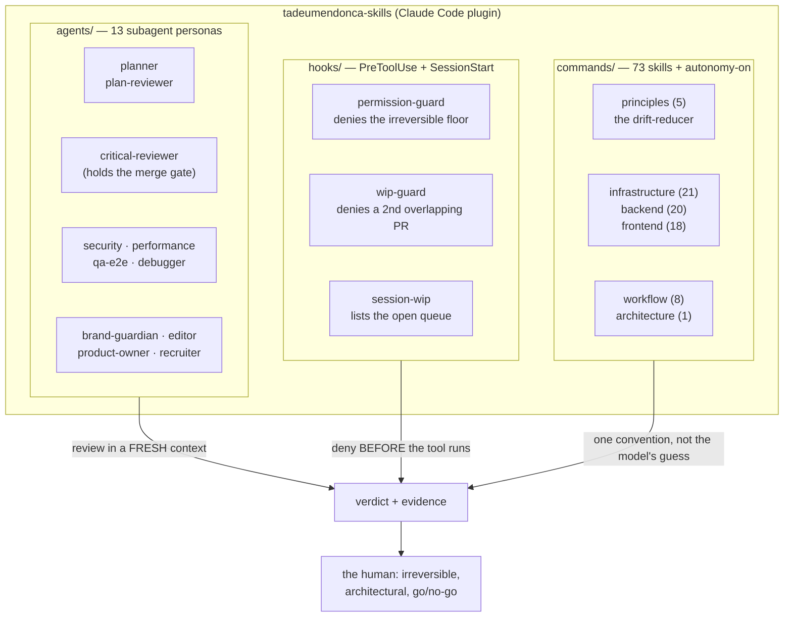

# tadeumendonca-skills

> A **Claude Code harness**: the personas, permission hooks and skill library that make an agent's
> work reviewable — so "the agent finished" and "the work is done" stop being the same claim.

Treating the development loop itself as the thing you engineer — its gates, its guardrails, its
review — rather than just working faster inside an unchanged one. The author's CV calls that
**AI-DLC & Agent Harness Engineering**; this repo is it, packaged so it runs somewhere other than his own
machine. Install it into a repo and Claude gains a dev-loop with gates
in it: a reviewer that verifies a merge request against a Definition of Done, a hook that
mechanically refuses irreversible actions, and 73 skills that hand the model one set of conventions
to follow instead of whatever it would have reached for that session.

The loop is not a proposal — it builds and ships
[tadeumendonca.io](https://tadeumendonca.io), whose repo
([`tadeumendonca-io`](https://github.com/tedeuxx/tadeumendonca-io)) is public alongside this one: a
live deployed site with a blocking CI matrix, a decision library recording each load-bearing choice
and what it cost, and hooks carrying their own test suites. **The library is wider than that one
site proves**, which is the honest scope and is spelled out under [Limitation](#limitation).

## The problem

Agentic development produces plausible work fast. The bottleneck moves: it is no longer *writing* the
code, it is *trusting* it. And "trust" defaults to a human reading every diff, which puts the human
back on the critical path the agent was supposed to clear.

Three failures cause most of that, and none is fixed by prompting harder.

**The agent's own report is the only evidence.** It says the tests pass. Asked whether the work is
done, the same context that produced the code judges the code — so a missed edge case is missed
twice, confidently.

**The floor is advice, not a floor.** "Don't force-push", "don't `terraform apply` locally", "ask
before merging" live in a prompt, which means they hold until the context is long, the task is
urgent, or the instruction scrolls out of the window.

**Every session re-decides the same questions.** How this project names things, which library it
already chose, why the last person rejected the obvious approach — none of that survives a new
context, so the model answers from the average of everything it has read. The result is code that is
individually reasonable and collectively inconsistent, and the inconsistency compounds silently.

## How it works

The pattern is **agent-led verification, human-residual**: the agent proves *done* with mechanical
gates and real evidence; the human keeps the judgment that is genuinely theirs — the irreversible
call, the architectural one, the production go/no-go. One mechanism per failure above, in order —
**personas** answer the self-report problem, **hooks** answer the advisory-floor problem, **skills**
answer the re-decision problem — and they are deliberately different in kind, because a guarantee
that is only as strong as the model's attention is not the same kind of thing as one that is a shell
script. Each says below what it costs.



**Subagent personas review in a fresh context, which is the whole point.** A `critical-reviewer`
spawned to judge a merge request has not read the conversation that produced it, so it has no
authorship bias to overcome and no memory of why a shortcut felt reasonable at the time. It verifies
each criterion against the repo and returns a verdict with citations. `security`, `performance`,
`qa-e2e`, `brand-guardian` and `editor` are lenses over the same diff; `planner` and `plan-reviewer`
do the equivalent at design time, before code exists to be attached to.

- **Choice:** a separate agent per concern, over one reviewer with a long checklist. A checklist item
  competes for attention with every other item; an agent whose entire task is the security lens
  spends its whole context there. **The cost is tokens** — a five-lens review is five inference
  passes over the same diff, and on a small change that is real overhead you are choosing to pay.

**Hooks are mechanical, and that is a different kind of guarantee.** `permission-guard` runs as
`PreToolUse` on every `Bash` call and returns a deny *before* the command executes — force-push,
`terraform apply`, `rm -rf`, secret writes. A long context cannot argue it down, because it is not
reasoning: it is a shell script matching a command.

`wip-guard` refuses to open a pull request that touches files an open one already touches. **The
bound is file overlap, not a count**, and that is a narrowing the hook made on measured evidence: it
used to allow one open PR per repo, which blocked disjoint slices — the common case — while doing
nothing about the actual risk, which is two PRs that will conflict on merge. Its own header records
the measurement.

- **Choice:** a hook over an instruction. An instruction degrades with context length and pressure;
  a hook does not degrade at all. **The cost is that it errs in both directions, and only one of them
  is loud.** It matches patterns rather than intent, so it will sometimes deny something legitimate —
  that you find out immediately, and the fix is arguing with a regex. It also **fails open**: on a
  parse error, a missing `gh`, or no network, it allows rather than blocks, and there are deliberate
  uncovered paths (a raw `gh api` call reaching the same endpoint as a gated command is an accepted,
  named gap, not an oversight). Those you do not find out about at all. They are booked in the hook
  sources with their reasons, which is the honest form: a guardrail that tells you what it does not
  catch is worth more than one asserting it catches everything.

**Skills carry the conventions so the model does not re-invent them.** 73 markdown skills, generic by
construction (`<project>` / `<apex-domain>` placeholders), covering the AWS services, the frontend
stack, the CI/CD wiring and the engineering principles. Each states *the choice and its trade-off*,
not just the rule — because a rule without its reason is one the next session will "improve".

- **Choice:** skills in the repo over knowledge in the model. The model's default is a reasonable
  average of the internet; a skill is one opinion, held consistently, that you can read and disagree
  with. **The cost is maintenance** — a skill that drifts from the code is worse than no skill, since
  it is confidently wrong rather than absent.

## Stack

Markdown skill definitions · POSIX shell hooks (`bash`, `jq`) · Claude Code plugin + marketplace
manifests · GitHub Actions for its own gates. **No runtime, no package to install, no service.** The
plugin *is* the git repo; the marketplace is a metadata file the consumer points at.

## Prerequisites

**[Claude Code](https://claude.ai/code)**, which needs paid access — there is no free tier. That is
the barrier, and it belongs before step one rather than at step four. No plan list and no price
appear here on purpose: an enumeration of access routes would silently exclude the ones it forgot,
and any price written here would go stale. The link carries the current answer.

**`bash` and [`jq`](https://jqlang.github.io/jq/)** — the hooks are shell scripts and parse tool
input as JSON. Both are present or one `brew`/`apt` install away on macOS and Linux.

**[`gh`](https://cli.github.com/), and this one degrades quietly.** `wip-guard` and `session-wip`
read the open PR queue through it, and both **exit clean when it is missing** rather than erroring —
so without `gh` you get no warning, no failure, and no WIP guard. Named here at full weight because a
guard that silently is not running is worse than one you know you skipped.

**A git repo to install it into.** The loop is about pull requests, so the value lands in a repo with
a remote.

### What it does *not* require

Worth stating plainly, because this repo is presented alongside
[`tadeumendonca-io`](https://github.com/tedeuxx/tadeumendonca-io) and that one's costs do not carry
over: **no AWS account, no cloud account of any kind, no domain, no Terraform Cloud, no CI
subscription, nothing to deploy.** Several skills *describe* AWS infrastructure; none of them provision
any. This half of the stack is free apart from the Claude subscription, and it works on a local repo
that never leaves your machine.

## Run it

```bash
claude plugin marketplace add tedeuxx/tadeumendonca-skills
claude plugin install tadeumendonca-skills@tadeumendonca
```

Or interactively, inside Claude Code: `/plugin marketplace add tedeuxx/tadeumendonca-skills`, then
`/plugin install`.

**To share it with everyone on a repo**, commit `.claude/settings.json` so each dev and CI run picks
it up on trusting the folder:

```json
{
  "extraKnownMarketplaces": {
    "tadeumendonca": { "source": { "source": "github", "repo": "tedeuxx/tadeumendonca-skills" } }
  },
  "enabledPlugins": { "tadeumendonca-skills@tadeumendonca": true }
}
```

That tracks `main`. **Pin a release** by adding `"ref": "vX.Y.Z"` to the marketplace `source`, taking
the tag from [the releases page](https://github.com/tedeuxx/tadeumendonca-skills/releases) — every
`vX.Y.Z` tag is cut by the release workflow and never mid-development, so any tag is a safe pin. The
`ref` is the lockfile.

Invoke a skill by its namespaced path, passing context as arguments:

```
/tadeumendonca-skills:infrastructure/cognito staging
/tadeumendonca-skills:workflow/github-actions production
```

**Hooks activate on install. Personas do not run themselves** — every one of them, the reviewer
included, has to be dispatched by something.

What the hooks buy you is the converse, and it is the stronger half: `permission-guard` denies
`gh pr merge` to every context except the `critical-reviewer` subagent. So the reviewer will not
start itself, but a merge **cannot happen without it** — the gate is unskippable from the moment you
install, with no configuration. (Subject to the fail-open caveat above: the natural command is
gated, the raw API call is a named gap.)

[`CLAUDE.md`](./CLAUDE.md) is the full command reference and the versioning contract.
[`PRINCIPLES.md`](./PRINCIPLES.md) is the engineering floor the whole library encodes.

## Limitation

**It is calibrated to one loop, one stack and one person's judgment**, and the library is broader
than the code it is proven against. Much of `infrastructure/` and most of `backend/` describe
patterns the consuming site *no longer runs* — it retired its backend and is now fully static. Those
are reference patterns, and a reference pattern is the thing that rots without a build failing: read
them as documented opinions, not as descriptions of running systems.

**How to tell which is which, rather than guessing per file — two places to look, because a skill
can be exercised in two ways.** What
[`iac/`](https://github.com/tedeuxx/tadeumendonca-io/tree/main/iac) provisions is exercised on every
deploy. What
[`apps/fed/scripts/`](https://github.com/tedeuxx/tadeumendonca-io/tree/main/apps/fed/scripts) runs is
exercised on every build — and that second half matters, because an infrastructure-only test gets it
backwards for real skills. Prerendering and OG-card generation are `backend/` skills running in
production right now, despite the site having no backend; nothing in `iac/` provisions them.

**No further examples, and the reason is worth more than the examples were.** Three were drafted for
this paragraph while it was being reviewed and one was wrong each time — most recently a `backend/`
edge-handler skill named as live, when it documents a Lambda for the retired API and the thing
actually running at the edge is a CloudFront Function that `iac/` provisions, inverting both halves
of the claim. The test generalises; hand-picked examples of it do not, and this is a document arguing
that its claims are checkable in thirty seconds. So the two directories are the answer — **check
them, not this paragraph.** The serverless, data-store and API skills are the bulk of what you will
find is reference.

The narrower version of the same point: the trunk-based single-environment loop, the AWS choices and
the React/Vite conventions are one context's answers. **Take the pattern, not the specifics.**

## Related

- **[tadeumendonca-io](https://github.com/tedeuxx/tadeumendonca-io)** — the site this plugin is
  consumed by, and the worked example of the loop. Its `docs/adr/` is the decision library.
- [tadeumendonca.io/en/architecture](https://tadeumendonca.io/en/architecture) — how the two fit together.
- [LinkedIn](https://www.linkedin.com/in/luiz-tadeu-mendonca-83a16530/) · [GitHub](https://github.com/tedeuxx)

