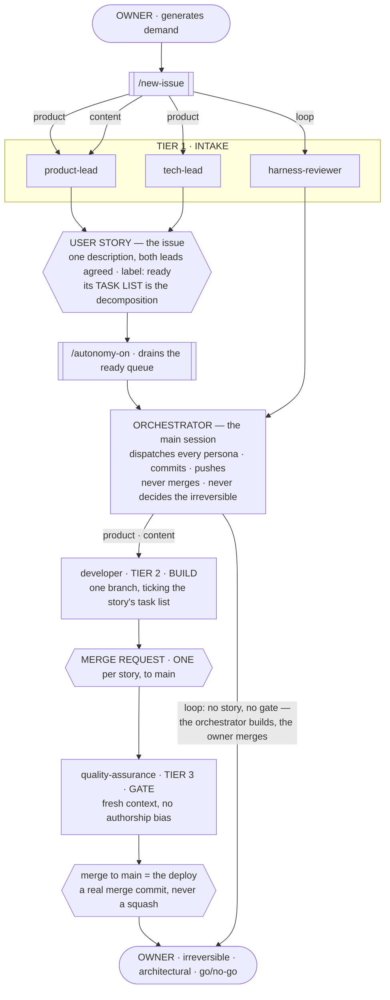
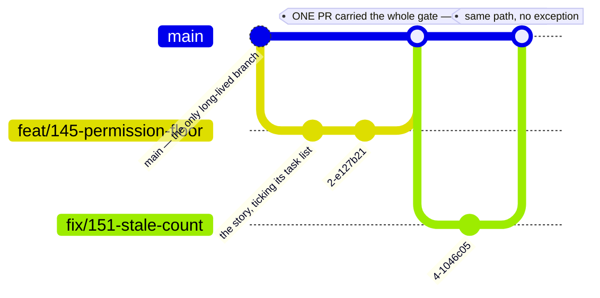
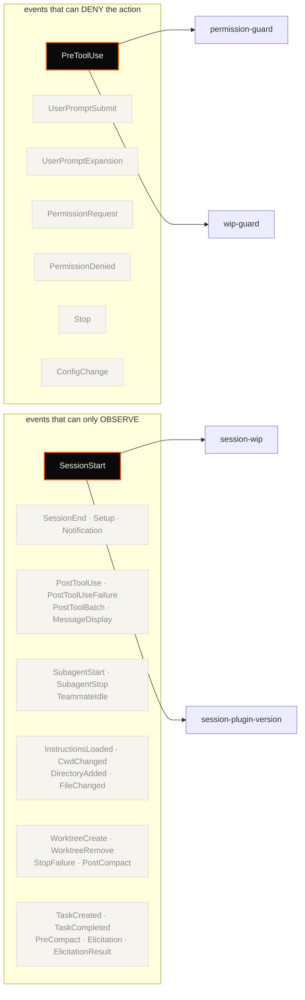

# tadeumendonca-skills

> A **Claude Code harness configuration**: the personas, permission hooks and skill library that make
> an agent's work reviewable — so "the agent finished" and "the work is done" stop being the same claim.

Treating the development loop itself as the thing you engineer — its gates, its guardrails, its
review — rather than just working faster inside an unchanged one. The author's CV calls that
**AI-DLC & Agent Harness Engineering**; this repo is it, packaged so it runs somewhere other than his own
machine. Install it into a repo and Claude gains a dev-loop with gates
in it: a reviewer that verifies a merge request against a Definition of Done, a hook that
mechanically refuses irreversible actions, and 73 skills that hand the model one set of conventions
to follow instead of whatever it would have reached for that session.

The loop is not a proposal — it builds and ships
[tadeumendonca.io](https://tadeumendonca.io), whose repo
([`tadeumendonca-io`](https://github.com/tedeuxx/tadeumendonca-io)) is public alongside this one: a
live deployed site with a blocking CI matrix, a decision library recording each load-bearing choice
and what it cost, and hooks carrying their own test suites. **The library is wider than that one
site proves**, which is the honest scope and is spelled out under [Limitation](#limitation).

## The problem

Agentic development produces plausible work fast. The bottleneck moves: it is no longer *writing* the
code, it is *trusting* it. And "trust" defaults to a human reading every diff, which puts the human
back on the critical path the agent was supposed to clear.

Three failures cause most of that, and none is fixed by prompting harder.

**The agent's own report is the only evidence.** It says the tests pass. Asked whether the work is
done, the same context that produced the code judges the code — so a missed edge case is missed
twice, confidently.

**The floor is advice, not a floor.** "Don't force-push", "don't `terraform apply` locally", "ask
before merging" live in a prompt, which means they hold until the context is long, the task is
urgent, or the instruction scrolls out of the window.

**Every session re-decides the same questions.** How this project names things, which library it
already chose, why the last person rejected the obvious approach — none of that survives a new
context, so the model answers from the average of everything it has read. The result is code that is
individually reasonable and collectively inconsistent, and the inconsistency compounds silently.

## How it works

The pattern is **agent-led verification, human-residual**: the agent proves *done* with mechanical
gates and real evidence; the human keeps the judgment that is genuinely theirs — the irreversible
call, the architectural one, the production go/no-go. One mechanism per failure above, in order —
**personas** answer the self-report problem, **hooks** answer the advisory-floor problem, **skills**
answer the re-decision problem — and they are deliberately different in kind, because a guarantee
that is only as strong as the model's attention is not the same kind of thing as one that is a shell
script. Each says below what it costs.

## The engineering floor the whole library encodes

The personas, hooks and skills are mechanisms. This is what they are mechanisms *for*.

**Two tiers, and the difference between them is the discipline.**

**The non-negotiable floor never bends to risk:** the quality gate (tests, coverage, lint, typecheck,
review), a regression suite covering the implemented features, observability, and security by-design.
Stated as **properties** — which suites and which telemetry satisfy them is read from the repo, never
assumed.

**Calibrated judgment scales to blast-radius:** planning depth, threat-model depth, abstraction, when to
ask. Heavy where a mistake is irreversible; product-speed where it is cheap to revert.

The eleven principles:

1. **Plan-first** — design and align before coding.
2. **Ask on the boundaries** — architecture, contracts, anything irreversible. In-pattern implementation
   is decided autonomously, and no architectural call is made alone.
3. **Thin vertical slices, bounded by file overlap** — a second slice may start if it touches no file an
   open one touches. Overlap rather than a count, because counting blocks disjoint work while doing
   nothing about the real risk.
4. **Surgical changes, tracked debt** — work around adjacent mess and file it.
5. **Simple but extensible** — an abstraction must pay for itself.
6. **No dogma** — honour a platform's conventions as its context.
7. **Rigor calibrated to blast-radius** — the dial. The floor is what it never turns below.
8. **Quality is a gate** — tests, coverage, regression, lint, typecheck, review.
9. **Observability is part of done** — provable where it runs, and smoke after deploy.
10. **Security and resilience by-design** — least privilege, idempotency, fail-fast, retries.
11. **Living docs** — diagrams and decisions kept current.

### Permissions

**Pre-authorize the inner loop**, which is git-reversible. **Deny the irreversible boundary** —
`terraform apply`/`destroy`, direct cloud mutation, force-push, `rm -rf`, secret writes — and gate at the
repo's point of no return. Never `--dangerously-skip-permissions`.

**Permissions are a versioned repo contract**: the committed `settings.json`, never the gitignored local
overlay. A prohibition that lives only in an unreviewed local file is one "allow always" click from
being gone.

**Control comes from reversibility, mechanical gates and the deny boundary — not from interrupting you.**

## The roster, and what each tier holds

`agents/` holds **5 subagent personas** — three tiers, the owner at both ends, and the work units they
hand each other.



**The edge label is the routing rule.** A `product` issue is closed by the two leads that disagree by
design; `content` is the owner's voice, so only the lens that holds it takes part; `loop` changes how
work is decided, and there the owner is both the lead and the gate — which is why that path never
reaches tier 3.

**The work units are where the handoffs happen.** The leads converge on one user story; `ready` is what
makes it executable. The gate reviews a merge request, not a task list.

**No persona talks to another persona** — every dispatch goes through the orchestrator. It is drawn once,
where its own act is distinct, because drawing every edge would make the picture unreadable.

**The `loop` path is shorter on purpose.** A product slice passes three independent readings between build
and merge; a loop change passes none — the orchestrator builds and the owner merges. Drawn, so it can be
judged.

| persona | tier | what it holds |
|---|---|---|
| **product-lead** | 1 · intake | what to build and why · the reader · the market · the copy lens |
| **tech-lead** | 1 · intake | architecture direction · sequencing · **the only writer of the ADRs** |
| **harness-reviewer** | 1 · intake | the machinery — the scenarios a harness proposal misses, before it is built |
| **developer** | 2 · build | the slice end to end — app, infrastructure and pipeline |
| **quality-assurance** | 3 · gate | the Definition of Done, **and** whether this can cause a problem in production · **holds the merge** |

**The owner appears twice on purpose** — *human-residual* is where the loop opens and where the
undelegatable part comes back. **`harness-reviewer` sits in tier 1** because a harness proposal is closed
the same way a story is: before anything is built.

**A fresh context is the whole point.** The gate has not read the conversation that produced the work, so
it has no authorship bias and no memory of why a shortcut felt reasonable. It verifies each criterion
against the repo and cites what it found.

**Choice: a persona exists for one of four reasons, and "someone should be arguing with someone" is only
the first.**

- **Disagreement is wanted** — two roles pointing opposite ways produce information a single view cannot.
- **A fresh context is wanted** — the reviewer has not read the conversation that produced the work, so
  it has no authorship bias and no memory of why a shortcut felt reasonable.
- **The context window is the constraint** — a review that would not fit beside the work runs beside
  nothing, in its own window, and returns a verdict instead of a transcript.
- **The capability should be smaller** — a role can be denied what the orchestrator holds. That is a
  boundary a shell hook can enforce, where an instruction only asks.

A persona that satisfies none of the four is a handoff, and **a persona that is never invoked is a
document.**

- **Cost:** every persona is another result to reconcile on the same merge request.
- **Cost:** fewer personas means fewer capability boundaries — separate specialists cannot edit each
  other's files, one builder can, and a guarantee becomes discipline.
- **Cost:** a broader persona's checklist is longer, and every item competes with every other.
- **Counter-evidence for the narrow design:** specialised lenses spent their best findings outside their
  own lanes. The specialisation was not what made them useful — the fresh context was.

### What the model buys, and what it costs

**Buys**

- **Disagreement is information.** Two roles grading the same change from different angles catch
  different things — measured here: one graded the exposure and called it advisory, the other graded the
  record and blocked. Both were right about different objects.
- **A fresh context has no authorship bias.** The reviewer has not read the conversation that produced
  the work, so a shortcut that felt reasonable at the time reads as a shortcut.
- **Reviews that would not fit run anyway.** Each persona has its own window, so depth on the review does
  not compete with room for the work.
- **Capability boundaries are enforceable.** A role can be denied what the orchestrator holds, and a hook
  enforces that where an instruction only asks.

**Costs**

- **Reconciliation overhead, and it scales with the roster.** Every persona is another verdict to weigh
  on the same merge request, and the orchestrator does the weighing. This is the cost that folded two
  gatekeepers into one.
- **The orchestrator is a relay, and relays distort.** A verdict reaches the owner through a summary
  someone wrote — which is why gatekeeper verdicts are posted as artifacts on the pull request, and why
  approvals and ratifications are read from the artifact rather than from the relay.
- **Nothing enforces a dispatch.** No check, job or hook requires that a lens ran, so an undispatched
  lens fails silently and looks identical to a clean one.
- **Personas can run on a stale brief.** A merged change to a persona does not reach a session until the
  installed build catches up, and a subagent cannot see the notice that says so.
- **Work no brief claims runs the default path anyway.** Nothing detects *"this is not my kind of work"* —
  a persona dispatched outside its mandate reviews competently against the wrong criteria and returns
  findings that are true and irrelevant. Measured here: a harness reconfiguration ran through the product
  delivery line for eleven rounds. Every round found something real, because with no user story there was
  nothing else left to measure against but the record itself. **The issue type on the routing edges is
  the fix, and it only works because something reads it.**
- **Changing the harness is itself engineering, and for a long time nobody owned it.** Second-order
  effects of a configuration change are invisible from inside the change — a deny written for a tool no
  hook can see, a glob scoped to the wrong root, a persona left running a brief that predates the merge
  it is reviewing. Each was found by accident, after implementation, and each cost review rounds in
  tokens and wall-clock. `harness-reviewer` exists to move that discovery **before** the build, and its
  standing rule is the one that decides whether it is worth dispatching: **every scenario ships with how
  to verify it, or is labelled a hypothesis.** A persona that speculates about a harness produces twenty
  plausible failure modes and no way to sort them.
- **Review does not converge on its own.** Fixing a finding writes a record, and the record is reviewable
  — so each round creates surface for the next. Without a stopping rule that is a decision rather than a
  judgement, a slice can stay in review while the queue behind it stands still.

**Which gives the rule for where a persona may be added: sparingly, and almost never a second one in the
same tier.** Reconciliation cost is paid *within* a tier — two roles judging the same thing at the same
moment produce two verdicts someone has to weigh. Across tiers it is not paid at all, because each tier
hands the next a finished artifact rather than an opinion.

So the tiers here hold one persona each, except intake, where the second exists because **disagreement
between product and system is the point** — and where the third, on the machinery, never runs on the same
work as the other two.

## The skill library, and who wields each family

**Skills carry the conventions so the model does not re-invent them.** **73 skills + autonomy-on** and
`new-issue`, generic by construction (`<project>` / `<apex-domain>` placeholders), covering the AWS
services, the frontend stack, the CI/CD wiring and the engineering principles. Each states *the choice
and its trade-off*, not just the rule — because a rule without its reason is one the next session will
"improve".

**They are not shared evenly, and at family granularity the allocation cannot even be stated truthfully** — one skill is wielded by a different persona than the rest of its family, which is a fact about that skill rather than about the family. So this is one table, the family is a column, and **each description is the skill's own first line rather than a paraphrase of it.**

The library, by family: backend (20), frontend (18), infrastructure (21), principles (5), workflow (9).

| skill | what it decides | family | wielded by |
|---|---|---|---|
| `action-types` | Define or review action types (audit + RBAC + feature toggles) in `apps/bff`. | `backend` | `developer` |
| `audit-middleware` | Define or review the audit trail in `apps/bff`. | `backend` | `developer` |
| `bff` | Implement or review the Backend-for-Frontend (BFF) pattern. | `backend` | `developer` |
| `coverage` | Set up or review the backend (`apps/bff`) quality, test, and security gates. | `backend` | `developer` |
| `dynamodb` | Connect to and access DynamoDB in `apps/bff`. | `backend` | `developer` |
| `environment-config` | Configure and validate backend environments in `apps/bff`. | `backend` | `developer` |
| `error-handling` | Implement or review HTTP error handling in `apps/bff`. | `backend` | `developer` |
| `framework-hono` | Implement or review the Hono backend framework for `apps/bff` (the BFF). | `backend` | `developer` |
| `lambda-handler` | Implement a domain module in the BFF (`apps/bff`). | `backend` | `developer` |
| `logging` | Implement or review structured logging in `apps/bff`. | `backend` | `developer` |
| `metrics` | Implement or review metrics in `apps/bff` (Powertools Metrics → EMF → CloudWatch). | `backend` | `developer` |
| `notifications` | Implement or review notifications (email via SES) in `apps/bff`. | `backend` | `developer` |
| `og-edge-handler` | Implement or update the og-edge Lambda@Edge handler. **It lives in `<project>-pwa/iac`** (`iac/lambda-src/og-edge/index.js`), not `apps/bff` — see… | `backend` | `developer` |
| `og-image-generator` | Implement or update the OG image generator — a module of the BFF (`apps/bff/src/modules/og-image/`). | `backend` | `developer` |
| `openapi` | Maintain the backend API contract (OpenAPI) — generated, versioned, committed. | `backend` | `developer` |
| `postman` | Use Postman (+ newman) for API testing in `apps/bff`. | `backend` | `developer` |
| `prerender` | Implement or review the bot-rendering API (og-meta + prerender) in `apps/bff`. | `backend` | `developer` |
| `redis-cache` | Implement or review backend caching with Redis (ElastiCache) in `apps/bff`. Redis is VPC-only, so enabling it puts the BFF in-VPC (it is non-VPC… | `backend` | `developer` |
| `secrets-management` | Fetch sensitive backend values from AWS Secrets Manager in `apps/bff`. | `backend` | `developer` |
| `tracing` | Implement or review distributed tracing in `apps/bff`. | `backend` | `developer` |
| `analytics` | Frontend analytics (GA4) in `apps/fed` (concept). | `frontend` | `developer` |
| `api-client` | SPA → BFF API calls in `apps/fed` (concept). | `frontend` | `developer` |
| `authentication` | SPA authentication in `apps/fed` (concept). | `frontend` | `developer` |
| `authorization` | SPA authorization / UI gating in `apps/fed` (concept). | `frontend` | `developer` |
| `cloudwatch-rum` | Frontend real-user monitoring (CloudWatch RUM) in `apps/fed` (concept). | `frontend` | `developer` |
| `coverage` | Set up or review the frontend (`apps/fed`) quality, test, and security gates. | `frontend` | `developer` |
| `design-system` | Design system (custom Tailwind, no component library) — which pattern for each UI need. | `frontend` | `developer` |
| `environment-config` | Frontend environment config in `apps/fed` (concept). | `frontend` | `developer` |
| `forms` | Implement or review forms in `apps/fed` (admin compose). | `frontend` | `developer` |
| `framework-react` | Implement or review the React frontend framework for `apps/fed`. | `frontend` | `developer` |
| `markdown` | Render article markdown in `apps/fed` (concept). | `frontend` | `developer` |
| `pagination` | Cursor pagination in `apps/fed` (concept). | `frontend` | `developer` |
| `playwright` | Use Playwright for E2E tests in `apps/fed`. | `frontend` | `developer` |
| `routing` | Frontend routing in `apps/fed` (concept). | `frontend` | `developer` |
| `seo` | Frontend SEO in `apps/fed` (concept, no SSR). | `frontend` | `developer` |
| `state` | Frontend state management in `apps/fed` (concept). | `frontend` | `developer` |
| `storybook` | Build the component library with Storybook in `apps/fed`. | `frontend` | `developer` |
| `ux-states` | Loading / empty / error UX states in `apps/fed` (concept). | `frontend` | `developer` |
| `acm` | Use AWS Certificate Manager (ACM) in <project> infrastructure. | `infrastructure` | `developer` |
| `api-gateway` | Use API Gateway (REST API, v1) in <project> infrastructure. | `infrastructure` | `developer` |
| `cloudfront` | Use CloudFront in <project> infrastructure (incl. the SPA distribution). | `infrastructure` | `developer` |
| `cloudwatch-rum` | Provision CloudWatch RUM (app monitor) in <project>-iac. | `infrastructure` | `developer` |
| `cloudwatch-xray` | Use AWS X-Ray in <project> infrastructure (distributed tracing service). | `infrastructure` | `developer` |
| `cloudwatch` | Use Amazon CloudWatch in <project> infrastructure. | `infrastructure` | `developer` |
| `cognito` | Use Amazon Cognito in <project> infrastructure. | `infrastructure` | `developer` |
| `dynamodb` | Provision or review the DynamoDB tables (data.tf) in <project>-iac. | `infrastructure` | `developer` |
| `elasticache` | Provision or review the ElastiCache for Redis cluster (cache.tf) in `<project>-pwa/iac`. | `infrastructure` | `developer` |
| `iam` | Author or review any IAM role/policy in <project> infrastructure. | `infrastructure` | `developer` |
| `kms` | Apply the encryption + KMS key policy across <project>-iac. | `infrastructure` | `developer` |
| `lambda` | Use AWS Lambda in <project> infrastructure. | `infrastructure` | `developer` |
| `route53` | Use Amazon Route53 in <project> infrastructure (DNS records + the per-env domain model). | `infrastructure` | `developer` |
| `s3` | Provision or review the S3 buckets (storage.tf) in <project>-iac. | `infrastructure` | `developer` |
| `secrets-manager` | Provision secrets in AWS Secrets Manager (<project> infrastructure). | `infrastructure` | `developer` |
| `ses` | Provision or review SES (domain verification + DKIM) in <project>-iac (auth.tf). | `infrastructure` | `developer` |
| `sns` | Use Amazon SNS in <project> infrastructure (async domain events). | `infrastructure` | `developer` |
| `ssm` | Use AWS SSM Parameter Store in <project> infrastructure (the cross-repo config bus). | `infrastructure` | `developer` |
| `terraform` | Use Terraform in <project> infrastructure (how we use it as a whole). | `infrastructure` | `developer` |
| `vpc` | Implement or review the VPC and networking layer (vpc.tf) in <project>-iac. | `infrastructure` | `developer` |
| `waf` | Implement or review the WAF WebACLs (CLOUDFRONT + REGIONAL) across the two repos that own them. | `infrastructure` | `developer` |
| `dev-loop` | Apply the platform's end-to-end development loop in a `<project>` repo. This is the flow the principles run inside —… | `principles` | `product-lead` · `tech-lead` · `harness-reviewer` · `quality-assurance` |
| `engineering-philosophy` | Apply these engineering principles — the owner's way of building software — in any <project> repo. They shape every decision an agent makes here.… | `principles` | `product-lead` · `tech-lead` · `harness-reviewer` · `quality-assurance` |
| `loop-engineering` | Name and practice the discipline this whole plugin exists to run: **Agent Harness Engineering** (the owner's term for how he works; also… | `principles` | `product-lead` · `tech-lead` · `harness-reviewer` · `quality-assurance` |
| `permissions-and-environments` | Apply the platform's environment and permission model in any `<project>` repo — both at the global Claude Code level and per-project. This is the… | `principles` | `product-lead` · `tech-lead` · `harness-reviewer` · `quality-assurance` |
| `verification-and-gates` | Apply the platform's verification model and deploy gates in any `<project>` repo. This defines what "done" means and the mechanical gates that… | `principles` | `product-lead` · `tech-lead` · `harness-reviewer` · `quality-assurance` |
| `adr` | Author or review an Architecture Decision Record (ADR) for any `<project>` repo, following the platform's ADR practice. | `workflow` | `tech-lead` — the only writer of the ADRs |
| `claude-code` | Set up or review the Claude Code GitHub App automation in a <project> repo. | `workflow` | `developer` |
| `code-review` | Review your own slice for COMPLETENESS before opening the merge request. Author-side, run by `developer`, and distinct from the gatekeeper's… | `workflow` | `developer` |
| `documentation-standard` | Write or review docs for any <project> repo following the documentation standard. | `workflow` | `developer` |
| `github-actions` | Use GitHub for <project> repos — the CI/CD capability (Actions, branching + versioning, deploys, issues). Branching comes in **two models** — see… | `workflow` | `developer` |
| `license` | Apply the repository licensing standard in any <project> repo. | `workflow` | `developer` |
| `sonarcloud` | Use SonarCloud in <project> repos (code quality + security scan). | `workflow` | `developer` |
| `terraform-cloud` | Use Terraform Cloud (TFC) in <project> infrastructure (state backend). | `workflow` | `developer` |
| `versioning` | Apply the semantic-versioning + tagging rules (bump-my-version) in any <project> repo. | `workflow` | `developer` |

**Three things the table shows rather than asserts.** The builder is the only persona wielding a build
family — conventions exist for building, and one persona builds. `workflow` is the only family that
splits, and it splits for a reason: `adr` belongs to the only writer of the records. And the gate wields
`principles` and nothing else, because its questions are answered from the diff and the running system,
not from this repo's conventions.

**Choice: one convention per question, over the model's best guess each session.**

- **Cost:** a convention that is wrong is now wrong everywhere, consistently.
- **Cost:** the library is wider than the code it is proven against — see [Limitation](#limitation).

## The lifecycle, and what records each phase

**The user story issue is the spine.** Every phase from intake to deploy leaves its mark on it or one
hop from it, and **none of those marks is prose somebody has to remember to write** — each is a side
effect of the phase actually happening.

| phase | what records it | where |
|---|---|---|
| **intake** | the `ready` label | the issue — the two leads closed its description |
| **decomposition** | the **task list** in the body | the issue, with the progress GitHub renders from it |
| **build** | a linked branch, and `closes #N` | `gh issue develop` on one side, the PR on the other |
| **gate** | the verdict, under its own marker | a comment on the PR, one hop from the issue |
| **deploy** | the merge commit and the `vX.Y.Z` tag | git, and the published release |

**Decomposition lives in the tracker, not in git.** That is the whole reason there are no task branches
below: planning belongs where planning is read, and encoding it in branch names would be a second copy
of something the issue already holds — which is how the two copies start to disagree.

**Two gaps, named rather than implied.** The gate's verdict lives on the pull request, so someone opening
the issue does not see that it was reviewed — one hop away, and probably an acceptable price. And **the
deploy does not come back**: the issue closes on merge and never learns which version shipped it, so
answering *"which release carried this?"* means reading the commit, finding the tag, and crossing them by
hand — three manual steps for a fact the release job already knows at the moment it publishes.

### The decision records are a contract, not documentation

**They anchor context directly in the codebase, which is the third failure at the top of this page.**
A fresh session cannot know why the obvious approach was rejected here, and re-deriving it from the code
is how a model reaches for the average of everything it has read. The skills answer that for
**conventions**; the ADRs answer it for **this repo's own decisions** — and they sit in the repo, next to
what they decided, so an agent finds them by working rather than by being told to look.

**And they are what the personas measure a decision against**, which makes the library an input to the
loop rather than a description of it. `tech-lead` is its **only writer** — the party
that holds architecture decisions is the party that records them — and both the intake leads and the gate
read it: one to check that a proposal does not contradict a decision already taken, the other to check
that what shipped is what was decided.

**So a stale ADR does not merely misinform. It makes the agents enforce a contract that no longer
holds** — and they enforce it confidently, because a record is exactly the kind of evidence a persona is
built to trust. Measured in the batch that produced this section: three records described a two-gatekeeper
model in the present tense after the roster had one, and a comment in a hook asserted that removing a
floor entry *would* break a convention — an instruction to re-introduce a defect, not a stale note.

**Supersede, never rewrite.** A record that is edited in place leaves the next reader unable to tell that
anything changed, and leaves the reader who acted on the old value with no way to learn it moved. Strike
the claim, follow it with what replaced it, and keep the reasoning — the reasoning outlives the rule it
was written for.

**And an ADR that decides *how work is decided* is boundary class**: it goes to the owner, because that
is the one category where an agent amending the record would be amending its own mandate.

## The branch model the loop runs on

**One user story, one branch, one pull request.** The story's tasks are checkboxes on its issue, not
branches — so the branch layer has exactly one level, and the pull request the gate reviews is the unit
that has product meaning.

```
feat/<issue>-<slug>     a user story
fix/ · docs/ · chore/   a standalone slice with no story behind it
hotfix/<issue>-<slug>   multi-env only, and only there
```

The issue number in the name is for a human reading `git branch`; the mechanism does not need it —
**`gh issue develop <n>` creates the branch already linked to its issue**, and GitHub holds that link as
structured data rather than as a naming convention somebody has to honour.

**Two models, differing on exactly one thing: how many stops there are between the merge and
production.** Which one a repo runs is a declaration — its `CLAUDE.md` states it. Failing that, count
deployed environments: more than one is `gitflow-multi-env`, one is `gitflow-single-env`.

Picking wrong is not cosmetic. A multi-environment layout on a single-environment repo creates an
integration branch nothing merges to and **moves the required checks off the PR that actually ships** —
and there is no downstream tier to catch them, so a check moved there is a check that never runs.

### `gitflow-single-env` — the active model

Run by this plugin and by the `-io` site. **One environment, because the product is a static SPA: there
is nothing an extra integration environment would prove.**

**No `develop`, no `release/*`, no `hotfix/*` — everything merges to `main`.** A release branch exists to
carry a third stop and there is no third stop; a hotfix pattern exists to skip a promotion and there is no
promotion to skip. An urgent fix is another short-lived branch taking the same path as everything else.



- **`main` is the only long-lived branch, and it is the *working* branch**, not a protected production
  mirror. Protected as PR-required with **0 approvals**, no force-push and no deletion.
- **The whole gate sits on that PR.** It is the one that ships, so it is where every required check has to
  be green — there is no downstream tier to defer one to.
- **The merge deploys, so the merge is the go/no-go.** Never configure auto-merge into `main`.
- **Real merge commits; squash disabled** — squashing collapses the conventional-commit history the
  categorized release notes are built from.
- **WIP is bounded by file overlap**, not by a count: a second story may start if it touches no file an
  open one touches. Counting blocks disjoint work — the common case — while doing nothing about the real
  risk, which is two changes that will conflict on merge.

### `gitflow-multi-env` — the reference model

For a repo with more than one deployed environment, and **at most two**. **Environment is branch**:
`develop` is paired with staging, `main` with production. **Off here**, and described so the selection
rule has a second option to select.

**Still no `release/*`** — with two environments the promotion `develop → main` *is* the release, and a
branch in between would be a third stop nobody deploys to.

**`hotfix/*` exists here and only here**, because a production fix cannot wait for the `develop → main`
promotion. It cuts from `main` and merges back to both.


**Compare the two pictures rather than the two rule lists.** The story branch above is identical;
everything after its merge is the difference. With two environments the gate is **spread across the
promotion** — staging catches part of it and the production merge the rest, and the point of no return is
the second one. With one environment there is nothing to defer to, so **the whole gate collapses onto a
single PR**, and the merge that carries it is also the deploy.

The depth for both — protection settings, the versioning triggers, the two meanings of "ships" — lives
in `/workflow/github-actions`. This is the pointer, not the copy.

## The hooks, and what they refuse

Claude Code exposes **31 hook events**. This repo wires **two**, and the picture draws all of them so the
unused surface is visible rather than unmentioned — the two in use are filled, the other twenty-nine are
not.

**The split that matters is not used-versus-unused, it is whether an event can deny at all.** A control
placed on an observe-only event looks like enforcement and is not, and that mistake stays invisible until
someone tests it.



| event | when it fires | denies? | hooks wired here | purpose |
|---|---|---|---|---|
| **`PreToolUse`** | before a tool call executes | **yes** | `permission-guard`, `wip-guard` | refuse the irreversible floor and a PR that overlaps an open one, *before* either happens |
| **`SessionStart`** | a session begins or resumes | no | `session-wip`, `session-plugin-version` | inject the open queue, and warn when the installed build is not the merged one |
| `UserPromptSubmit` | a prompt is submitted, before processing | **yes** | — | |
| `UserPromptExpansion` | a typed command expands, before it reaches the model | **yes** | — | |
| `PermissionRequest` | a call needs a permission decision | **yes** | — | |
| `PermissionDenied` | a call is denied by the classifier | **yes** | — | |
| `Stop` | the model finishes responding | **yes** | — | |
| `ConfigChange` | a configuration file changes mid-session | **yes** | — | |
| `PostToolUse` · `PostToolUseFailure` · `PostToolBatch` | after a call succeeds, fails, or a parallel batch resolves | no | — | |
| `SessionEnd` · `Setup` · `Notification` · `MessageDisplay` | session teardown · one-time prep · notification · message render | no | — | |
| `SubagentStart` · `SubagentStop` · `TeammateIdle` | a subagent spawns or finishes · a teammate goes idle | not documented | — | |
| `TaskCreated` · `TaskCompleted` | a task is created or completed | not documented | — | |
| `InstructionsLoaded` · `CwdChanged` · `DirectoryAdded` · `FileChanged` | project rules load · cwd moves · a directory is added · a watched file changes | no | — | |
| `WorktreeCreate` · `WorktreeRemove` | a worktree is created or removed | not documented / no | — | |
| `PreCompact` · `PostCompact` · `StopFailure` | before and after compaction · a turn ends on an API error | not documented / no | — | |
| `Elicitation` · `ElicitationResult` | an MCP server asks for input, and after the answer | not documented | — | |

**"not documented" is the answer, not a gap.** The hooks guide references a per-event blocking table it
does not publish, so nine events have no stated blocking behaviour. Writing *no* there would be a claim
the documentation does not support.

**Two mechanics, measured rather than assumed.** A `matcher` scopes strictly to the tools it names —
`"Bash"` never fires for `Edit` or `Write`, though those are matchable as `"Edit|Write"`. And
`SessionStart`'s injected context reaches the main session but **not a subagent dispatched later**, which
is how a persona ends up running against a brief the session already knows is stale.

**Choice: a hook over an instruction.** An instruction degrades with context length and pressure. A hook
does not degrade at all.

- **Cost:** it errs in both directions, and only one of them is loud. A false deny is visible and
  annoying. A false allow is silent.
- **Cost:** it reads a command string, not intent. Everything it cannot express as a pattern has to live
  in a persona's judgement instead.
- **Cost:** it fails open. Without `jq` it emits no decision at all, which the harness reads as *no
  opinion* — so the session hook warns at startup when that is the case.

`permission-guard` denies the irreversible floor before the command runs. `wip-guard` refuses a pull
request that touches files an open one already touches — the bound is file overlap, not a count, because
counting blocks disjoint work while doing nothing about the real risk. `session-wip` lists the open queue.
`session-plugin-version` says when the installed build is not the merged one.

## Stack

Markdown skill definitions · POSIX shell hooks (`bash`, `jq`) · Claude Code plugin + marketplace
manifests · GitHub Actions for its own gates. **No runtime, no package to install, no service.** The
plugin *is* the git repo; the marketplace is a metadata file the consumer points at.

## Prerequisites

**[Claude Code](https://claude.ai/code)**, which needs paid access — there is no free tier. That is
the barrier, and it belongs before step one rather than at step four. No plan list and no price
appear here on purpose: an enumeration of access routes would silently exclude the ones it forgot,
and any price written here would go stale. The link carries the current answer.

**`bash` and [`jq`](https://jqlang.github.io/jq/)** — the hooks are shell scripts and parse tool
input as JSON. Both are present or one `brew`/`apt` install away on macOS and Linux.

**[`gh`](https://cli.github.com/), and this one degrades quietly.** `wip-guard` and `session-wip`
read the open PR queue through it, and both **exit clean when it is missing** rather than erroring —
so without `gh` you get no warning, no failure, and no WIP guard. Named here at full weight because a
guard that silently is not running is worse than one you know you skipped.

**A git repo to install it into.** The loop is about pull requests, so the value lands in a repo with
a remote.

### What it does *not* require

Worth stating plainly, because this repo is presented alongside
[`tadeumendonca-io`](https://github.com/tedeuxx/tadeumendonca-io) and that one's costs do not carry
over: **no AWS account, no cloud account of any kind, no domain, no Terraform Cloud, no CI
subscription, nothing to deploy.** Several skills *describe* AWS infrastructure; none of them provision
any. This half of the stack is free apart from the Claude subscription, and it works on a local repo
that never leaves your machine.

## Run it

```bash
claude plugin marketplace add tedeuxx/tadeumendonca-skills
claude plugin install tadeumendonca-skills@tadeumendonca
```

Or interactively, inside Claude Code: `/plugin marketplace add tedeuxx/tadeumendonca-skills`, then
`/plugin install`.

**To share it with everyone on a repo**, commit `.claude/settings.json` so each dev and CI run picks
it up on trusting the folder:

```json
{
  "extraKnownMarketplaces": {
    "tadeumendonca": { "source": { "source": "github", "repo": "tedeuxx/tadeumendonca-skills" } }
  },
  "enabledPlugins": { "tadeumendonca-skills@tadeumendonca": true }
}
```

That tracks `main`. **Pin a release** by adding `"ref": "vX.Y.Z"` to the marketplace `source`, taking
the tag from [the releases page](https://github.com/tedeuxx/tadeumendonca-skills/releases) — every
`vX.Y.Z` tag is cut by the release workflow and never mid-development, so any tag is a safe pin. The
`ref` is the lockfile.

Invoke a skill by its namespaced path, passing context as arguments:

```
/tadeumendonca-skills:infrastructure/cognito staging
/tadeumendonca-skills:workflow/github-actions production
```

**Hooks activate on install. Personas do not run themselves** — every one of them, the reviewer
included, has to be dispatched by something.

What the hooks buy you is the converse, and it is the stronger half: `permission-guard` denies
`gh pr merge` to every context except the `quality-assurance` subagent. So the reviewer will not
start itself, but a merge **cannot happen without it** — the gate is unskippable from the moment you
install, with no configuration. (Subject to the fail-open caveat above: the natural command is
gated, the raw API call is a named gap.)

[`CLAUDE.md`](./CLAUDE.md) is the full command reference and the versioning contract. The engineering
floor lives [above](#the-engineering-floor-the-whole-library-encodes) rather than in a file of its own —
a floor behind a click is a floor nobody reads.

## Limitation

**It is calibrated to one loop, one stack and one person's judgment**, and the library is broader
than the code it is proven against. Much of `infrastructure/` and most of `backend/` describe
patterns the consuming site *no longer runs* — it retired its backend and is now fully static. Those
are reference patterns, and a reference pattern is the thing that rots without a build failing: read
them as documented opinions, not as descriptions of running systems.

**How to tell which is which, rather than guessing per file — two places to look, because a skill
can be exercised in two ways.** What
[`iac/`](https://github.com/tedeuxx/tadeumendonca-io/tree/main/iac) provisions is exercised on every
deploy. What
[`apps/fed/scripts/`](https://github.com/tedeuxx/tadeumendonca-io/tree/main/apps/fed/scripts) runs is
exercised on every build — and that second half matters, because an infrastructure-only test gets it
backwards for real skills. Prerendering and OG-card generation are `backend/` skills running in
production right now, despite the site having no backend; nothing in `iac/` provisions them.

**No further examples, and the reason is worth more than the examples were.** Three were drafted for
this paragraph while it was being reviewed and one was wrong each time — most recently a `backend/`
edge-handler skill named as live, when it documents a Lambda for the retired API and the thing
actually running at the edge is a CloudFront Function that `iac/` provisions, inverting both halves
of the claim. The test generalises; hand-picked examples of it do not, and this is a document arguing
that its claims are checkable in thirty seconds. So the two directories are the answer — **check
them, not this paragraph.** The serverless, data-store and API skills are the bulk of what you will
find is reference.

The narrower version of the same point: the trunk-based single-environment loop, the AWS choices and
the React/Vite conventions are one context's answers. **Take the pattern, not the specifics.**

## Related

- **[tadeumendonca-io](https://github.com/tedeuxx/tadeumendonca-io)** — the site this plugin is
  consumed by, and the worked example of the loop. Its `docs/adr/` is the decision library.
- [tadeumendonca.io/en/architecture](https://tadeumendonca.io/en/architecture) — how the two fit together.
- [LinkedIn](https://www.linkedin.com/in/luiz-tadeu-mendonca-83a16530/) · [GitHub](https://github.com/tedeuxx)

