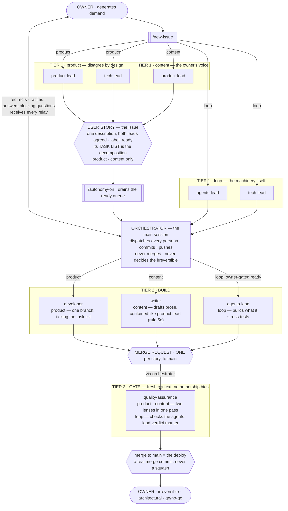
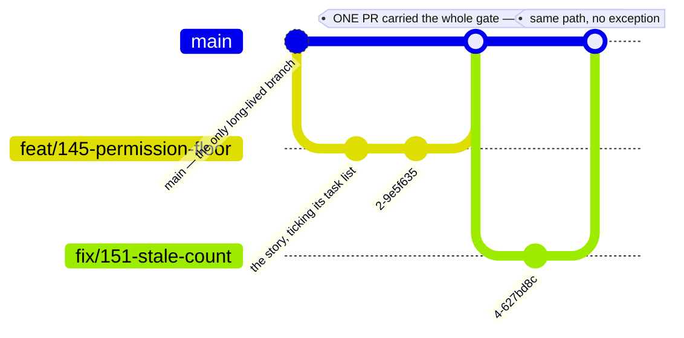
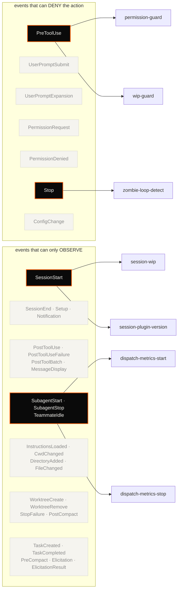
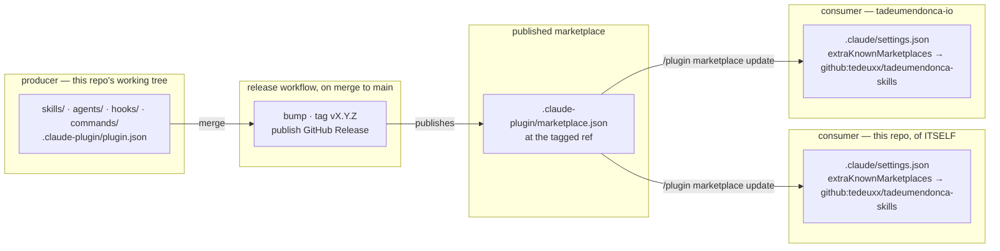

# tadeumendonca-skills

> A **Claude Code harness configuration**: the personas, permission hooks and skill library that make
> an agent's work reviewable — so "the agent finished" and "the work is done" stop being the same claim.

Treating the development loop itself as the thing you engineer — its gates, its guardrails, its
review — rather than just working faster inside an unchanged one. The author's CV calls that
**AI-DLC & Agent Harness Engineering**; this repo is it, packaged so it runs somewhere other than his own
machine. Install it into a repo and Claude gains a dev-loop with gates
in it: a reviewer that verifies a merge request against a Definition of Done, a hook that
mechanically refuses irreversible actions, and 13 skills that hand the model one set of conventions
to follow instead of whatever it would have reached for that session.

The loop is not a proposal — it builds and ships
[tadeumendonca.io](https://tadeumendonca.io), whose repo
([`tadeumendonca-io`](https://github.com/tedeuxx/tadeumendonca-io)) is public alongside this one: a
live deployed site with a blocking CI matrix, a decision library recording each load-bearing choice
and what it cost, and hooks carrying their own test suites. **The library is wider than that one
site proves**, which is the honest scope and is spelled out under [Limitation](#limitation).

## One of three pillars

The site this loop ships opens its architecture page on the frame this repository sits inside, and a
reader arriving from there should meet the same frame at the door rather than a click away. It is
three things, and this repository is the middle one:

- **The solution** — [`tadeumendonca-io`](https://github.com/tedeuxx/tadeumendonca-io): the React SPA
  built with Vite and TypeScript, the Terraform that provisions CloudFront and S3, the pipeline with
  its gates and its deploy, and the markdown content held in the repository itself.
- **The customization** — this repository: the personas in `agents/`, the hooks registered in
  `hooks/hooks.json`, the skill library in `skills/`, the three commands a human types in `commands/`
  (`autonomy-on`, `autonomy-off` and `new-issue`), and the methodology ADRs in `docs/adr/`.
- **The runtime** — Claude Code: the orchestrator and the subagents, the `PreToolUse` and
  `SessionStart` events, the permission policy, and the tools with MCP.

**Agent Harness Engineering is what sits where the three overlap** — deciding what the harness
**refuses**, what it **advises** and what it only **documents**, and then proving the inventory of
that is still true. None of the three is the discipline on its own.

**The frame does not make this repository a component of the site**, and that is the load-bearing
half rather than a caveat on it — the intersection only means something if the three are independent.
The site states it directly, so it is quoted rather than restated:

> The three are not tiers of one system […]: **each one exists without the other two**. The site runs
> without the plugin. The plugin installs in any repository. The runtime is not mine.
>
> — [tadeumendonca.io/en/architecture](https://tadeumendonca.io/en/architecture)

Read from this side, that is a claim this repository has to keep paying: installing it needs no AWS
account, no domain and nothing deployed — see [What it does not require](#what-it-does-not-require) —
and the loop it installs is judged by the gates in *your* repository, not by anything running at
tadeumendonca.io. What the site is, here, is the worked example: the one place the whole thing is
visible end to end, which is also why its scope is the honest bound on the library — see
[Limitation](#limitation).

## The problem

Agentic development produces plausible work fast. The bottleneck moves: it is no longer *writing* the
code, it is *trusting* it. And "trust" defaults to a human reading every diff, which puts the human
back on the critical path the agent was supposed to clear.

Three failures cause most of that, and none is fixed by prompting harder.

**The agent's own report is the only evidence.** It says the tests pass. Asked whether the work is
done, the same context that produced the code judges the code — so a missed edge case is missed
twice, confidently.

**The floor is advice, not a floor.** "Don't force-push", "don't `terraform apply` locally", "ask
before merging" live in a prompt, which means they hold until the context is long, the task is
urgent, or the instruction scrolls out of the window.

**Every session re-decides the same questions.** How this project names things, which library it
already chose, why the last person rejected the obvious approach — none of that survives a new
context, so the model answers from the average of everything it has read. The result is code that is
individually reasonable and collectively inconsistent, and the inconsistency compounds silently.

## How it works

The pattern is **agent-led verification, human-residual**: the agent proves *done* with mechanical
gates and real evidence; the human keeps the judgment that is genuinely theirs — the irreversible
call, the architectural one, the production go/no-go. One mechanism per failure above, in order —
**personas** answer the self-report problem, **hooks** answer the advisory-floor problem, **skills**
answer the re-decision problem — and they are deliberately different in kind, because a guarantee
that is only as strong as the model's attention is not the same kind of thing as one that is a shell
script. Each says below what it costs.

## The engineering floor the whole library encodes

The personas, hooks and skills are mechanisms. This is what they are mechanisms *for*.

**Two tiers, and the difference between them is the discipline.**

**The non-negotiable floor never bends to risk:** the quality gate (tests, coverage, lint, typecheck,
review), a regression suite covering the implemented features, observability, and security by-design.
Stated as **properties** — which suites and which telemetry satisfy them is read from the repo, never
assumed.

**Calibrated judgment scales to blast-radius:** planning depth, threat-model depth, abstraction, when to
ask. Heavy where a mistake is irreversible; product-speed where it is cheap to revert.

The eleven principles:

1. **Plan-first** — design and align before coding.
2. **Ask on the boundaries** — architecture, contracts, anything irreversible. In-pattern implementation
   is decided autonomously, and no architectural call is made alone.
3. **Thin vertical slices, bounded by file overlap** — a second slice may start if it touches no file an
   open one touches. Overlap rather than a count, because counting blocks disjoint work while doing
   nothing about the real risk.
4. **Surgical changes, tracked debt** — work around adjacent mess and file it.
5. **Simple but extensible** — an abstraction must pay for itself.
6. **No dogma** — honour a platform's conventions as its context.
7. **Rigor calibrated to blast-radius** — the dial. The floor is what it never turns below.
8. **Quality is a gate** — tests, coverage, regression, lint, typecheck, review.
9. **Observability is part of done** — provable where it runs, and smoke after deploy.
10. **Security and resilience by-design** — least privilege, idempotency, fail-fast, retries.
11. **Living docs** — diagrams and decisions kept current.

### Permissions

**Pre-authorize the inner loop**, which is git-reversible. **Deny the irreversible boundary** —
`terraform apply`/`destroy`, direct cloud mutation, force-push, history rewrite, hard reset, recursive
delete, secret writes, and any flag that disables the permission system itself — and gate at the repo's
point of no return. Never `--dangerously-skip-permissions`.

**Permissions are a versioned repo contract**: the committed `settings.json`, never the gitignored local
overlay. A prohibition that lives only in an unreviewed local file is one "allow always" click from
being gone.

**Control comes from reversibility, mechanical gates and the deny boundary — not from interrupting you.**

**Design constraints any reimplementation of this floor must keep, stated because they are easy to get
half right:** the deny must precede execution — a post-hoc audit is not this mechanism; the hook must be
tested through its **installed** form, not invoked directly by its own test suite, because a guard
committed non-executable silently no-ops and a test that never checks the installed path proves nothing
about what ships; and when a gate is found not to gate, **the fix is the gate, not the finding** — a green
that proves nothing is worse than a red.

## The roster, and what each tier holds

`agents/` holds **6 subagent personas** — three tiers, the owner at both ends, and the work units they
hand each other.



**Three lanes, one hub — not one box per tier.** Tier 1's composition is not a single box wearing three
labels; it is three lanes, and the issue's type decides which one it enters. `product` closes through the
two leads that disagree by design; `content` closes through the lens that holds the owner's voice alone;
`loop` closes through **both** `agents-lead` and `tech-lead` — the persona that stress-tests the
machinery and the persona that would write the ADR it produces, since a `loop` issue is the kind most
likely to need one. All three lanes converge on the same orchestrator: **the orchestrator is the hub every
lane passes through**, not a station one tier dispatches through.

**The owner↔orchestrator edge is drawn now, not left implicit.** The owner redirects, ratifies, answers a
blocking question, and receives every relay through the orchestrator — an interaction that runs
continuously through a story's whole build, not only at the two endpoints (`/new-issue` and the
irreversible act) the earlier diagram showed.

**`loop` is a shorter path, but not for the reason an earlier draft of this figure claimed.** It is not
gate-free at intake — a `loop`-typed Issue still needs `ready` before anything builds against it, and
`/autonomy-on`'s own queue predicate is `(product OR loop) AND ready` ([ADR-0002](./docs/adr/0002-roster-and-dev-loop.md)),
so it can be drained the same mechanical way a `product` story can. What is actually different: `ready`
on a `loop` Issue is an **owner-only** transition ([ADR-0002](./docs/adr/0002-roster-and-dev-loop.md),
record 0015's Corollary 4) rather than the two leads reconciling between themselves, and its own tier 2 is
`agents-lead`, building what it just stress-tested. **Tier 3 is not skipped — its lens is.** Every
lane, `loop` included, still merges through `MR --> QA --> M`: rule 7b denies `gh pr merge` to every
`agent_type` but `quality-assurance`, unconditionally, so an agents-lead-built change is no exception.
What differs is what `quality-assurance` checks there — `agents/quality-assurance.md`'s harness-diff
criterion ([ADR-0002](./docs/adr/0002-roster-and-dev-loop.md), record 0015's Corollary 2) means a diff touching `hooks/**`, `agents/**`, `skills/**`, `commands/**`
or `.claude/**` is gated on the presence of an `agents-lead` verdict marker, not on the full two-lens
Definition of Done — the DoD review already happened, in tier 1, before the build.

**No persona talks to another persona** — every dispatch still goes through the orchestrator; what changed
is that the edge is now drawn for its full span (including the owner's side of it) rather than once for
legibility.

**`MR --> QA` reads "via orchestrator"** because the gate is dispatched, not self-triggered — the merge
request reaches `quality-assurance` the same way every other piece of work reaches a persona: through the
orchestrator.

| persona | tier | what it holds |
|---|---|---|
| **product-lead** | 1 · intake | what to build and why · the reader · the market · the copy lens |
| **tech-lead** | 1 · intake | architecture direction · sequencing · **writes product/system ADRs** |
| **agents-lead** | 1 · intake | the machinery — the scenarios a harness proposal misses, before it is built · **writes loop/machinery ADRs** |
| **developer** | 2 · build | the slice end to end — app, infrastructure and pipeline |
| **quality-assurance** | 3 · gate | the Definition of Done, **and** whether this can cause a problem in production · **holds the merge** |

**The owner appears twice on purpose** — *human-residual* is where the loop opens and where the
undelegatable part comes back. **`agents-lead` sits in tier 1** because a harness proposal is closed
the same way a story is: before anything is built.

**A fresh context is the whole point.** The gate has not read the conversation that produced the work, so
it has no authorship bias and no memory of why a shortcut felt reasonable. It verifies each criterion
against the repo and cites what it found.

**Choice: a persona exists for one of four reasons, and "someone should be arguing with someone" is only
the first.**

- **Disagreement is wanted** — two roles pointing opposite ways produce information a single view cannot.
- **A fresh context is wanted** — the reviewer has not read the conversation that produced the work, so
  it has no authorship bias and no memory of why a shortcut felt reasonable.
- **The context window is the constraint** — a review that would not fit beside the work runs beside
  nothing, in its own window, and returns a verdict instead of a transcript.
- **The capability should be smaller** — a role can be denied what the orchestrator holds. That is a
  boundary a shell hook can enforce, where an instruction only asks.

A persona that satisfies none of the four is a handoff, and **a persona that is never invoked is a
document.**

- **Cost:** every persona is another result to reconcile on the same merge request.
- **Cost:** fewer personas means fewer capability boundaries — separate specialists cannot edit each
  other's files, one builder can, and a guarantee becomes discipline.
- **Cost:** a broader persona's checklist is longer, and every item competes with every other.
- **Counter-evidence for the narrow design:** specialised lenses spent their best findings outside their
  own lanes. The specialisation was not what made them useful — the fresh context was.

### What the model buys, and what it costs

**Buys**

- **Disagreement is information.** Two roles grading the same change from different angles catch
  different things — measured here: one graded the exposure and called it advisory, the other graded the
  record and blocked. Both were right about different objects.
- **A fresh context has no authorship bias.** The reviewer has not read the conversation that produced
  the work, so a shortcut that felt reasonable at the time reads as a shortcut.
- **Reviews that would not fit run anyway.** Each persona has its own window, so depth on the review does
  not compete with room for the work.
- **Capability boundaries are enforceable.** A role can be denied what the orchestrator holds, and a hook
  enforces that where an instruction only asks.

**Costs**

- **Reconciliation overhead, and it scales with the roster.** Every persona is another verdict to weigh
  on the same merge request, and the orchestrator does the weighing. This is the cost that folded two
  gatekeepers into one — and the fold has a residual: until 2026-08-04 `quality-assurance` verified the
  security gatekeeper's own comment before merging (marker present, verdict approving, head SHA matching)
  — the only place in this loop where a verdict was mechanically checked by a party other than its
  author. That subject is gone; the remaining verdict is **self-enforced**. The posted artifact still
  closes *omission* (a merge on a review that was claimed rather than given leaves no comment), it no
  longer buys *confirmation*.
- **The orchestrator is a relay, and relays distort.** A verdict reaches the owner through a summary
  someone wrote — which is why gatekeeper verdicts are posted as artifacts on the pull request, and why
  approvals and ratifications are read from the artifact rather than from the relay.
- ~~**Nothing enforces a dispatch.** No check, job or hook requires that a lens ran, so an undispatched
  lens fails silently and looks identical to a clean one.~~ **Struck 2026-08-20 (#294).** Still true
  of *omission* — no check, job or hook requires that a lens ran, and a dispatch that never happens is
  not a tool call, so no hook can intercept it. What changed: the loop can also go zombie on
  **narration** — the orchestrator asserting a dispatch in prose without making the tool call, which is
  strictly worse than silence because it defeats the human reading the turn. `zombie-loop-detect.sh` (a
  `Stop` hook) now surfaces this, one turn after the turn that went zombie: it reads the same
  `gatekeeper-verdict` artifact `session-wip.sh` already read at `SessionStart`, moved to fire at the
  end of every main-agent turn instead — the failure's own boundary. It is detection, not prevention,
  and it reads loop state only (a closed three-literal enumeration the gate's own persona defines),
  never prose — it cannot distinguish "narrated but not attempted" from "attempted and errored", and it
  catches nothing during intake, before a PR exists, or a narrated dispatch of a lens denied `gh pr
  comment` (whose absence stays unobservable by construction). See the hooks section above for the full
  design.
- **Personas can run on a stale brief.** A merged change to a persona does not reach a session until the
  installed build catches up, and a subagent cannot see the notice that says so.
- **Work no brief claims runs the default path anyway.** Nothing detects *"this is not my kind of work"* —
  a persona dispatched outside its mandate reviews competently against the wrong criteria and returns
  findings that are true and irrelevant. Measured here: a harness reconfiguration ran through the product
  delivery line for eleven rounds. Every round found something real, because with no user story there was
  nothing else left to measure against but the record itself. **The issue type on the routing edges is
  the fix, and it only works because something reads it.**
- **Changing the harness is itself engineering, and for a long time nobody owned it.** Second-order
  effects of a configuration change are invisible from inside the change — a deny written for a tool no
  hook can see, a glob scoped to the wrong root, a persona left running a brief that predates the merge
  it is reviewing. Each was found by accident, after implementation, and each cost review rounds in
  tokens and wall-clock. `agents-lead` exists to move that discovery **before** the build, and its
  standing rule is the one that decides whether it is worth dispatching: **every scenario ships with how
  to verify it, or is labelled a hypothesis.** A persona that speculates about a harness produces twenty
  plausible failure modes and no way to sort them.
- **Review does not converge on its own.** Fixing a finding writes a record, and the record is reviewable
  — so each round creates surface for the next. Without a stopping rule that is a decision rather than a
  judgement, a slice can stay in review while the queue behind it stands still.

**Which gives the rule for where a persona may be added: sparingly, and almost never a second one in the
same tier.** Reconciliation cost is paid *within* a tier — two roles judging the same thing at the same
moment produce two verdicts someone has to weigh. Across tiers it is not paid at all, because each tier
hands the next a finished artifact rather than an opinion.

So the tiers here hold one persona each, except intake, where the second exists because **disagreement
between product and system is the point** — and where the third, on the machinery, never runs on the same
work as the other two.

### Intake formalism is what buys the gate its objectivity

**The gate's ruler is external to the gate, and that is the load-bearing relationship in the whole
design.** `quality-assurance` consolidates that every requirement of the issue was met, and those
requirements are the leads' output, not something the gate invents mid-review. A finding either anchors
in a stated requirement or a Definition-of-Done criterion, or it does not block — taste has no route to a
blocker, not because the reviewer restrains itself but because there is nothing to anchor it to.

Read backwards, the failure is obvious: **a vague issue leaves the gate nothing to anchor on**, so it
falls back on impression, and impression has no stopping rule — twenty-two findings on one documentation
change is what an unanchored gate looks like. The work does not disappear when a loop adopts this
formalism; it moves upstream, where a missed requirement costs a text edit at intake instead of a full
review round at the gate. **A design that adopts the gate without the intake formalism gets the cost and
not the benefit.**

**Parallel, not serial.** Dispatching lens → fix → gate → fix serialises steps that have no dependency
between them; the measured cost of serialising was the loop's throughput, not its round count.

**Two rounds is the budget.** From the third round on, the gate's verdict is accompanied by a decision
request: rounds consumed, what remains, and an explicit choice — push through, park, or narrow. The
obligation is one sentence: **state what shipping as-is would cost.** Not whether more could be found —
more can always be found — but what the reader or the next maintainer actually pays.

## The Definition of Done, and when a finding earns the right to block

**The primary ruler is the issue: every requirement the leads stated, enumerated and marked met or
unmet, individually.** A verdict that says "implements the issue" has consolidated nothing. Where the
description is not closed enough to enumerate, *that* is the finding — reviewing it anyway hides that
intake failed. `quality-gates` (in the table below) is the **mechanical** half of "done" — the coverage
floor, the gate table per loop model, the concrete thresholds. This is the **methodology** half: how a
requirement becomes a verdict, and how a finding earns the right to hold a merge. Each of the ten
criteria below is verified with **evidence** — a command's real output, a line in the diff — never with
"looks fine".

1. **Scope** — one thin vertical slice, end to end, no unrelated changes. Adjacent debt is *reported*,
   not fixed inline and **not filed as new work**.
2. **Traceability** — references its issue; acceptance criteria covered by end-to-end journeys.
3. **Tests proportional to the slice** — unit/integration alongside the code to the repo's coverage
   floor; a user-visible change adds a green end-to-end story; a docs change adds none but breaks none.
4. **Gates green with real evidence** — lint, typecheck, build, end-to-end regression, static analysis.
5. **Decision recorded** — if the change crosses a significance boundary (infrastructure, a public
   contract or schema, a fixed decision, a new dependency or tool class, a cross-cutting pattern) it
   references a decision record; otherwise it declares that none is needed.
6. **Observability** — new behaviour is provable *where it runs*, satisfied by naming the artifact that
   proves it. **`n/a` is a finding, not a shrug**: say what has no observable and why, so a reader can
   disagree.
7. **No documentation drift** — affected docs and records updated in the same merge request.
8. **History hygiene** — conventional commit subjects; a real merge commit.
9. **Security posture** — names what the diff touches on that axis and what was checked.
10. **Content truth** — where the diff changes anything a reader or a crawler will see, the copy lens
    (`product-lead`) returned a verdict and its blocking findings are resolved. **A claim the gate can
    itself falsify against a checkable source fails this criterion whatever the lens returned.**

**A finding blocks only if it names a criterion and a falsifier** — the command, line or file that would
show the reviewer wrong. A finding naming no criterion is **advisory**: reported, never blocking. This is
not licence to notice less; what changes is that *good observation* and *merge blocker* stop being the
same thing. Without the rule, the ceiling on a review is however much the reviewer happened to notice —
which is how six review passes land on a README.

**Severity is set by the lens that found it**, with a stated reason. The party reading a verdict has no
basis for re-ranking it and will treat everything as blocking otherwise — which is how a five-item list
becomes five commits. A verdict whose findings are all advisory **does not hold a merge**, and must say
so, because the word *adjust* reads like a blocker.

**Named residual:** nothing catches a lens that marks something advisory when it should have blocked.
Criterion 10's second half bounds it for false claims; the rest is accepted deliberately, because a
reviewer that freely re-grades another lens's findings recreates the reconciliation cost the single gate
was built to avoid.

## The skill library, whose domain each skill is, and what is actually preloaded

**Skills carry the conventions so the model does not re-invent them.** **13 skills + autonomy-on**,
`autonomy-off` and `new-issue`, generic by construction (`<project>` / `<apex-domain>` placeholders), covering the AWS
services, the frontend stack, the CI/CD wiring and the engineering principles. Each states *the choice
and its trade-off*, not just the rule — because a rule without its reason is one the next session will
"improve".

**They are not shared evenly, and the allocation is stated per skill because no coarser granularity could state it truthfully.** ~~At family granularity one skill belongs to a different persona than the rest of its family, which is a fact about that skill rather than about the family. So this is one table, the family is a column…~~ **Struck #286 — the families are gone and the tree is one level, thirteen directories.** The table was already per skill, which is why the flatten cost it one column rather than a redesign: what disappeared is the *inheritance* (`hooks/scripts/skills-table.py`'s map was per family with three exceptions beside it; it is now thirteen explicit lines, one per skill). **Each description is still the skill's own first line of body rather than a paraphrase of it.**

**That column was headed *wielded by* until #172, and the rename is the point rather than a tidy-up.** It answers **whose mandate a convention falls under** — who is accountable for `dynamodb` being right. It does **not** answer *what does this persona have loaded*, and the two diverge sharply: under the old heading a reader had one column and no way to tell which question it was answering, so the curated preload below read as a contradiction of it rather than as a different fact.

**Reconciling the two into one column was the alternative, and it was rejected.** Across the six
briefs the `skills:` lists total **23 preload entries** (`harness-engineering`'s universal preload,
#224, is what pushed this above the ten it used to be), resolving to **seven distinct files, all seven
of them rows in this table.** Against 67 rows, making the column mean *preloaded by* would still print
"— none" against **60 of them**, `dynamodb`, `vpc` and `cloudfront` among them: publishing, on the
document a forker reads first, that no persona is responsible for nine tenths of the library. That is
false, and it deletes the true information the column already carries to remove a contradiction that a
heading fixes.

*"Of body"* is a precision the frontmatter forced (#166): every skill now opens with a `description:`
block written for the **matcher** — one trigger sentence of 300-500 characters naming the situation the
skill serves. This column is not that field, deliberately. It is the human inventory, and the generator
skips the frontmatter to keep reading the line under it.

### What each persona actually preloads

**`skills:` in a persona's frontmatter is not a menu — it injects each file's full body into the context
before the persona's first turn.** There is no declare-without-loading option, so the list is bounded by
**bytes, not by count**, and it is also the **only** channel: `Skill` is not grantable through `tools:`
(#177), and `printenv CLAUDE_PLUGIN_ROOT` exits 1 inside a subagent shell. **Every exclusion is a real
deprivation rather than a deferral**, which is why the briefs argue their omissions rather than listing
them.

- **`developer` — 101,637 B** — `code-review` · `quality-gates` ·
  `harness-engineering` · `command-hygiene` · `devops`. `quality-gates` grew 763 B at #265 — a pointer
  paragraph repointing its former generic DoD framing at the new `definition-of-done` skill — which
  moves this total by the same amount, since this brief carries the whole file.
- **`quality-assurance` — 81,977 B** — `harness-engineering` · `quality-gates` ·
  `devops` · `command-hygiene`. `coverage` used to be a fifth, separate entry here; #257 folded its
  content into `quality-gates`, so the same policy is still fully preloaded — the entry disappeared, not
  the content. `sonarcloud` used to be the third entry; #259 folded it into `devops`, and this brief now
  preloads `devops` whole rather than losing the Sonar-diagnosis content it needs — the same fork #258
  put to `tech-lead`, decided the same way and for a stronger reason here: `devops` also carries the
  canonical source for three of this brief's own production-lens criteria (IAM least-privilege, the
  immutable OIDC subject, SHA-pinning) that this file previously restated in compressed form.
  `quality-gates`'s #265 growth (see `developer`, above) moves this total by the same 763 B.
- **`tech-lead` — 89,996 B** — `documentation-standard` · `harness-engineering` ·
  `definition-of-ready` · `command-hygiene` · `devops`. This used to be five entries (`adr`,
  `documentation-standard`, `harness-engineering`, `command-hygiene`, `devops`); #260 folded `adr` into
  `documentation-standard` as its Part II, so the entry count temporarily dropped to four before #264
  added a fifth back. This brief already preloaded both bodies of content in full
  before the merge (76,495 B), and the merged file runs 1,590 B heavier than the sum of the two originals
  it replaces (12,024 B vs. 6,307 B + 4,127 B) — the added framing prose that keeps Part I and Part II
  legible as two sections rather than one blended body. `versioning` used to be a separate fifth entry too;
  #258 folded it into `devops`, and this brief now preloads `devops` whole rather than losing the
  sequencing content it argued it needs (#227) — a real decision, recorded in the brief itself, that
  also closes a gap the *whose domain* table below already asserted (`tech-lead` as a `devops` domain
  holder, #227) without this preload list backing it until now. The trade: a heavier preload than the
  narrow `versioning` file it replaces. **`definition-of-ready` (11,131 B, #264) is the newest entry** —
  argued rather than assumed: closing an Issue's description with `product-lead` is not an occasional
  reference for this persona, it happens at every intake dispatch, which is the same class of necessity
  that justifies a preload rather than a `Read` on demand.
- **`product-lead` — 50,437 B** — `harness-engineering` · `definition-of-ready` · `command-hygiene`.
  `definition-of-ready` (11,131 B, #264) is a new, deliberate second domain-specific entry alongside the
  universal preloads — the same reasoning as `tech-lead`'s addition above: this persona performs the act
  the skill defines (closing a description to the point it earns `ready`) at every dispatch, not
  occasionally.
- **`agents-lead` — 78,885 B** — `harness-engineering` · `documentation-standard` · `command-hygiene` ·
  `devops`. `harness-engineering` was the one exception to what used to be `skills: []`; the other three
  followed for reasons its own brief states (`documentation-standard`'s Part II — the ADR practice
  formerly the standalone `adr` skill, folded in at #260 — for loop/harness ADRs since #223,
  `command-hygiene` and `devops` as the transversal/machinery skills it owns). This entry used to read
  `adr` (6,307 B, 72,368 B total); the #260 merge swaps the identifier **and** grows what this brief
  receives — it now also carries Part I, the general documentation standard, which it never preloaded on
  its own. That is a real, if incidental, increase (+5,717 B) rather than a renaming with no effect, and
  it is harmless: nothing in Part I describes machinery this brief owns, so there is nothing new to go
  stale. `versioning` used to be a fifth entry here;
  #258 folded it into `devops`, so the entry disappeared and the content travels inside the skill already
  loaded. **`definition-of-ready` was deliberately NOT added here** — `agents-lead` takes no part in
  closing a `product`/`content` description (`/harness-engineering`, *Intake*); it is dispatched on
  `loop`-typed proposals only, where `ready` is an owner-only transition it never performs. It remains
  the persona most exposed to staleness, a real tension a frozen
  preload creates that its own brief names as a residual rather than resolves.
- **`writer` — 39,326 B** — `harness-engineering` · `command-hygiene`

**`definition-of-done` (15,255 B, #265) is deliberately preloaded by NO persona.** Argued rather than
assumed, unlike `definition-of-ready`'s addition to `product-lead` and `tech-lead` above: those two
*perform the act the skill defines* at every intake dispatch (closing a description to `ready`). No
persona in this roster *designs* a Definition of Done at dispatch time — `quality-assurance` **applies**
one that already exists (`quality-gates`, this loop's own concrete instance), it does not construct one
from scratch, and the new skill's actual audience — someone standing up a DoD for a *new* project — is
not a role any of the six plays inside this loop's own operation. It stays reachable the same way every
non-preloaded skill is: typed as `/definition-of-done`, or via the `Skill` tool on demand.

**`planning-poker` (13,112 B, #266) is deliberately preloaded by NO persona either, and for a stronger
reason than `definition-of-done`'s.** This loop runs no human estimation ceremony at all — the roster
that would once have held one (`scrum-master`, `product-owner`, `product-manager`) was absorbed into
`product-lead`, and the loop's own thesis (`/harness-engineering`) replaced story points with mechanical,
agent-graded gates as the thing that decides whether work is done. No persona in this roster *runs* a
planning poker round, *diagnoses* one, or *designs* one at dispatch time — unlike `definition-of-done`,
where `quality-assurance` at least *applies* a concrete instance of the concept the skill defines, nothing
here even touches this skill's subject at any dispatch. It stays reachable the same way every
non-preloaded skill is: typed as `/planning-poker`, or via the `Skill` tool on demand.

**442,258 B as billed across the six, 124,911 B distinct — 30.6% of the library (408,521 B across 13
skills; `find skills -name SKILL.md | xargs wc -c`), and no persona over 102 KB (`developer`, still the
largest at 101,637 B — see its bullet above for the 763 B, #265-driven delta).**
(All figures measured
directly — `wc -c` per file listed above — rather than carried forward from an earlier count, as the LAST
step against the final committed state; #266 added `planning-poker` as a new skill, preloaded by no
persona (see above), which moves the library-wide total and percentage but neither the billed nor the
distinct preload figure, since nothing carries it. #265 added `definition-of-done` as a new skill,
preloaded by no
persona (see above), and grew `quality-gates` by 763 B via its own repointing paragraph, which moves
`developer`'s and `quality-assurance`'s totals — the only two that carry `quality-gates` — by that amount.
#264 added `definition-of-ready` as a new skill and a new preload
entry for `product-lead` and `tech-lead` specifically — see each bullet above for why those two and not
the other four — and grew `harness-engineering` itself by 661 B via its own cross-reference edit, which
moved every persona's total by that amount since all six carry it. #260 folded `adr` into
`documentation-standard`, which changed the `tech-lead` and `agents-lead` totals and
the library-wide distinct/billed figures; #259 folded `sonarcloud` into `devops` before that, changing
four of the six totals — `developer`, `agents-lead` and `tech-lead` via `devops`'s growth, and
`quality-assurance` via the `sonarcloud`→`devops` swap decided above.)
`harness-engineering` (33,412 B, the
universal preload, #224) is the
largest single skill in the library and is carried by all six briefs. The two figures (billed vs.
distinct) differ because several skills — `harness-engineering`, `command-hygiene`, `quality-gates`,
`documentation-standard`, `devops` — are each carried by more than one persona: there is no dedupe, so each is
billed once per persona and the library sees it once. Note what this list and
the table below disagree about, deliberately: `developer` **preloads** `quality-gates` and
`harness-engineering` while the table below puts both under the four judging personas. Both are true.
The principles are the judges' ruler and the builder's floor; *whose domain* and *what is loaded* are
different questions, which is exactly why they are two lists rather than one contested column.

**Identifiers are the skill's own directory name** (`code-review`, for
`skills/code-review/SKILL.md`). That has been true through every shape this tree has taken, and it is
why none of the three moves changed a single invocation: flat (#164), nested under families (#182),
flat again (#286). **Re-measured on #286 rather than inherited** — one probe plugin, one skill body,
the identifier held fixed and only the directory depth changed:

```
claude --plugin-dir <probe> -p "/probeplug:probealpha"   # skills/fam/probealpha -> the nonce
claude --plugin-dir <probe> -p "/probeplug:probealpha"   # skills/probealpha     -> the same nonce
```

So the colon form that qualified it (`workflow:code-review`) does not resolve, and never did — the
loader reads the innermost directory and nothing above it. Slash forms
do not resolve, there is no
glob support, and there is no dedupe — two identifiers naming one file load it twice and bill it twice.
A wrong identifier fails at **0 bytes of stderr**, which is why the check sits in CI rather than in the
runtime: `hooks/scripts/skills-resolve.test.sh` asserts that every list **complies** with those rules —
no slash, no glob, no duplicate or same-path alias, and every identifier resolving to a tracked file.
**It does not, and cannot, assert the silence itself** — it reads the same tree the loader reads and is
not the loader, so it catches a broken reference rather than a broken loader.

The library: 13 skills, one directory each, at one level under `skills/`.

| skill | what it decides | whose domain |
|---|---|---|
| `backend` | Backend (BFF-on-Lambda) | `developer` |
| `cloud-infrastructure` | Cloud infrastructure (AWS) | `developer` |
| `code-review` | Review your own slice for COMPLETENESS before opening the merge request. Author-side, run by `developer`, and distinct from the gatekeeper's… | `developer` |
| `command-hygiene` | Apply this working-files and shell-command discipline in any `<project>` repo, for any persona dispatched | `product-lead` · `tech-lead` · `agents-lead` · `developer` · `quality-assurance` |
| `definition-of-done` | Definition of Done — the ruler that decides when work stops | `product-lead` · `tech-lead` · `agents-lead` · `quality-assurance` |
| `definition-of-ready` | Definition of Ready — the bar a work item clears before it is buildable | `product-lead` · `tech-lead` · `agents-lead` · `quality-assurance` |
| `devops` | Operate the DevOps capability for any `<project>` repo — GitHub Actions, Terraform Cloud, branching, and | `developer` · `agents-lead` · `tech-lead` (#227) |
| `documentation-standard` | Documentation — the general standard and the ADR practice | `developer` (Part I, general docs) · `tech-lead` · `agents-lead` — Part II, ADR practice split by domain (#223) |
| `frontend` | Frontend (React SPA) | `developer` |
| `harness-engineering` | Apply Agent Harness Engineering — the owner's name for how this loop is built and run, the state | `product-lead` · `tech-lead` · `agents-lead` · `quality-assurance` |
| `license` | Apply the repository licensing standard in any <project> repo. | `developer` |
| `planning-poker` | Planning Poker — consensus estimation, and what it is actually for | `product-lead` · `tech-lead` · `agents-lead` · `quality-assurance` |
| `quality-gates` | Quality gates — the definition of done and the concrete policy that proves it | `product-lead` · `tech-lead` · `agents-lead` · `quality-assurance` |
**Three things the table shows rather than asserts.** The builder is the only persona holding a build
skill — `backend`, `frontend`, `cloud-infrastructure` — because conventions exist for building, and one
persona builds. `documentation-standard` is the only skill that splits between personas, and it splits
for a reason: its ADR practice (Part II, merged in from the former standalone `adr` skill at #260)
belongs to the two writers of the records, split by domain (#223), not to a single default author,
while its general-docs half (Part I) stays the builder's. And **the gate's** domain is the process
skills and nothing else, because its questions are answered from the diff and the running system, not
from this repo's conventions.

**What the table still does not assert, and it is the same limit the rename made visible.** The `whose
domain` column is hand-maintained, in `hooks/scripts/skills-table.py`'s `WIELDER` map — it is a fact
about the roster, not about the filesystem, so nothing derives it and nothing checks it. The preload
list above is the half that *is* checked: `skills-resolve.test.sh` verifies every identifier resolves to
a tracked file. **Neither check reaches the other's claim**, and a reader deciding how much to trust each
column should know which one has a gate behind it.

**Choice: one convention per question, over the model's best guess each session.**

- **Cost:** a convention that is wrong is now wrong everywhere, consistently.
- **Cost:** the library is wider than the code it is proven against — see [Limitation](#limitation).

## The lifecycle, and what records each phase

**The user story issue is the spine.** Every phase from intake to deploy leaves its mark on it or one
hop from it, and **none of those marks is prose somebody has to remember to write** — each is a side
effect of the phase actually happening.

| phase | what records it | where |
|---|---|---|
| **intake** | the `ready` label | the issue — the two leads closed its description |
| **decomposition** | the **task list** in the body | the issue, with the progress GitHub renders from it |
| **build** | a linked branch, and `closes #N` | `gh issue develop` on one side, the PR on the other |
| **gate** | the verdict, under its own marker | a comment on the PR, one hop from the issue |
| **deploy** | the merge commit and the `vX.Y.Z` tag | git, and the published release |

**Decomposition lives in the tracker, not in git.** That is the whole reason there are no task branches
below: planning belongs where planning is read, and encoding it in branch names would be a second copy
of something the issue already holds — which is how the two copies start to disagree.

**Two gaps, named rather than implied.** The gate's verdict lives on the pull request, so someone opening
the issue does not see that it was reviewed — one hop away, and probably an acceptable price. And **the
deploy does not come back**: the issue closes on merge and never learns which version shipped it, so
answering *"which release carried this?"* means reading the commit, finding the tag, and crossing them by
hand — three manual steps for a fact the release job already knows at the moment it publishes.

### The decision records are a contract, not documentation

**They anchor context directly in the codebase, which is the third failure at the top of this page.**
A fresh session cannot know why the obvious approach was rejected here, and re-deriving it from the code
is how a model reaches for the average of everything it has read. The skills answer that for
**conventions**; the ADRs answer it for **this repo's own decisions** — and they sit in the repo, next to
what they decided, so an agent finds them by working rather than by being told to look.

**And they are what the personas measure a decision against**, which makes the library an input to the
loop rather than a description of it. `tech-lead` is its **only writer** — the party
that holds architecture decisions is the party that records them — and both the intake leads and the gate
read it: one to check that a proposal does not contradict a decision already taken, the other to check
that what shipped is what was decided.

**So a stale ADR does not merely misinform. It makes the agents enforce a contract that no longer
holds** — and they enforce it confidently, because a record is exactly the kind of evidence a persona is
built to trust. Measured in the batch that produced this section: three records described a two-gatekeeper
model in the present tense after the roster had one, and a comment in a hook asserted that removing a
floor entry *would* break a convention — an instruction to re-introduce a defect, not a stale note.

**Supersede, never rewrite.** A record that is edited in place leaves the next reader unable to tell that
anything changed, and leaves the reader who acted on the old value with no way to learn it moved. Strike
the claim, follow it with what replaced it, and keep the reasoning — the reasoning outlives the rule it
was written for.

**And an ADR that decides *how work is decided* is boundary class**: it goes to the owner, because that
is the one category where an agent amending the record would be amending its own mandate.

## The branch model the loop runs on

**Two levels: one branch per story, one branch per task.** Per [ADR-0002](./docs/adr/0002-roster-and-dev-loop.md),
a task is an Issue **child** — its own Issue, `Parent: #N` in its body, its own branch, its own pull
request — not a checkbox on the story's issue. Each level is independently reviewable: the pull request
the gate reviews is the unit that has product meaning, at whichever level it sits, story or task.
`gh issue develop <n>` links the branch to whichever issue it is run against, story or task, the same
way — GitHub holds that link as structured data rather than as a naming convention (see below).

**Sibling tasks touching the same file, as this repo's mechanism stands today:** `wip-guard.sh`'s overlap
rule denies a new PR that touches a file an open PR by the same author already has open, with no
parent-story carve-out — so two sibling tasks under one story that would both touch the same file are
blocked until that exemption is rebuilt (tracked as #195, not yet merged as of this writing). Read
`hooks/scripts/wip-guard.sh`'s overlap logic directly for the mechanism as it currently stands rather than
trusting this paragraph's date — the restriction lifts the moment #195 lands, and this text is not
guaranteed to be updated at that instant.

```
feat/<issue>-<slug>     a user story
fix/ · docs/ · chore/   a standalone slice with no story behind it
hotfix/<issue>-<slug>   multi-env only, and only there
```

The issue number in the name is for a human reading `git branch`; the mechanism does not need it —
**`gh issue develop <n>` creates the branch already linked to its issue**, and GitHub holds that link as
structured data rather than as a naming convention somebody has to honour.

**Two models, differing on exactly one thing: how many stops there are between the merge and
production.** Which one a repo runs is a declaration — its `CLAUDE.md` states it. Failing that, count
deployed environments: more than one is `gitflow-multi-env`, one is `gitflow-single-env`.

Picking wrong is not cosmetic. A multi-environment layout on a single-environment repo creates an
integration branch nothing merges to and **moves the required checks off the PR that actually ships** —
and there is no downstream tier to catch them, so a check moved there is a check that never runs.

### `gitflow-single-env` — the active model

Run by this plugin and by the `-io` site. **One environment, because the product is a static SPA: there
is nothing an extra integration environment would prove.**

**No `develop`, no `release/*`, no `hotfix/*` — everything merges to `main`.** A release branch exists to
carry a third stop and there is no third stop; a hotfix pattern exists to skip a promotion and there is no
promotion to skip. An urgent fix is another short-lived branch taking the same path as everything else.



- **`main` is the only long-lived branch, and it is the *working* branch**, not a protected production
  mirror. Protected as PR-required with **0 approvals**, no force-push and no deletion.
- **The whole gate sits on that PR.** It is the one that ships, so it is where every required check has to
  be green — there is no downstream tier to defer one to.
- **The merge deploys, so the merge is the go/no-go.** Never configure auto-merge into `main`.
- **Real merge commits; squash disabled** — squashing collapses the conventional-commit history the
  categorized release notes are built from.
- **WIP is bounded by file overlap**, not by a count: a second story may start if it touches no file an
  open one touches. Counting blocks disjoint work — the common case — while doing nothing about the real
  risk, which is two changes that will conflict on merge.

### `gitflow-multi-env` — the reference model

For a repo with more than one deployed environment, and **at most two**. **Environment is branch**:
`develop` is paired with staging, `main` with production. **Off here**, and described so the selection
rule has a second option to select.

**Still no `release/*`** — with two environments the promotion `develop → main` *is* the release, and a
branch in between would be a third stop nobody deploys to.

**`hotfix/*` exists here and only here**, because a production fix cannot wait for the `develop → main`
promotion. It cuts from `main` and merges back to both.


**Compare the two pictures rather than the two rule lists.** The story branch above is identical;
everything after its merge is the difference. With two environments the gate is **spread across the
promotion** — staging catches part of it and the production merge the rest, and the point of no return is
the second one. With one environment there is nothing to defer to, so **the whole gate collapses onto a
single PR**, and the merge that carries it is also the deploy.

The depth for both — protection settings, the versioning triggers, the two meanings of "ships" — lives
in `/devops`. This is the pointer, not the copy.

## The hooks, and what they refuse

Claude Code exposes **31 hook events**. This repo wires **four**, and the picture draws all of them so the
unused surface is visible rather than unmentioned — the four in use are filled, the other twenty-seven are
not. `Stop` joined 2026-08-20 (#294) — it sits in the deny-capable group with `PreToolUse`, but the hook
wired to it never uses that half; see the row below.

**The split that matters is not used-versus-unused, it is whether an event can deny at all.** A control
placed on an observe-only event looks like enforcement and is not, and that mistake stays invisible until
someone tests it.



| event | when it fires | denies? | hooks wired here | purpose |
|---|---|---|---|---|
| **`PreToolUse`** | before a tool call executes | **yes** | `permission-guard`, `wip-guard` | refuse the irreversible floor and a PR that overlaps an open one, *before* either happens |
| **`SessionStart`** | a session begins or resumes | no | `session-wip`, `session-plugin-version` | inject the open queue, and warn when the installed build is not the merged one |
| **`SubagentStart`** | a subagent is dispatched | no | `dispatch-metrics-start` | best-effort dependency probe only — see below; does not post |
| **`SubagentStop`** | a subagent finishes | no | `dispatch-metrics-stop` | log rework rounds, time, output size and token cost for the dispatch as a structured Issue comment (#209) |
| **`Stop`** | the main agent's turn ends | **yes, but this hook never uses that half** | `zombie-loop-detect` | detect (never prevent) an outstanding gate verdict left unaddressed at turn end — one turn late instead of one session late (#294) |
| `UserPromptSubmit` | a prompt is submitted, before processing | **yes** | — | |
| `UserPromptExpansion` | a typed command expands, before it reaches the model | **yes** | — | |
| `PermissionRequest` | a call needs a permission decision | **yes** | — | |
| `PermissionDenied` | a call is denied by the classifier | **yes** | — | |
| `ConfigChange` | a configuration file changes mid-session | **yes** | — | |
| `PostToolUse` · `PostToolUseFailure` · `PostToolBatch` | after a call succeeds, fails, or a parallel batch resolves | no | — | |
| `SessionEnd` · `Setup` · `Notification` · `MessageDisplay` | session teardown · one-time prep · notification · message render | no | — | |
| `TeammateIdle` | a teammate goes idle | not documented | — | |
| `TaskCreated` · `TaskCompleted` | a task is created or completed | not documented | — | |
| `InstructionsLoaded` · `CwdChanged` · `DirectoryAdded` · `FileChanged` | project rules load · cwd moves · a directory is added · a watched file changes | no | — | |
| `WorktreeCreate` · `WorktreeRemove` | a worktree is created or removed | not documented / no | — | |
| `PreCompact` · `PostCompact` · `StopFailure` | before and after compaction · a turn ends on an API error | not documented / no | — | |
| `Elicitation` · `ElicitationResult` | an MCP server asks for input, and after the answer | not documented | — | |

**"not documented" is the answer, not a gap.** The hooks guide references a per-event blocking table it
does not publish, so nine events have no stated blocking behaviour. Writing *no* there would be a claim
the documentation does not support.

**Two mechanics, measured rather than assumed.** A `matcher` scopes strictly to the tools it names —
`"Bash"` never fires for `Edit` or `Write`, though those are matchable as `"Edit|Write"`. And
`SessionStart`'s injected context reaches the main session but **not a subagent dispatched later**, which
is how a persona ends up running against a brief the session already knows is stale.

**Choice: a hook over an instruction.** An instruction degrades with context length and pressure. A hook
does not degrade at all.

- **Cost:** it errs in both directions, and only one of them is loud. A false deny is visible and
  annoying. A false allow is silent.
- **Cost:** it reads a command string, not intent. Everything it cannot express as a pattern has to live
  in a persona's judgement instead.
- **Cost:** it fails open. Without `jq` it emits no decision at all, which the harness reads as *no
  opinion* — so the session hook warns at startup when that is the case.

`permission-guard` denies the irreversible floor before the command runs. `wip-guard` refuses a pull
request that touches files an open one already touches — the bound is file overlap, not a count, because
counting blocks disjoint work while doing nothing about the real risk. `session-wip` lists the open queue.
`session-plugin-version` says when the installed build is not the merged one. `dispatch-metrics-stop`
logs the four benchmarking metrics the owner asked for on #209 — rework rounds, time, token cost, and an
output-size proxy — as a structured comment on the Issue the dispatch worked, deriving them from
`agent_transcript_path` (a per-dispatch JSONL transcript, separate from the main session's own) and from
the PR's own gatekeeper-verdict markers rather than pasting any raw dispatch text. `dispatch-metrics-start`
does not post; it only warns, once, if `jq` is missing and the `SubagentStop` hook (`dispatch-metrics-stop`)
therefore cannot capture anything this session — see `hooks/scripts/dispatch-metrics-stop.sh` for the full
design record, including why this is one comment per dispatch rather than one comment updated per Issue.
`zombie-loop-detect` is a *second, independent reader* of the same ADR-0006 `gatekeeper-verdict` artifact
`session-wip` already reads, wired to `Stop` instead of `SessionStart` so an outstanding REQUEST-CHANGES or
APPROVE-PENDING-HUMAN verdict surfaces one turn late rather than one session late; it never parses prose,
only loop state, and it never blocks — `additionalContext` only, debounced to once per (PR, head SHA) per
session via a marker file under the checkout's own `.git/` — see
`hooks/scripts/zombie-loop-detect.sh` for the full design record and what it deliberately cannot catch.

**There used to be a fifth hook here, `session-scratch`, sweeping a repo-root `.scratch/` directory —
retired at #245.** It existed to guarantee nothing survived into a new session, on the belief that a
repo-side scratch directory needed its own cleanup because nothing else would ever provide one. Scratch
work now lives in the harness's own session scratchpad, which is not part of any repo and needs no
repo-side sweep hook to own its lifecycle — so the hook, its test suite, and the directory it swept are
gone rather than adapted.

## What this repo ships — the platform's own resource taxonomy

A Claude Code plugin can export nine kinds of resource: Skills · Commands (legacy) · Agents · Hooks ·
MCP servers · LSP servers · Monitors · Settings · Executables (`bin/`). This repo ships five of the
nine and deliberately does not ship the other four — read straight off the tree below it, not counted
by hand:

| resource type | ships? | where | how it takes effect |
|---|---|---|---|
| **Skills** | yes — **13** | `skills/<name>/SKILL.md` — one level, no families since #286 — each declared in `.claude-plugin/plugin.json`'s `skills` array | invoked `/tadeumendonca-skills:<name>`, reachable by the `Skill` tool, preloadable via a persona's `skills:` frontmatter |
| **Commands (legacy)** | yes — **3** (`autonomy-on`, `autonomy-off`, `new-issue`) | `commands/<name>.md` | typed by a human (`argument-hint` is what they see while typing) — otherwise the same invocation mechanics as a skill, see [above](#the-skill-library-whose-domain-each-skill-is-and-what-is-actually-preloaded) |
| **Agents** | yes — **6 subagent personas** | `agents/*.md` (`developer`, `agents-lead`, `product-lead`, `quality-assurance`, `tech-lead`, `writer`) | dispatched by name via `Task` |
| **Hooks** | yes — **`hooks.json` registers 7** | `hooks/hooks.json` → `hooks/scripts/*.sh` | `PreToolUse` (`permission-guard`, `wip-guard`), `SessionStart` (`session-wip`, `session-plugin-version`), `SubagentStart` (`dispatch-metrics-start`), `SubagentStop` (`dispatch-metrics-stop`), `Stop` (`zombie-loop-detect`) — automatic, no invocation |
| **Settings** | yes | `.claude/settings.json` | loaded automatically at session start: `permissions.allow`/`deny`, `extraKnownMarketplaces`, `enabledPlugins` |
| MCP servers | **no** | — | no `.mcp.json`, no `mcpServers` key in any manifest |
| LSP servers | **no** | — | no `.lsp.json` |
| Monitors | **no** | — | no `monitors/` directory |
| Executables | **no** | — | no `bin/` directory, no `executable` field in `plugin.json` |

The two files under `.claude-plugin/` — `plugin.json` and `marketplace.json` — are not a row of their
own; they are the manifests that make the first four shipped rows (Skills, Commands, Agents, Hooks)
resolvable as a plugin at all. **Settings is different in kind, not degree** — `.claude/settings.json`
is not packaged *by* the plugin, it is what a consumer commits to *turn the plugin on* (`enabledPlugins`,
`extraKnownMarketplaces`); this repo ships one because it is also its own first consumer, covered next.

**Versioned-and-shared is not the same set as versioned.** `.claude/settings.json` above is the row that
matters here, and it is committed; `.claude/settings.local.json` and `.brand/` are the deliberate
counter-example — local, gitignored, changing behaviour on one machine only, never in this table because
they are never in this repo's git history.

**Shipped is not the same claim as exported, and `docs/` is the case that proves it.** The methodology
ADR library lives at `docs/adr/`, is tracked in git, and travels with every clone — a human reading this
repository reaches it by opening the directory. **Nothing loads it at runtime.** No hook in
`hooks/hooks.json` reads it, no manifest references it, and no persona's `skills:` frontmatter names a
`docs/` path — the six personas above preload only files under `skills/`. An agent reaches `docs/` the
same way a human does: by choosing to read the path, not because the harness put it in front of them.
That gap is why the decision records are read by *convention* (`tech-lead` writes them, the leads and the
gate are told to consult them) rather than by *mechanism* — nothing here forces the read the way
`session-plugin-version` forces the marketplace-staleness warning below.

### The producer, its own marketplace, and the two consumers

**This repo is not just the producer — it is also a consumer of itself, and not of its own working
tree.** `.claude/settings.json`'s `extraKnownMarketplaces` points at
`{ "source": "github", "repo": "tedeuxx/tadeumendonca-skills" }` — the **published**, tagged state of
this repository, fetched the same way `tadeumendonca-io` fetches it. There is no local-path source
anywhere in either consumer's settings.



**The self-loop is the non-obvious fact, and it has a real consequence.** A session working in this repo
installs its own plugin from the published marketplace, never from the working tree it is editing — so a
merged change to a hook, persona or skill does not reach that same session until `/plugin marketplace
update` re-pulls and the plugin is reinstalled. This is not hypothetical, and #93 is the measured case:
a `wip-guard` rewrite (#88/#90) merged and released as `0.4.18`, and minutes later the installed copy —
three versions behind, still on the pre-rewrite logic — denied a PR for the exact case the rewrite existed
to allow. It matters most for the change that is hardest to notice: a renamed or deleted subagent still
resolves to its OLD definition until the cache refreshes, so a dispatch silently runs a persona whose file
no longer exists in the repo. `session-plugin-version` (above, under
[The hooks](#the-hooks-and-what-they-refuse)) is the mechanism that catches exactly this gap — it does not
resolve it, it warns at the next `SessionStart` that the installed build is behind the merged one.

## Stack

Markdown skill definitions · POSIX shell hooks (`bash`, `jq`) · Claude Code plugin + marketplace
manifests · GitHub Actions for its own gates. **No runtime, no package to install, no service.** The
plugin *is* the git repo; the marketplace is a metadata file the consumer points at.

## Prerequisites

**[Claude Code](https://claude.ai/code)**, which needs paid access — there is no free tier. That is
the barrier, and it belongs before step one rather than at step four. No plan list and no price
appear here on purpose: an enumeration of access routes would silently exclude the ones it forgot,
and any price written here would go stale. The link carries the current answer.

**`bash` and [`jq`](https://jqlang.github.io/jq/)** — the hooks are shell scripts and parse tool
input as JSON. Both are present or one `brew`/`apt` install away on macOS and Linux.

**[`gh`](https://cli.github.com/), and this one degrades quietly.** `wip-guard` and `session-wip`
read the open PR queue through it, and both **exit clean when it is missing** rather than erroring —
so without `gh` you get no warning, no failure, and no WIP guard. Named here at full weight because a
guard that silently is not running is worse than one you know you skipped.

**A git repo to install it into.** The loop is about pull requests, so the value lands in a repo with
a remote.

### What it does *not* require

Worth stating plainly, because this repo is presented alongside
[`tadeumendonca-io`](https://github.com/tedeuxx/tadeumendonca-io) and that one's costs do not carry
over: **no AWS account, no cloud account of any kind, no domain, no Terraform Cloud, no CI
subscription, nothing to deploy.** Several skills *describe* AWS infrastructure; none of them provision
any. This half of the stack is free apart from the Claude subscription, and it works on a local repo
that never leaves your machine.

## Run it

```bash
claude plugin marketplace add tedeuxx/tadeumendonca-skills
claude plugin install tadeumendonca-skills@tadeumendonca
```

Or interactively, inside Claude Code: `/plugin marketplace add tedeuxx/tadeumendonca-skills`, then
`/plugin install`.

**To share it with everyone on a repo**, commit `.claude/settings.json` so each dev and CI run picks
it up on trusting the folder:

```json
{
  "extraKnownMarketplaces": {
    "tadeumendonca": { "source": { "source": "github", "repo": "tedeuxx/tadeumendonca-skills" } }
  },
  "enabledPlugins": { "tadeumendonca-skills@tadeumendonca": true }
}
```

That tracks `main`. **Pin a release** by adding `"ref": "vX.Y.Z"` to the marketplace `source`, taking
the tag from [the releases page](https://github.com/tedeuxx/tadeumendonca-skills/releases) — every
`vX.Y.Z` tag is cut by the release workflow and never mid-development, so any tag is a safe pin. The
`ref` is the lockfile.

Invoke a skill as `<plugin>:<skill>` — the skill's own directory name, which is what the loader reads
at any depth (measured, #286) and what it read when the library was nested too — passing context as
arguments:

```
/tadeumendonca-skills:cloud-infrastructure staging
/tadeumendonca-skills:devops production
```

**Hooks activate on install. Personas do not run themselves** — every one of them, the reviewer
included, has to be dispatched by something.

What the hooks buy you is the converse, and it is the stronger half: `permission-guard` denies
`gh pr merge` to every context except the `quality-assurance` subagent. So the reviewer will not
start itself, but a merge **cannot happen without it** — the gate is unskippable from the moment you
install, with no configuration. (Subject to the fail-open caveat above: the natural command is
gated, the raw API call is a named gap.)

[`CLAUDE.md`](./CLAUDE.md) is the full command reference and the versioning contract. The engineering
floor lives [above](#the-engineering-floor-the-whole-library-encodes) rather than in a file of its own —
a floor behind a click is a floor nobody reads.

## Run it in Kiro — the Power export, and what that format cannot carry

**The same repository is also a [Kiro](https://kiro.dev) Power**, installable through Kiro's own native
path with no manual copying. In Kiro: **Powers** → **Add Custom Power** → **Import power from GitHub**,
then enter

```
https://github.com/tedeuxx/tadeumendonca-skills/tree/main/powers/tadeumendonca-skills
```

**The `/tree/<branch>/<path>` form is required, not decorative.** Kiro parses the branch and the
sub-path out of the URL and sparse-checks-out that one directory; a bare repository URL resolves the
package root to the repository root, where there is no Kiro manifest. Kiro's own docs state the rule
that makes the sub-path legal: *"Each power must have a valid `plugin.json` or `POWER.md` file at its
package root. A single repository can contain multiple powers, each in its own directory."*
([kiro.dev/docs/powers/installation/](https://kiro.dev/docs/powers/installation/)) That is why the two
distributions do not collide — the repository root stays a Claude Code plugin, and
`powers/tadeumendonca-skills/` is a Kiro package root beside it.

**The export is generated, never hand-maintained.** `hooks/scripts/kiro-power-build.py` writes it from
the same `skills/` tree the Claude Code manifest declares, and `hooks/scripts/kiro-power.test.sh`
re-runs the generator into a temporary directory and diffs it against what is committed — so the two
trees cannot drift, in either direction, without CI going red. The conversion is not a copy: **none of
the 13 source skills carries a `name:` key** (`grep -c '^name:' skills/*/SKILL.md` → `0` for all
thirteen), because Claude Code derives the identifier from the directory, while Kiro validates
`name` **and** `description` in the frontmatter. The generator synthesises it, and rewrites the
library's relative `../../docs/adr/…` link targets to absolute URLs, which are the only form that still
resolves once Kiro has copied a skill into `~/.kiro/powers/`.

### What each format can carry — the element-by-element gap

**Measured 2026-08-21** against **Kiro 0.12.333** (`CFBundleShortVersionString`, `kiroAgent`
extension `0.3.721`) and the docs as published that day. **This ages, and faster than most things
written here** — Kiro's Power format changed on 2026-08-07, from the `POWER.md` era to the
[Agent Plugins](https://agent-plugins.org) spec, so treat every row below as a dated reading rather
than a standing property.

| this repo ships | Claude Code plugin format | Kiro Power format |
|---|---|---|
| `skills/` — 13 `SKILL.md` guides | declared in `.claude-plugin/plugin.json`'s `skills` array | **carried** — `skills/<name>/SKILL.md` under the package root, discovered by walking the tree. The one element that ports and installs cleanly |
| `agents/` — 6 persona briefs with `tools:` / `skills:` frontmatter | shipped and loaded | **no channel.** Kiro *has* a per-subagent mechanism — `.kiro/agents/*.md` with `tools`/`excludedTools` and a `permissions.rules[]` block that compiles to Cedar policy and parses shell with tree-sitter — but a Power cannot install into it. A Kiro user hand-authors it |
| `hooks/` — the `PreToolUse` permission guard and the loop's session hooks | registered by `hooks/hooks.json` on install; the guard denies the irreversible floor | **no channel — and whether a mechanism exists at all depends on which Kiro you mean.** See the CLI/IDE split below; it is not a footnote |
| `commands/` — 3 typed commands with `argument-hint` | `/plugin:<name>`, arguments interpolated as `$ARGUMENTS` | the corresponding element is **steering**. Kiro's own packaging command names `dev.kiro/` alongside `skills/`, but the 2026-08-07 changelog describes the format as bundling *"skills and MCP"* and does not name steering — **that ambiguity is unresolved here and is stated rather than guessed at**. Not exported in this slice |
| `mcp.json` | — | carried (optional). This repo ships none |
| `.claude-plugin/marketplace.json` | the marketplace a consumer adds once, then installs and updates from | **a difference, not a limitation.** Kiro installs straight from a GitHub URL; there is no marketplace indirection to be missing |

**What the manifests themselves say, since the table above is about files and this is about schemas.**
The Agent Plugins 1.0.0 manifest schema requires exactly `$schema` and `name`, and declares
`"additionalProperties": false` — so there is no key to smuggle a persona or a hook through, and no
`skills` array either (Kiro walks the directory instead). Claude Code's manifest is the opposite shape:
an explicit `skills` array is what registers a skill, and omitting one makes the skill invisible to the
model's own discovery.

### Kiro CLI and Kiro IDE are different targets, and the difference is a silent one

**A Kiro agent definition carries a `hooks` field** with `agentSpawn`, `userPromptSubmit`,
`preToolUse`, `postToolUse` and `stop` events, and the reference says of `preToolUse` in as many
words: *"Can block the tool use."* That is a real counterpart to what `permission-guard.sh` does. It is
also marked **"(CLI only - IDE ignores this field)"** — both strings verified directly against
[kiro.dev/docs/custom-agents/configuration-reference/](https://kiro.dev/docs/custom-agents/configuration-reference/)
on 2026-08-21.

**So the IDE accepts a configuration carrying blocking hooks and silently does not run them.** That is
the worst failure shape in this whole comparison and the reason it is a heading rather than a row: not
a missing feature, which announces itself, but a config that *looks* complete and enforces nothing —
the exact defect this repo's own floor names, *presenting a prompt-level instruction as an
enforcement*. Anyone porting the guard must know which Kiro they are porting to before they start.

Two things about it are **not** settled here and are named rather than guessed:

- **Exit-code semantics for the CLI's blocking hook are unverified.** The IDE-side experiment path was
  read as exit-code based; whether the CLI agent-hooks path uses the same convention is not something
  this reading establishes.
- **Nothing below was exercised live.** Every Kiro claim in this section is read out of the shipped
  bundle and the published docs. The Kiro install on the machine that measured it has no authenticated
  session, so no rule was observed denying anything.

**One open question from the original evaluation is closed, in Kiro's favour.** The `skills:` preload
key this repo's persona briefs use was recorded as having "no observed carrier" on Kiro. It has one:
an agent definition's `resources` field accepts `skill://` URIs, and the reference's own example is
`skill://.kiro/skills/**/SKILL.md`. The per-persona curation ADR-0011 describes is expressible there.

**The honest conclusion, which is narrower than "Kiro users get the skills".** What a Kiro user
installs from this repository is the **knowledge** layer of this harness and none of its
**enforcement** layer. That distinction is the whole thesis of the repo — *every guarantee is
mechanical or it is not real* — so shipping the advice without the denies is worth saying out loud
rather than leaving a reader to discover. It is a limit of the **Power format**, not of Kiro: the
`permissions.rules[]` mechanism is a genuine content-level deny, comparable in kind to
`permission-guard.sh`, and it is reachable by hand. What has no channel is the **distribution** of it.

**One caveat that is larger than the rest, and it is measured rather than inferred.** On this
machine's build — 0.12.333, `stable` — the Power installer's own copy allow-list is `POWER.md`,
`mcp.json` and `steering/`, and the string `plugin.json` does not occur even once in the extension's
821,906-line bundle. That build therefore does not implement the Agent Plugins format at all: it would
report a successful install of this Power and copy **nothing**.

**And the conclusion rests on the execution path, not merely on the absent string** — which is a
stronger statement of the same fact and was proved by `quality-assurance` on PR #306 rather than
inferred here. `copyPowerFiles` iterates the two allow-lists and **swallows `ENOENT`**: `if
(error.code !== "ENOENT") { throw error; }`. Nothing in this export matches either list, so every copy
misses, every miss is silently absorbed, and the install reports success over an empty directory. The
failure is not merely undetected — it is *actively* discarded by the installer. The export is built to the **current
documented** format, which is what kiro.dev tells third parties to author; a build old enough to
predate it will install it empty rather than fail loudly. **Verify against your own Kiro version before
relying on it.**

## What travels if this design moves to another harness

This repository is the **Claude Code** implementation. Nothing about the *design* it implements is
specific to Claude Code — the author's CV calls the discipline **AI-DLC & Agent Harness Engineering**,
named that way because it is meant to be run with Claude Code **and** Kiro, or reimplemented against a
different tool entirely. This section is the record of that separation: what a reimplementation loses the
guarantee by dropping, what it may re-choose freely, and what is weak here today rather than something
the next reviewer has to rediscover.

**Essential — a reimplementation loses the guarantee if it drops any of these:**

- the three-layer separation: fresh-context review · mechanical pre-execution deny · durable decision
  record — three different kinds of guarantee, and conflating them means presenting a prompt-level
  instruction as an enforcement
- personas justified by one of the four reasons [above](#the-roster-and-what-each-tier-holds) — never by
  concern — and reconciliation cost paid *within* a tier, so a second persona in one tier needs a reason
  the others do not
- **intake formalism paired with gate objectivity** — the leads write the requirements, the gate applies
  them as an external ruler (see [Intake formalism](#intake-formalism-is-what-buys-the-gate-its-objectivity)
  above). Adopting either half alone gets the cost without the benefit
- nothing worked outside the tracker; an issue is executable only once its description is closed
- one consolidated demand reaching the builder
- **both gate axes on every merge request** — one objective against the issue, one holding judgement over
  production risk — unconditioned by what the diff touches. Whether they are two personas or two lenses in
  one is incidental (this implementation moved from the first to the second on 2026-08-04, for
  reconciliation cost); that both axes fire on every merge request is essential. If they are merged, every
  finding must still name its lens
- findings that name a criterion and a falsifier, with severity set at the source
- an explicit safe/boundary classification, and ratification that is *verified* rather than relayed
- an explicit round budget that converts "this is expensive" into a decision

**Incidental to this implementation — re-choose per harness:**

- the persona *names*, and the fact that they are markdown files with tool grants
- the specific hook runtime, and the command-matching syntax
- the coverage floor, the round budget's number, the CI provider, the cloud
- the choice of MADR over a leaner record format
- trunk-based single-environment, as opposed to a promotion model

**Known-weak — named so a reviewer does not have to discover it independently:**

- **the gate's objectivity is transferred, not created** — it holds exactly as far as the issue is
  complete, and nothing mechanically checks that a description was actually closed by the leads rather
  than nodded through by one
- **the production lens's `n/a` is enforced by phrasing, not by a check** — nothing catches a verdict
  that names axes it did not really examine
- **the gate's own verdict is read by nobody** — see the note on the merged gatekeeper
  [above](#what-the-model-buys-and-what-it-costs): the posting rule is self-enforced, and the artifact
  closes omission without buying confirmation
- **a roster assertion written as a COUNT cannot see a substitution.** Swapping one persona for another
  holds the count constant, so a count-based check stays green through exactly the change it exists to
  catch — silently, which is worse than absent, because a green check reads as evidence. Assert
  **membership**, never a count
- one builder means directory isolation is discipline, not capability
- the significance test for an ADR is applied once, after the code exists, since the design-time reviewer
  (`plan-reviewer`) was retired outright
- a lens that under-classifies its own finding's severity is not caught by anything
- the content-truth trigger is a *rule*, not an enumerable list, and nothing mechanical can enforce it — an
  enumeration fails open, so the rule is phrased to fail closed: when it is unclear whether a string is
  reader-facing, it is

## Limitation

**It is calibrated to one loop, one stack and one person's judgment**, and the library is broader
than the code it is proven against. Much of `infrastructure/` and most of `backend/` describe
patterns the consuming site *no longer runs* — it retired its backend and is now fully static. Those
are reference patterns, and a reference pattern is the thing that rots without a build failing: read
them as documented opinions, not as descriptions of running systems.

**How to tell which is which, rather than guessing per file — two places to look, because a skill
can be exercised in two ways.** What
[`iac/`](https://github.com/tedeuxx/tadeumendonca-io/tree/main/iac) provisions is exercised on every
deploy. What
[`apps/fed/scripts/`](https://github.com/tedeuxx/tadeumendonca-io/tree/main/apps/fed/scripts) runs is
exercised on every build — and that second half matters, because an infrastructure-only test gets it
backwards for real skills. Prerendering and OG-card generation are `backend/` skills running in
production right now, despite the site having no backend; nothing in `iac/` provisions them.

**No further examples, and the reason is worth more than the examples were.** Three were drafted for
this paragraph while it was being reviewed and one was wrong each time — most recently a `backend/`
edge-handler skill named as live, when it documents a Lambda for the retired API and the thing
actually running at the edge is a CloudFront Function that `iac/` provisions, inverting both halves
of the claim. The test generalises; hand-picked examples of it do not, and this is a document arguing
that its claims are checkable in thirty seconds. So the two directories are the answer — **check
them, not this paragraph.** The serverless, data-store and API skills are the bulk of what you will
find is reference.

The narrower version of the same point: the trunk-based single-environment loop, the AWS choices and
the React/Vite conventions are one context's answers. **Take the pattern, not the specifics.**

## Related

- **[tadeumendonca-io](https://github.com/tedeuxx/tadeumendonca-io)** — the site this plugin is
  consumed by, and the worked example of the loop. Its `docs/adr/` is the decision library.
- [tadeumendonca.io/en/architecture](https://tadeumendonca.io/en/architecture) — the three pillars,
  and what sits in the intersection.
- [LinkedIn](https://www.linkedin.com/in/luiz-tadeu-mendonca-83a16530/) · [GitHub](https://github.com/tedeuxx)

