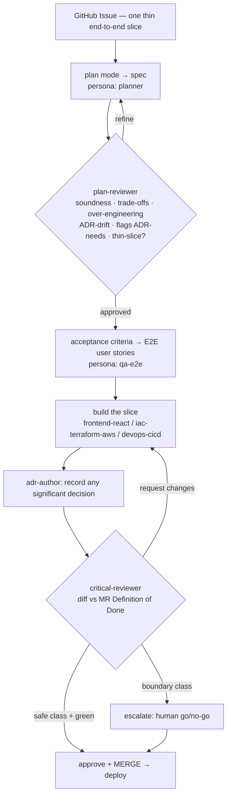

# Proposal: the agentic dev-loop

- **Status:** Proposed (awaiting ratification)
- **Date:** 2026-07-22
- **Scope:** `tadeumendonca-skills` (the plugin — the reusable machine) consumed by `tadeumendonca-io` and future projects
- **On acceptance, splits into methodology ADRs:** ADR-0001 (adopt MADR), ADR-0002 (agentic dev-loop architecture), ADR-0003 (MR Definition of Done), ADR-0004 (autonomy & permission model)

## 0. TL;DR

Turn the dev-loop into a **team of per-task subagents** orchestrated by the main loop, where each stage
is an isolated fresh context (a *persona* wielding a specific skill/tool/model bundle). Two review gates —
a **plan-reviewer** at design-time and a **critical-reviewer** at code-time — give autonomy on delimited
work while the human keeps the architectural/irreversible boundary. **ADRs are the durable shared brain**
that makes per-task isolation safe: a fresh context can't remember prior decisions, so the decisions must
be written where it can read them. All of this lives in the plugin, reusable across projects.

## 1. Motivation

The current loop scores about **7/10**: strong mechanical spine (gates, E2E-on-PR, coverage ≥85%,
OIDC least-privilege, reconciled principles) but real structural gaps that a single multi-hour session
of **manual drift-cleanup** just exposed — dead-platform references across code, config, memory and
workflow names, none of it caught by the loop, all of it caught by hand.

The gaps this proposal closes:

1. **No decision durability.** Decisions live scattered in commit messages, `CLAUDE.md`, memory and
   `.brand/`. That dispersion *is* the root cause of the drift. → ADRs.
2. **Reactive, not preventive.** Nothing detects "this change contradicts a prior decision." → the
   plan-reviewer's ADR-drift check + ADRs as the fresh-context brain.
3. **Autonomy capped at the ceiling.** Every merge asks; no delimited work completes end-to-end without
   the human. → the reviewer subagents + a merge-authority classification.
4. **Safety leans on judgment.** The merge boundary is behavioural ("always ask"), not mechanical. →
   tool-scoping per persona makes the boundary a capability, not a promise.
5. **Incomplete quality capture.** Sonar scans only `apps/fed/src`; `iac/` and workflows are blind. →
   comprehensive blocking Sonar + a remediation subagent.
6. **Informal intake.** The roadmap lives in `.brand/backlog.md`, not versioned as work items. →
   GitHub Issues as the backlog, each a thin end-to-end slice.

**Goals:** maximum autonomy with safety on delimited/roadmap items · anti-drift by construction ·
reusable across projects (it lives in the plugin) · the loop is itself a proof-of-engineering artifact.

## 2. Core model

### 2.1 Personas vs per-task instances
A **subagent is a per-task autonomous context**, not a standing employee. The *persona* (e.g.
`frontend-react`, `critical-reviewer`) is the reusable **definition** — it lives in the plugin. Each
**invocation** is a fresh, ephemeral context that loads only what the task needs and is discarded after.

That isolation is where the two wins come from:
- **Context efficiency** — an instance carries its persona's skills + the slice's inputs, not the whole
  session history.
- **Bias elimination** — the instance never saw prior tasks. The reviewer never watched the author
  defend the code; the builder of slice B carries none of slice A's mental clutter.

### 2.2 ADRs are the durable shared brain
A per-task isolated context **cannot remember prior decisions — by construction.** So it is only safe if
the decisions are written where a fresh instance can read them: in **ADRs**. Without ADRs, per-task
isolation is a drift machine — every slice re-decides and contradicts the last. With ADRs, each fresh
context loads the project's shared brain and stays coherent with what was already pacted. **This is why
ADRs are the substrate and come first** — they are not documentation, they are the memory that makes the
whole architecture safe.

### 2.3 Orchestrator + artifacts-as-interface
The **main loop is the orchestrator**: it holds the plan/roadmap, decomposes work into thin slices,
routes each slice to a fresh specialist context, collects results, and drives the gates. Subagents do
not share a context or know about each other — they hand off through **artifacts** (the Issue, the spec,
the ADR, the diff, the evidence). State lives in the artifacts, not the context window. This is exactly
how Claude Code subagents work: fresh context in, structured report out.

### 2.4 Each persona configures four axes
`{ skills it wields · MCPs it can reach · tools it may use · model tier + effort }`. Two consequences:
- **Tool-scoping = per-agent least-privilege**, and it enforces the DoD *mechanically* instead of by
  good faith. The `critical-reviewer` gets read + verdict + (safe-class) merge — **but not edit**.
  Specialists get edit-within-their-glob — **but not merge**. The classification stops being a promise
  and becomes a capability boundary.
- **Model per task = cost/latency calibration.** Strong model where judgment and risk live
  (`plan-reviewer`, `critical-reviewer`, `planner`); cheap/fast model for mechanical work
  (`sonar-remediator`, formatting fixes). Don't pay for a frontier model to change quotes.

## 3. The loop

Two adversarial, fresh-context review gates at two altitudes: **plan-reviewer** (the spec, design-time)
and **critical-reviewer** (the MR, code-time). Sonar runs comprehensive + blocking inside the build/PR
gate; `sonar-remediator` captures findings and fixes them within the slice.

## 4. Subagent roster

**Two-tier rule.** The plugin **defines** the full team, so it reads as a complete engineering org and
stays reusable. Each project **enables** only the personas whose blast-radius justifies them. Enabling a
persona with no work is theatre — it costs context and implies coverage that isn't there. The
"Enabled in `-io`?" column reflects a **static SPA + light IaC, no backend**.

**Build specialists** (own a directory glob; write unit tests inline as they build — TDD):

| Persona | Ownership | Wields | Model | Can NOT | `-io`? |
|---|---|---|---|---|---|
| `frontend-react` | `apps/fed/src/**` | `/frontend/*` | mid–strong | merge · touch `iac/` | ✅ |
| `iac-terraform-aws` | `iac/**` | `/infrastructure/*` | mid–strong | merge · local `apply` | ✅ |
| `devops-cicd` | `.github/workflows/**` | `/workflow/*` | mid | merge | ✅ |
| `backend-node` | `apps/*/api` | `/backend/*` | mid–strong | merge | ❌ no backend |
| `data-modeling` | schema · domain model · migrations | `/backend/dynamodb`, `/infrastructure/dynamodb` | mid–strong | merge | ❌ no data layer |

**Design & product** (design-time, advisory — produce specs/critique, do not write code):

| Persona | Owns | Wields | Model | `-io`? |
|---|---|---|---|---|
| `ux` | information architecture · flows · a11y · reader-first voice — feeds planner & `frontend-react` | `/frontend/{design-system,ux-states}`, a11y | strong | ✅ *(most borderline — could fold into planner + owner taste if it fires rarely)* |
| `api-design` | API contract — OpenAPI · resource modeling · error semantics · versioning — feeds `backend-node` | `/backend/openapi` | strong | ❌ no API |
| `analytics` | GA4 event tagging + the **measurement plan** — product/behavioral (distinct from `observability`, which is system health) | `/frontend/analytics` | mid | ✅ |

**The two design→build→verify tridents** (one per app layer, mirror images):
`ux` → `frontend-react` → `e2e-testing`  ·  `api-design` → `backend-node` → `api-testing`. The frontend
trident is enabled here; the backend trident is defined-but-off (no backend), turned on as a unit by a
backend-ful project.

**Verification specialists** (adversarial, fresh-context — the bias argument):

| Persona | Owns | Wields | Model | `-io`? |
|---|---|---|---|---|
| *unit testing* | — | — | — | **not a persona** — embedded in each build specialist (TDD, co-located; the tight red-green loop) |
| `e2e-testing` (`qa-e2e`) | E2E specs + coverage audit | `/frontend/playwright` | mid | ✅ |
| `api-testing` | contract/API tests | `/backend/postman` | mid | ❌ no API |
| `debugger` | hypothesis-driven diagnosis of **non-trivial** failures (broken gate, flaky E2E, incident) — escalation mode, not every error | domain skill of the failure | strong | ✅ |

**Process / orchestration:**

| Persona | Owns | Wields | Model | Can NOT | `-io`? |
|---|---|---|---|---|---|
| `planner` | intake → spec (plan mode) | `/principles/*`, `/architecture/*` | strong | edit code | ✅ |
| `plan-reviewer` | reviews the spec | `/principles/*`, ADR library | strong | edit · merge | ✅ |
| `adr-author` | ADRs (MADR) | ADR practice | mid | merge | ✅ |
| `critical-reviewer` | reviews the MR vs DoD | DoD, ADR library | strong | **edit** | ✅ |
| `sonar-remediator` | Sonar findings | domain skill | cheap/fast | merge | ✅ |

**Non-functional / cross-cutting** (specialized lenses at both design- and code-time):

| Persona | Owns | Wields | Model | `-io`? |
|---|---|---|---|---|
| `security` (AppSec) | threat modeling (plan-time) · dependency-audit/SAST findings · IAM/least-privilege review · secret hygiene · supply-chain (action SHA-pinning) | `/infrastructure/{iam,kms,secrets-manager}`, `/workflow/sonarcloud`, checkov | strong | ✅ — security is diffuse today (guard hook, Sonar, checkov, OIDC) and needs an owner |
| `performance` | performance budget — CWV · bundle size · Lighthouse · font/image loading — owns the perf gate | `/frontend/*` (perf-relevant), Lighthouse | mid–strong | ✅ — the 609 kB bundle is live signal; a slow site fails the reader-first thesis |

Both can edit within their concern's glob for remediation; neither merges.

**Deliberately not a persona:**
- **Product ownership** — *what* and *why*, and backlog prioritization, stay with the **human**. The loop
  owns *how*. Issue curation is human; this is the boundary the human keeps, not a gap.
  **Amended 2026-07-23 (ADR-0002), twice:**
  1. Unchanged for *deciding*. What was missing was **reviewing the copy**: the DoD has no criterion for
     what the words claim, so a positioning breach shipped green. `product-owner` (renamed `brand-guardian`
     in amendment #3 below) reviews and escalates; it decides nothing, edits nothing, and has no write
     capability at all.
  2. **Backlog prioritization: the owner DECIDES the order; `product-manager` PROPOSES it.** The owner
     is explicit that they are the CEO of this initiative and the final word is theirs — so the boundary
     moves from *"no persona touches prioritization"* to *"a persona may recommend an order, with the
     reasoning attached, and the owner approves or overrules it"*. The distinction is load-bearing in
     both directions: a recommendation the owner cannot audit is worthless, and one they cannot overrule
     is a decision in disguise. `product-manager` writes nothing, merges nothing, and every verdict it
     returns (PROCEED · RESEQUENCE · RESCOPE · DEFER) is a proposal.

     Evidence this was a real gap rather than org-chart completeness: in one session the open queue went
     from 2 to 8 issues with nothing sequencing them, and three of those interact. The persona was
     **withheld** on its first attempt for exactly the lack of that evidence (#65).
- **unit testing** — embedded in each build specialist (TDD, co-located).

**Operations** (real work only with a running backend):

| Persona | Owns | Wields | `-io`? |
|---|---|---|---|
| `observability` | telemetry pipeline + post-deploy health | `/backend/{tracing,metrics,logging}`, `/infrastructure/cloudwatch*` | ❌ thin here — GA + client errors + prerender smoke are covered by the DoD's observability item + the deploy smoke |
| `sre` | reliability, incident response, SLOs | ops skills | ❌ no ops surface — static CDN, scale-to-zero, no on-call |

Tool-scoping is uniform: **build/verification specialists edit within their glob but cannot merge; the
reviewers cannot edit.** `plan-reviewer` is the evolution of the existing `agents/principles-guide.md`
— it already validates a plan against the principles; it grows to also check the plan against the **ADR
library** (drift) and flag which decisions need an ADR.

**20 personas defined; `-io` enables 14.** *(22 defined / 15 materialized after the first two amendments; the third amendment (2026-07-24) adds `brand-guardian` and re-scopes `product-owner` → 23 defined now, heading to 26 as `editor`/`recruiter`/`scrum-master` land; `-io` still materializes 15, with `brand-guardian` in `product-owner`'s old content slot. See the amendments at the end of this section.)*
Off here: the backend trident (`api-design`, `backend-node`,
`api-testing`), `data-modeling`, and the operations tier (`observability`, `sre`) — all turned on as a
unit by a backend-ful project. Unit-testing folds into the build specialists.

~~Product ownership stays human.~~ **Amended 2026-07-23 (ADR-0002):** product *decisions* stay human —
that has not changed, and the owner has since made it explicit by naming themselves CEO of the
initiative. What was missing was the layer that **prepares** those decisions rather than making them:

- **`brand-guardian`** — reviews copy against the private positioning source (claims, cross-surface
  coherence, confidentiality, third-party naming). Exists because a positioning breach is not a DoD
  criterion, so on a presence where the words are the product it ships green. Advisory, **no write
  capability at all**, triggered from `critical-reviewer` on content-boundary paths. *(This was
  `product-owner`'s mandate until amendment #3 — see below.)*
- **`product-owner`** — re-scoped by amendment #3 to a genuine **software** product owner (user/reader
  value + feature acceptance, advisory — "product ownership stays human"). Defined-but-not-materialized
  in `-io` (the `ux` precedent): a static content presence has no application behavior to accept.
- **`product-manager`** — proposes the order of work; the owner approves it. Advisory, writes nothing.

Two personas already *defined* here were also **materialized** in the same pass, both on evidence rather
than on completeness: **`analytics`** (the repo's `CLAUDE.md` asserted Google Analytics as part of "done"
and the app contained no analytics of any kind — a DoD item passing without the thing existing) and
**`debugger`** (two non-trivial failures in one session — a suite silently targeting the deployed
environment, and a green E2E run against a stale build — both diagnosis problems, both initially
mis-hypothesised).

**`ux` was deliberately NOT materialized**, though it is marked ✅ here: no evidence it would have fired.
The visual decisions in that session (the round portrait, the OG card) were made by the owner directly
and held up. This document's own rule applies — *enabling a persona with no work is theatre.*

**Amended 2026-07-24 (ADR-0002 amendment #3, `#69`) — the roster reshapes.** `product-owner` was carrying
two hats: the *name* of a generic software role, the *job* of a copy/positioning reviewer. Split cleanly:
`product-owner` re-scoped to the software role (above); the copy mandate moved **unchanged** (checks and
the `Read, Grep, Glob`-only / no-`Bash` capability guarantee intact) into a new **`brand-guardian`**, and
`critical-reviewer`'s content-boundary trigger re-points to it. Three genuinely new concerns join:
**`editor`** (long-form craft & rigor — distinct from `brand-guardian`'s claim-vs-truth), **`recruiter`**
(external hiring efficacy: LinkedIn/ATS/hiring-manager fit — distinct from `brand-guardian`'s internal
conformance), and **`scrum-master`** (flow/WIP hygiene — every piece of work becomes a tracked issue).
`career-advisor` and a separate "QA funcional" were considered and **rejected as duplicates** (of
`brand-guardian` and `qa-e2e`). Any `product-owner` mention above the amendment line names the role as it
was *then* (the copy reviewer); the copy reviewer is now `brand-guardian`.

**22 personas defined; 15 materialized in `-io`** (verified against `agents/*.md`, not asserted).

## 5. Skills ↔ subagents (the re-evaluation)

The library today: **1 architecture · 20 backend · 18 frontend · 21 infrastructure · 4 principles ·
7 workflow = 71 skills.** The re-evaluation's conclusion is that **the taxonomy already matches the
roster** — no restructuring needed, because skills and subagents are different things:

- **Skills = knowledge** (the procedures: how to implement a Lambda handler, the design-system rules,
  the OIDC-immutable-subject trap). Passive, invoked on demand.
- **Subagents = agency** (a persona that wields a *bundle* of skills, with tools + model + isolated
  context). Active.

So the mapping is a **per-persona skill manifest**, not a rewrite:

| Skill group | Loaded by |
|---|---|
| `/principles/*` + `/architecture/*` | **the universal floor** — every persona loads it (it's the shared judgment); planner & plan-reviewer lean on it most |
| `/frontend/*` | `frontend-react`; `/frontend/playwright` also `qa-e2e` |
| `/infrastructure/*` | `iac-terraform-aws` |
| `/workflow/*` | `devops-cicd` |
| `/backend/*` | `backend-node` (retained as reference; not enabled here) |

Two small adjustments this surfaces (each its own later slice, not this proposal):
1. **`/principles/*` becomes the explicit universal floor** every persona loads — today it's consumed
   ad hoc. Formalize the "always-loaded" set.
2. The `design-system` skill still says "Cloudscape" in one place (`CLAUDE.md`) though the code is
   custom Tailwind — a stray to fix when `frontend-react` is built.

The knowledge from the exhaustive reverse-engineering (§10) also flows here: each product ADR that a
persona must respect is in the ADR library its fresh context loads.

## 6. MR Definition of Done (the pact)

The objective ruler the `critical-reviewer` enforces. **Every criterion is mechanically checkable or
evidence-cited** — subjective criteria reintroduce the bias the isolated reviewer exists to remove.

### 6.1 Every MR must satisfy
1. **Scope — thin vertical slice, end-to-end value.** One slice; no unrelated changes; adjacent debt →
   an Issue, never fixed inline.
2. **Traceability.** References its backlog **Issue**; if it implements a spec, the spec's acceptance
   criteria are covered by **E2E user-story journeys**.
3. **Tests proportional to slice type.** Unit/integration alongside code, coverage **≥85%**. Slice that
   changes user-visible behavior → **E2E story added and green**. Docs/config/comment slice → no new
   E2E (must not break existing).
4. **Gates green, real evidence.** lint · typecheck · build · E2E regression · comprehensive Sonar gate
   — all blocking, all green, reported with actual output, never "I ran it".
5. **Decision recorded (light ADR gate).** If the MR crosses a **significant boundary**, it references
   an ADR (new or amended); otherwise it declares "no ADR". *Significance test (objective):* touches
   `iac/`, changes a public contract/schema, alters a fixed decision, introduces a new
   dependency/tool-class, or sets a cross-cutting pattern.
6. **Observability.** New behavior provable where it runs (static site: analytics + client error
   surface + prerender smoke).
7. **No doc drift.** Affected docs/ADRs updated **in the same MR**.
8. **History hygiene.** Conventional-commit subjects; real merge commit, never squash.
9. **Security/resilience posture** applied.

### 6.2 Classification — who merges
- **Safe class** (`critical-reviewer` may approve **and merge** with §6.1 fully green): docs · dependency
  bumps · test-only · in-pattern refactor · **in-pattern implementation of an already-approved
  spec/ADR**.
- **Boundary class** (always escalates to the **human**): new architecture · contract/schema change ·
  anything in `iac/` · positioning / public content · any MR that **creates or changes an ADR's
  decision** · any irreversible/public action.

### 6.3 Three pacted resolutions
- **Significance > in-pattern.** A significant boundary always pulls the merge from the subagent, even
  if the change looks routine. Safety over convenience.
- **Coverage ≥85%.** The plugin sets 85 as the default; a project may raise it, **never lower**.
- **Approval hook.** The human's approval happens **once, on the spec/Issue**; the slices that implement
  it are born safe-class. This is the join between one approval and downstream autonomy.

## 7. Autonomy & permissions

The boundary is enforced at **three layers**, deepest wins:
1. **Tool-scoping per persona** (mechanical) — specialists have no merge tool; the reviewer has no edit
   tool. The classification is a capability, not a promise.
2. **The DoD classification** (§6.2) — the reviewer only self-merges the safe class; boundary escalates.
3. **The existing permission floor** — global deny of `apply`/`destroy`/`--force`/`rm -rf`/secrets/
   `--dangerously-skip-permissions` + the `PreToolUse` guard hook, unchanged and inescapable.

Config split: the **plugin defines the model** (personas, their tool/skill/model manifests, the DoD, the
classes); the **project's committed `.claude/settings.json` consumes it** (enables personas, sets its
coverage threshold, its glob ownership). Per-machine overrides stay in `settings.local.json`.

## 8. ADR practice

- **Format:** MADR (context · options · decision · consequences · status).
- **Two libraries:** methodology ADRs in `tadeumendonca-skills/docs/adr/` (decisions about the *machine*);
  product ADRs in `tadeumendonca-io/docs/adr/` (decisions about the *product*). The template/skill is
  single, in the plugin, consumed by both.
- **Numbering:** zero-padded sequential per library; status lifecycle `proposed → accepted → superseded`.
  A superseded ADR is kept and linked forward, never deleted (reverted decisions become history, not
  gaps — matching the exhaustive reverse-engineering).
- **Light gate:** an MR crossing the §6.1.5 significance test must reference an ADR. `plan-reviewer`
  flags the need at design-time; `critical-reviewer` verifies it at code-time.

## 9. Where it lives

| In the plugin (reusable machine) | In the project (instances) |
|---|---|
| the loop definition, personas + manifests | the enabled persona set in `settings.json` |
| the DoD, the classes, the autonomy model | the coverage threshold, glob ownership |
| the ADR template/skill + practice | the actual ADRs (`docs/adr/`) |
| the thin-slice + plan→E2E-story practices | the actual Issues, specs, E2E journeys |

`tadeumendonca-io` enables (16): `frontend-react`, `iac-terraform-aws`, `devops-cicd`, `ux`, `analytics`,
`e2e-testing`, `debugger`, `planner`, `plan-reviewer`, `adr-author`, `critical-reviewer`,
`sonar-remediator`, `security`, `performance`, `brand-guardian`, `product-manager`. Off (7):
`api-design`, `backend-node`, `api-testing`, `data-modeling`, `observability`, `sre`, and — since
amendment #3 re-scoped it to a software product owner with no application behavior to accept here —
`product-owner`. *(`editor`/`recruiter`/`scrum-master`, ratified in amendment #3, are authored in
follow-on slices and not yet in this set.)*

**Enabled ≠ materialized.** 16 enabled, **15 with a file in `agents/`** — `ux` is enabled but not
written, held back for absence of evidence rather than absence of a surface. The gap between the two
numbers is the design working as intended ("materialized lazily as work demands"), not drift; it becomes
drift only if nobody ever states which side of it a persona is on.

## 10. Build sequence (each slice → its own ADR + Issue)

1. **ADR practice** — the MADR template/skill in the plugin + both `docs/adr/` libraries. `[ADR-0001]`
2. **This loop architecture** — personas × per-task instances, ADRs-as-brain, orchestrator. `[ADR-0002]`
3. **The MR DoD** — §6, the pacted ruler. `[ADR-0003]`
4. **Autonomy & permission model** — §7, tool-scoping + classes. `[ADR-0004]`
5. **The subagents**, one persona per slice — **materialized lazily**: a persona is *defined* in this
   proposal cheaply (a markdown entry), but *built* only as work demands it, in leverage order —
   `critical-reviewer` first, then `plan-reviewer` (evolve `principles-guide`), then the specialists as
   the roadmap needs them. We catalog the target team; we do not spawn 20 agents on day one.
6. **Comprehensive Sonar** (fed + iac + workflows, blocking) + `sonar-remediator`.
7. **Backlog ↔ Issues** sync + the plan→E2E-story wiring.
8. **Exhaustive reverse-engineering of the product ADRs** in `tadeumendonca-io` (the ~15–20 live
   architectural decisions + the reverted backend-era ones as `superseded`).

## 11. Risks & open questions (honest)

- **Orchestration overhead.** Many subagents cost tokens and add handoffs. Mitigation: spawn a specialist
  only when a slice genuinely spans its domain; a one-file change stays in the main loop.
- **The reviewer is not a human.** A fresh-context reviewer removes *authorship* bias but not *model*
  bias — plan-reviewer and critical-reviewer are the same model family as the author. It is a strong
  gate, not a substitute for human judgment on the boundary class. That's why boundary always escalates.
- **Same-model review has a ceiling.** Consider raising the reviewer's model/effort above the author's,
  and/or a multi-vote refute pass for high-stakes MRs.
- **Cost of comprehensive Sonar + auto-remediation loops.** Cap remediation attempts; a finding that
  survives N passes escalates instead of looping.
- **This proposal is itself a design.** It is the **first artifact the `plan-reviewer` should review** —
  bootstrapped manually now, self-hosting once the persona exists.

## 12. What this proposal needs

Ratification of §6 (the DoD) and the roster/sequence. On acceptance it splits into ADR-0001..0004 and
the build proceeds slice by slice — the loop practicing itself: decision → ADR → thin slice → gates →
merge.
